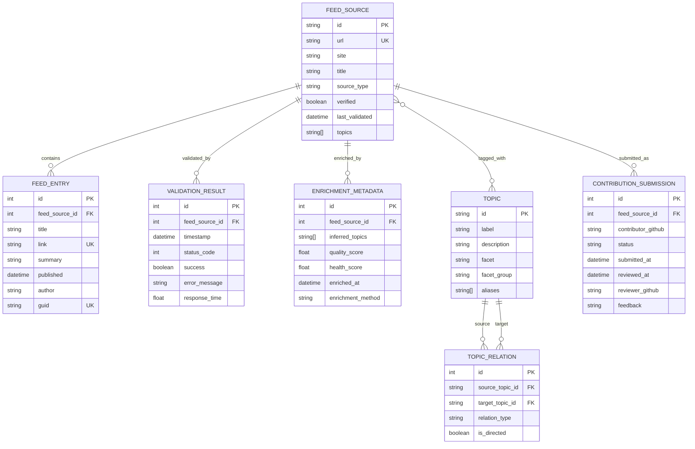

# Phase 1: Data Model & Entity Schemas

**Feature**: AIWebFeeds - AI/ML Feed Aggregator Platform  
**Branch**: `001-core-project-spec`  
**Date**: 2025-10-22  
**Status**: Complete

## Overview

This document defines the complete data model for AIWebFeeds, including entity schemas, relationships, validation rules, and state transitions. All entities use Pydantic v2 + SQLModel for type safety and database mapping. Configuration management uses pydantic-settings for type-safe environment variable handling.

---

## Entity Relationship Diagram



---

## Core Entities

### 1. FeedSource

**Purpose**: Represents an individual RSS/Atom/JSON Feed with metadata, validation status, and topics.

**Schema** (SQLModel):
```python
from sqlmodel import SQLModel, Field, Relationship
from pydantic import HttpUrl, field_validator
from datetime import datetime
from enum import Enum

class SourceType(str, Enum):
    """Feed source categories."""
    BLOG = "blog"
    PODCAST = "podcast"
    NEWSLETTER = "newsletter"
    PREPRINT = "preprint"
    REPOSITORY = "repository"
    ORGANIZATION = "organization"
    COURSE = "course"
    CONFERENCE = "conference"

class FeedSource(SQLModel, table=True):
    """Feed source entity with metadata and validation status."""
    
    # Primary identification
    id: str = Field(primary_key=True, max_length=100)  # e.g., "openai-blog", "arxiv-cs-lg"
    url: str = Field(unique=True, index=True, max_length=500)  # Feed URL (RSS/Atom/JSON Feed)
    site: str | None = Field(default=None, max_length=500)  # Website URL
    title: str = Field(max_length=200)
    description: str | None = Field(default=None, max_length=1000)
    
    # Classification
    source_type: SourceType = Field(index=True)
    topics: list[str] = Field(default_factory=list, sa_column_kwargs={"type_": "JSON"})
    tags: list[str] = Field(default_factory=list, sa_column_kwargs={"type_": "JSON"})
    
    # Validation & health
    verified: bool = Field(default=False, index=True)
    last_validated: datetime | None = Field(default=None, index=True)
    is_active: bool = Field(default=True, index=True)
    
    # Metadata
    language: str | None = Field(default=None, max_length=10)  # ISO 639-1 code
    feed_format: str | None = Field(default=None, max_length=20)  # rss2.0, atom1.0, jsonfeed1.1
    update_frequency: str | None = Field(default=None, max_length=50)  # daily, weekly, irregular
    
    # Provenance
    source: str | None = Field(default=None, max_length=100)  # Where feed was discovered
    license: str | None = Field(default=None, max_length=100)
    
    # Timestamps
    created_at: datetime = Field(default_factory=lambda: datetime.now(UTC))
    updated_at: datetime = Field(default_factory=lambda: datetime.now(UTC))
    
    # Relationships
    entries: list["FeedEntry"] = Relationship(back_populates="feed_source")
    validation_results: list["ValidationResult"] = Relationship(back_populates="feed_source")
    enrichment: "EnrichmentMetadata | None" = Relationship(back_populates="feed_source")
    
    @field_validator('url')
    @classmethod
    def validate_url(cls, v: str) -> str:
        """Ensure URL is valid and canonicalized."""
        if not v.startswith(('http://', 'https://')):
            raise ValueError('URL must start with http:// or https://')
        return v.lower().strip()
    
    @field_validator('id')
    @classmethod
    def validate_id(cls, v: str) -> str:
        """Ensure ID is lowercase, alphanumeric with hyphens."""
        if not v.replace('-', '').isalnum():
            raise ValueError('ID must be alphanumeric with hyphens only')
        return v.lower().strip()
```

**Validation Rules**:
- `id`: Unique, lowercase, alphanumeric + hyphens, max 100 chars
- `url`: Unique, valid HTTP/HTTPS URL, canonicalized (lowercase)
- `title`: Required, max 200 chars
- `source_type`: One of SourceType enum values
- `topics`: Array of valid topic IDs (validated against Topic table)
- `verified`: Boolean, set by validation process
- `last_validated`: ISO datetime, updated on each validation run
- `is_active`: Boolean, false if inactive for 30+ days

**State Transitions**:
```
[NEW] --validate--> [VERIFIED] or [UNVERIFIED]
[VERIFIED] --validate_fail--> [UNVERIFIED]
[UNVERIFIED] --validate_success--> [VERIFIED]
[ANY] --inactive_30_days--> [INACTIVE] (is_active=False)
[INACTIVE] --validate_success--> [VERIFIED] (is_active=True)
```

---

### 2. Topic

**Purpose**: Hierarchical taxonomy node for categorizing feeds by AI/ML domains, tasks, methodologies, and tools.

**Schema** (SQLModel):
```python
class TopicFacet(str, Enum):
    """Topic categorization facets."""
    DOMAIN = "domain"
    TASK = "task"
    METHODOLOGY = "methodology"
    TOOL = "tool"
    GOVERNANCE = "governance"
    OPERATIONAL = "operational"

class Topic(SQLModel, table=True):
    """Topic taxonomy node."""
    
    # Identification
    id: str = Field(primary_key=True, max_length=50)  # e.g., "llm", "cv", "mlops"
    label: str = Field(max_length=100)  # Human-readable name
    description: str | None = Field(default=None, max_length=500)
    
    # Classification
    facet: TopicFacet = Field(index=True)
    facet_group: str | None = Field(default=None, max_length=50)  # conceptual, technical, etc.
    
    # Search & discovery
    aliases: list[str] = Field(default_factory=list, sa_column_kwargs={"type_": "JSON"})
    tags: list[str] = Field(default_factory=list, sa_column_kwargs={"type_": "JSON"})
    rank_hint: float = Field(default=0.5)  # 0.0-1.0 for search ranking
    
    # External mappings
    mappings: dict[str, str] = Field(default_factory=dict, sa_column_kwargs={"type_": "JSON"})
    # e.g., {"wikidata": "Q124351267", "arxiv": "cs.LG"}
    
    # Internationalization
    i18n: dict[str, dict[str, str]] = Field(default_factory=dict, sa_column_kwargs={"type_": "JSON"})
    # e.g., {"fr": {"label": "Intelligence Artificielle"}}
    
    # Metadata
    notes: str | None = Field(default=None, max_length=500)
    created_at: datetime = Field(default_factory=lambda: datetime.now(UTC))
    updated_at: datetime = Field(default_factory=lambda: datetime.now(UTC))
    
    # Relationships
    outgoing_relations: list["TopicRelation"] = Relationship(
        sa_relationship_kwargs={"foreign_keys": "[TopicRelation.source_topic_id]"}
    )
    incoming_relations: list["TopicRelation"] = Relationship(
        sa_relationship_kwargs={"foreign_keys": "[TopicRelation.target_topic_id]"}
    )
```

**Validation Rules**:
- `id`: Unique, lowercase, alphanumeric + hyphens, max 50 chars
- `label`: Required, max 100 chars
- `facet`: One of TopicFacet enum values
- `aliases`: Array of strings for search matching
- `rank_hint`: Float 0.0-1.0 (higher = more important in search)
- **DAG Constraint**: No cycles in directed relationships

**Cycle Detection**:
```python
def validate_no_cycles(session: Session, source_id: str, target_id: str) -> bool:
    """Ensure adding edge (source_id -> target_id) doesn't create a cycle."""
    visited = set()
    
    def has_path_to(node_id: str, target: str) -> bool:
        if node_id in visited:
            return False
        if node_id == target:
            return True
        visited.add(node_id)
        
        relations = session.exec(
            select(TopicRelation).where(
                TopicRelation.source_topic_id == node_id,
                TopicRelation.is_directed == True
            )
        ).all()
        
        return any(has_path_to(rel.target_topic_id, target) for rel in relations)
    
    return not has_path_to(target_id, source_id)  # No cycle if no path back
```

---

### 3. TopicRelation

**Purpose**: Directed or symmetric relationships between topics forming the taxonomy graph.

**Schema** (SQLModel):
```python
class RelationType(str, Enum):
    """Types of topic relationships."""
    # Directed relations
    DEPENDS_ON = "depends_on"        # A depends on B (A needs B)
    IMPLEMENTS = "implements"        # A implements B (A is realization of B)
    INFLUENCES = "influences"        # A influences B (A affects B)
    
    # Symmetric relations
    RELATED_TO = "related_to"        # A and B are related
    CONTRASTS_WITH = "contrasts_with"  # A contrasts with B
    SAME_AS = "same_as"              # A is equivalent to B (alias)

class TopicRelation(SQLModel, table=True):
    """Topic-to-topic relationship edge."""
    
    id: int | None = Field(default=None, primary_key=True)
    source_topic_id: str = Field(foreign_key="topic.id", index=True)
    target_topic_id: str = Field(foreign_key="topic.id", index=True)
    relation_type: RelationType = Field(index=True)
    is_directed: bool = Field(default=True)  # False for symmetric relations
    
    # Metadata
    weight: float = Field(default=1.0)  # Relationship strength (0.0-1.0)
    notes: str | None = Field(default=None, max_length=200)
    created_at: datetime = Field(default_factory=lambda: datetime.now(UTC))
    
    # Prevent duplicate edges
    __table_args__ = (
        {"sqlite_autoincrement": True},
    )
```

**Validation Rules**:
- `source_topic_id` and `target_topic_id` must exist in Topic table
- No self-loops: `source_topic_id != target_topic_id`
- No duplicate edges: Unique (source, target, relation_type)
- Directed relations: Check for cycles before insertion
- Symmetric relations: Automatically create reverse edge

**Relationship Semantics**:
- **depends_on**: "LLM depends_on training" (LLMs need training)
- **implements**: "RAG implements retrieval" (RAG is a retrieval implementation)
- **influences**: "research influences industry" (research affects industry)
- **related_to**: "NLP related_to CV" (both are ML subfields)
- **contrasts_with**: "supervised contrasts_with unsupervised"

---

### 4. FeedEntry

**Purpose**: Individual article/post from a feed, cached for analysis and search.

**Schema** (SQLModel):
```python
class FeedEntry(SQLModel, table=True):
    """Individual feed article/post."""
    
    id: int | None = Field(default=None, primary_key=True)
    feed_source_id: str = Field(foreign_key="feedsource.id", index=True)
    
    # Content
    title: str = Field(max_length=500)
    link: str = Field(unique=True, index=True, max_length=1000)  # Article URL
    summary: str | None = Field(default=None, max_length=5000)  # Excerpt/description
    guid: str = Field(unique=True, index=True, max_length=500)  # Unique identifier
    
    # Metadata
    author: str | None = Field(default=None, max_length=200)
    published: datetime | None = Field(default=None, index=True)
    updated: datetime | None = Field(default=None)
    
    # Categories & tags (from feed)
    categories: list[str] = Field(default_factory=list, sa_column_kwargs={"type_": "JSON"})
    tags: list[str] = Field(default_factory=list, sa_column_kwargs={"type_": "JSON"})
    
    # Timestamps
    fetched_at: datetime = Field(default_factory=lambda: datetime.now(UTC), index=True)
    
    # Relationships
    feed_source: FeedSource = Relationship(back_populates="entries")
```

**Validation Rules**:
- `feed_source_id`: Must exist in FeedSource table
- `title`: Required, max 500 chars
- `link`: Required, unique, valid URL
- `guid`: Required, unique (feed-provided unique ID)
- `summary`: Optional, max 5000 chars (metadata + excerpt only, not full content)
- `published`: ISO datetime (from feed)

**Caching Strategy** (from clarifications):
- ✅ Cache: title, link, summary/excerpt, published date, author
- ❌ Do NOT cache: Full article content, HTML, media files
- Rationale: Metadata + summaries enable search/analysis while respecting copyright

---

### 5. ValidationResult

**Purpose**: Historical record of feed validation attempts for health tracking.

**Schema** (SQLModel):
```python
class ValidationResult(SQLModel, table=True):
    """Feed validation attempt record."""
    
    id: int | None = Field(default=None, primary_key=True)
    feed_source_id: str = Field(foreign_key="feedsource.id", index=True)
    
    # Validation outcome
    success: bool = Field(index=True)
    status_code: int | None = Field(default=None)  # HTTP status code
    error_message: str | None = Field(default=None, max_length=1000)
    
    # Performance metrics
    response_time: float | None = Field(default=None)  # Seconds
    content_length: int | None = Field(default=None)  # Bytes
    
    # Parsing results
    format_detected: str | None = Field(default=None, max_length=20)  # rss2.0, atom1.0, etc.
    entries_found: int | None = Field(default=None)
    
    # Timestamp
    timestamp: datetime = Field(default_factory=lambda: datetime.now(UTC), index=True)
    
    # Relationships
    feed_source: FeedSource = Relationship(back_populates="validation_results")
```

**Validation Rules**:
- `feed_source_id`: Must exist in FeedSource table
- `success`: Boolean (True if validation passed)
- `status_code`: HTTP status code (200, 404, 500, etc.)
- `response_time`: Float >= 0.0 (seconds)
- `timestamp`: ISO datetime (when validation ran)

**Health Score Calculation**:
```python
def calculate_health_score(validation_history: list[ValidationResult]) -> float:
    """Calculate feed health score based on validation history."""
    if not validation_history:
        return 0.0
    
    # Recent validations weighted more heavily
    recent = validation_history[-10:]  # Last 10 validations
    
    success_count = sum(1 for v in recent if v.success)
    success_rate = success_count / len(recent)
    
    # Penalize slow responses
    avg_response_time = sum(v.response_time or 5.0 for v in recent) / len(recent)
    speed_factor = max(0.0, 1.0 - (avg_response_time / 10.0))  # Penalize > 10s
    
    return success_rate * 0.8 + speed_factor * 0.2  # 80% success, 20% speed
```

---

### 6. EnrichmentMetadata

**Purpose**: AI-inferred metadata including topics, quality scores, and source type classification.

**Schema** (SQLModel):
```python
class EnrichmentMetadata(SQLModel, table=True):
    """AI-enriched feed metadata."""
    
    id: int | None = Field(default=None, primary_key=True)
    feed_source_id: str = Field(foreign_key="feedsource.id", unique=True, index=True)
    
    # Inferred data
    inferred_topics: list[str] = Field(default_factory=list, sa_column_kwargs={"type_": "JSON"})
    inferred_source_type: SourceType | None = Field(default=None)
    
    # Quality metrics
    quality_score: float = Field(default=0.5)  # 0.0-1.0
    health_score: float = Field(default=0.5)   # 0.0-1.0
    completeness_score: float = Field(default=0.5)  # 0.0-1.0
    
    # Metadata
    enrichment_method: str | None = Field(default=None, max_length=100)  # "content-analysis", "manual", "llm"
    confidence: float = Field(default=0.5)  # 0.0-1.0
    enriched_at: datetime = Field(default_factory=lambda: datetime.now(UTC))
    
    # Provenance
    enriched_by: str | None = Field(default=None, max_length=100)  # Service/user that enriched
    
    # Relationships
    feed_source: FeedSource = Relationship(back_populates="enrichment")
```

**Validation Rules**:
- `feed_source_id`: Must exist in FeedSource table, unique
- `quality_score`, `health_score`, `completeness_score`: Float 0.0-1.0
- `confidence`: Float 0.0-1.0
- `enriched_at`: ISO datetime

**Score Calculation**:
```python
def calculate_quality_score(feed: FeedSource, entries: list[FeedEntry]) -> float:
    """Calculate feed quality score based on content richness."""
    score = 0.0
    
    # Content completeness (40%)
    has_title = 1.0 if feed.title else 0.0
    has_description = 1.0 if feed.description else 0.0
    has_site = 1.0 if feed.site else 0.0
    content_score = (has_title + has_description + has_site) / 3.0
    score += content_score * 0.4
    
    # Update frequency (30%)
    if entries:
        recent_entries = [e for e in entries if e.published and 
                         (datetime.now(UTC) - e.published).days < 30]
        frequency_score = min(len(recent_entries) / 10.0, 1.0)  # 10+ entries/month = 1.0
        score += frequency_score * 0.3
    
    # Entry richness (30%)
    if entries:
        avg_summary_length = sum(len(e.summary or "") for e in entries) / len(entries)
        richness_score = min(avg_summary_length / 500.0, 1.0)  # 500+ chars = 1.0
        score += richness_score * 0.3
    
    return min(score, 1.0)
```

---

### 7. ContributionSubmission

**Purpose**: Track community-submitted feeds through the review process.

**Schema** (SQLModel):
```python
class SubmissionStatus(str, Enum):
    """Contribution submission states."""
    PENDING = "pending"
    APPROVED = "approved"
    REJECTED = "rejected"
    CHANGES_REQUESTED = "changes_requested"

class ContributionSubmission(SQLModel, table=True):
    """Community feed contribution tracking."""
    
    id: int | None = Field(default=None, primary_key=True)
    feed_source_id: str = Field(foreign_key="feedsource.id", index=True)
    
    # Contributor info
    contributor_github: str = Field(max_length=100, index=True)
    contributor_email: str | None = Field(default=None, max_length=200)
    
    # Submission details
    status: SubmissionStatus = Field(default=SubmissionStatus.PENDING, index=True)
    pr_number: int | None = Field(default=None, index=True)  # GitHub PR number
    pr_url: str | None = Field(default=None, max_length=500)
    
    # Review details
    reviewer_github: str | None = Field(default=None, max_length=100)
    reviewed_at: datetime | None = Field(default=None)
    feedback: str | None = Field(default=None, max_length=2000)
    
    # Timestamps
    submitted_at: datetime = Field(default_factory=lambda: datetime.now(UTC), index=True)
    updated_at: datetime = Field(default_factory=lambda: datetime.now(UTC))
```

**Validation Rules**:
- `contributor_github`: Required, max 100 chars
- `status`: One of SubmissionStatus enum values
- `pr_number`: Optional GitHub PR number
- `feedback`: Optional, max 2000 chars

**State Transitions**:
```
[PENDING] --approve--> [APPROVED] (feed added to main collection)
[PENDING] --reject--> [REJECTED] (feedback provided)
[PENDING] --request_changes--> [CHANGES_REQUESTED]
[CHANGES_REQUESTED] --resubmit--> [PENDING]
```

---

## Data Validation & Constraints

### Database-Level Constraints

**Unique Constraints**:
- `FeedSource.id`: Primary key, unique feed identifier
- `FeedSource.url`: Unique feed URL (canonicalized)
- `Topic.id`: Primary key, unique topic identifier
- `FeedEntry.link`: Unique article URL
- `FeedEntry.guid`: Unique feed entry identifier
- `EnrichmentMetadata.feed_source_id`: One enrichment per feed

**Foreign Key Constraints**:
- `FeedEntry.feed_source_id` → `FeedSource.id` (CASCADE on delete)
- `ValidationResult.feed_source_id` → `FeedSource.id` (CASCADE on delete)
- `EnrichmentMetadata.feed_source_id` → `FeedSource.id` (CASCADE on delete)
- `TopicRelation.source_topic_id` → `Topic.id` (CASCADE on delete)
- `TopicRelation.target_topic_id` → `Topic.id` (CASCADE on delete)

**Index Strategy**:
- `FeedSource`: id (PK), url (UK), source_type, verified, last_validated, is_active
- `Topic`: id (PK), facet
- `TopicRelation`: source_topic_id, target_topic_id, relation_type
- `FeedEntry`: id (PK), feed_source_id (FK), link (UK), guid (UK), published, fetched_at
- `ValidationResult`: id (PK), feed_source_id (FK), success, timestamp
- `ContributionSubmission`: id (PK), feed_source_id (FK), contributor_github, status, submitted_at

---

## JSON Schema Mapping

All entities have corresponding JSON schemas for data file validation:

**File-to-Schema Mapping**:
- `data/feeds.yaml` → `data/feeds.schema.json` (FeedSource array)
- `data/topics.yaml` → `data/topics.schema.json` (Topic + TopicRelation array)
- `data/feeds.enriched.yaml` → `data/feeds.enriched.schema.json` (FeedSource + EnrichmentMetadata)

---

## Migration Strategy

### Initial Schema Creation

```python
# Using Alembic for migrations
from alembic import op
import sqlalchemy as sa
import sqlmodel

def upgrade():
    """Create initial schema."""
    # Create feed_source table
    op.create_table(
        'feedsource',
        sa.Column('id', sa.String(100), primary_key=True),
        sa.Column('url', sa.String(500), unique=True, nullable=False),
        sa.Column('title', sa.String(200), nullable=False),
        # ... all other columns
    )
    
    # Create indexes
    op.create_index('idx_feedsource_verified', 'feedsource', ['verified'])
    op.create_index('idx_feedsource_active', 'feedsource', ['is_active'])
    
    # Create topic table
    # Create topic_relation table
    # Create feed_entry table
    # Create validation_result table
    # Create enrichment_metadata table
    # Create contribution_submission table

def downgrade():
    """Rollback schema."""
    op.drop_table('contribution_submission')
    op.drop_table('enrichment_metadata')
    op.drop_table('validation_result')
    op.drop_table('feedentry')
    op.drop_table('topicrelation')
    op.drop_table('topic')
    op.drop_table('feedsource')
```

### Schema Versioning

- Version format: `YYYY-MM-DD-###-description.py`
- Each migration includes upgrade() and downgrade()
- Test migrations locally before production deployment
- Document breaking changes in migration comments

---

*Data Model Version*: 1.0.0 | *Completed*: 2025-10-22


