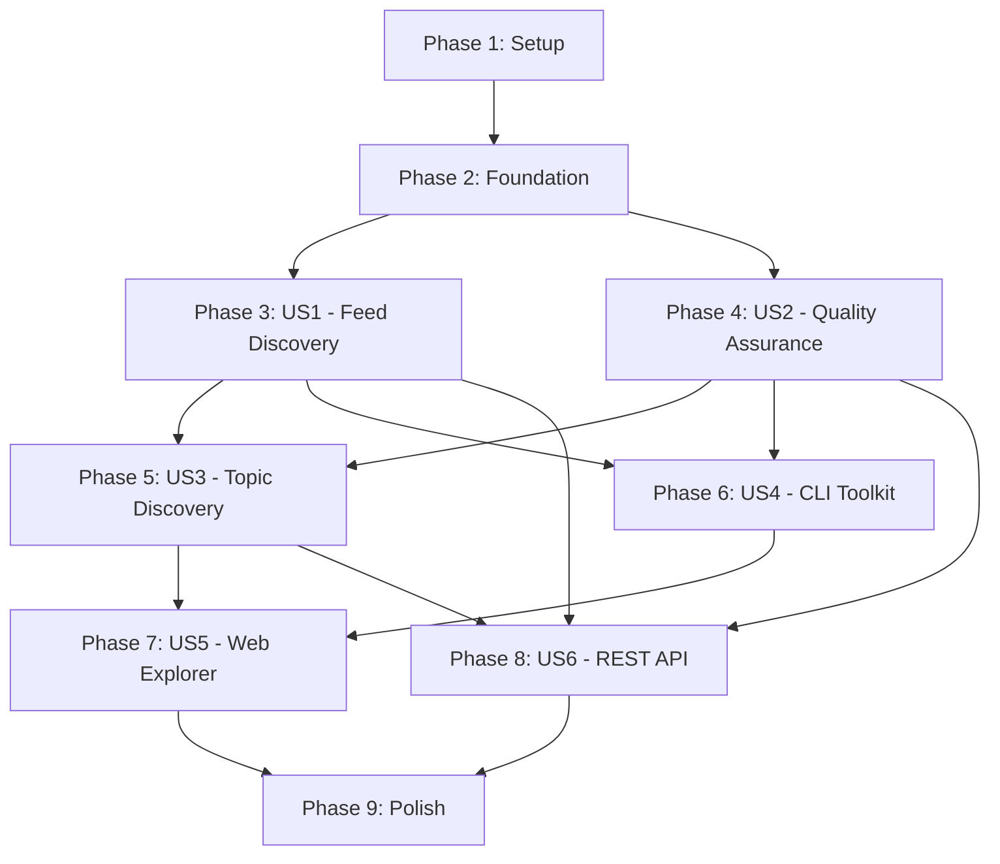

# Implementation Tasks: AIWebFeeds - AI/ML Feed Aggregator Platform

**Feature Branch**: `001-core-project-spec`  
**Created**: 2025-10-22  
**Status**: Ready for Implementation

## Overview

This document provides actionable, dependency-ordered tasks for implementing the AIWebFeeds platform. Tasks are organized by user story to enable independent implementation and testing. Each user story can be developed as a complete, testable increment.

**Total Tasks**: 148  
**MVP Tasks** (US1 + US2): 63 tasks  
**User Stories**: 6 (2 P1/MVP, 2 P2, 2 P3)

---

## Implementation Strategy

### MVP-First Approach

**MVP Scope**: User Story 1 (Feed Discovery & Access) + User Story 2 (Feed Quality Assurance)

**Why**: These two stories provide immediate value (curated, validated feeds with OPML export) and establish the foundational architecture. Users can import feeds into their readers and trust the quality.

**Delivery Sequence**:
1. **Phase 1-2**: Setup + Foundation → Complete workspace structure and shared infrastructure
2. **Phase 3**: US1 (Feed Discovery) → Working feed catalog with OPML export
3. **Phase 4**: US2 (Quality Assurance) → Validation and health tracking
4. **Phase 5+**: Additional features incrementally (US3-US6)

### Parallel Execution Opportunities

Tasks marked with **[P]** can be executed in parallel (different files, no dependencies on incomplete tasks).

**Per User Story**:
- **US1**: 8 parallelizable tasks (models, services, CLI commands, API routes)
- **US2**: 6 parallelizable tasks (validation, storage, async operations)
- **US3**: 5 parallelizable tasks (topic models, graph traversal, filters)
- **US4**: 4 parallelizable tasks (CLI commands, export formats)
- **US5**: 6 parallelizable tasks (React components, graph visualization)
- **US6**: 7 parallelizable tasks (API endpoints, pagination, rate limiting)

---

## Dependencies & Completion Order

**Critical Path**: Setup → Foundation → US1 → US2 → US3 → US5 → Polish

**Independent Stories** (can start after Foundation):
- US1 and US2 can proceed in parallel
- US4 (CLI) can proceed once US1+US2 have models/services
- US6 (API) can proceed once US1+US2+US3 have data layer

---

## Phase 1: Setup & Project Initialization

**Goal**: Establish workspace structure, dependencies, and tooling

**Tasks**: 12

### Workspace Setup

- [X] T001 Create Python workspace root with uv in pyproject.toml
- [X] T002 Create workspace members structure (packages/, apps/, tests/) per plan.md
- [X] T003 [P] Initialize packages/ai_web_feeds/ with pyproject.toml and src/ structure
- [X] T004 [P] Initialize apps/cli/ with pyproject.toml and CLI entry point
- [X] T005 [P] Initialize apps/web/ with package.json and Next.js 15 structure
- [X] T006 [P] Initialize tests/ with pytest.ini and conftest.py

### Dependency Installation

- [X] T007 Add core Python dependencies to packages/ai_web_feeds/pyproject.toml (pydantic, pydantic-settings, sqlmodel, httpx, tenacity, feedparser, loguru, tqdm)
- [X] T008 Add CLI dependencies to apps/cli/pyproject.toml (typer, rich)
- [X] T009 Add test dependencies to workspace root pyproject.toml (pytest, pytest-cov, pytest-asyncio, pytest-xdist, hypothesis)
- [ ] T010 Run uv sync to install all dependencies and create .venv/
- [X] T011 Add TypeScript dependencies to apps/web/package.json (next@15, react@19, fumadocs, tailwindcss@4)
- [ ] T012 Run pnpm install in apps/web/ to install Node dependencies

---

## Phase 2: Foundational Infrastructure

**Goal**: Build shared components required by all user stories

**Tasks**: 9

### Configuration & Logging

- [X] T013 [P] Create Settings class using pydantic-settings in packages/ai_web_feeds/src/ai_web_feeds/config.py with database_url, validation settings, API config
- [X] T014 [P] Configure Loguru logger in packages/ai_web_feeds/src/ai_web_feeds/logger.py with JSON format, rotation, correlation IDs
- [X] T015 [P] Create .env.example file with all AIWEBFEEDS_* environment variables

### Database Setup

- [X] T016 Create SQLModel base models in packages/ai_web_feeds/src/ai_web_feeds/models.py (Base class, common fields)
- [X] T017 Initialize database engine and session management in packages/ai_web_feeds/src/ai_web_feeds/storage.py
- [ ] T018 Create Alembic migration configuration for reversible schema changes
- [ ] T019 Write initial migration to create database schema (all tables from data-model.md)

### Data Schemas

- [X] T020 [P] Copy JSON Schemas from contracts/schemas/ to data/ directory (feeds.schema.json, topics.schema.json, topic-relation.schema.json)
- [X] T021 [P] Create schema validation utilities in packages/ai_web_feeds/src/ai_web_feeds/utils.py (validate_against_schema, load_yaml_with_validation)

---

## Phase 3: User Story 1 - Feed Discovery & Access (P1) 🎯 MVP

**Story Goal**: Researchers can discover and download curated AI/ML feeds as OPML files for import into their feed readers.

**Independent Test**: Visit website → Browse feed catalog → Download OPML → Import into RSS reader → Verify feeds appear correctly

**Tasks**: 21

### Models & Data Layer (US1)

- [X] T022 [P] [US1] Implement FeedSource model in packages/ai_web_feeds/src/ai_web_feeds/models.py with SQLModel (id, url, title, source_type, topics, verified, etc.)
- [X] T023 [P] [US1] Implement SourceType enum in packages/ai_web_feeds/src/ai_web_feeds/models.py (blog, podcast, newsletter, preprint, repository, etc.)
- [X] T024 [P] [US1] Create FeedStorage class in packages/ai_web_feeds/src/ai_web_feeds/storage.py with methods: add_feed(), get_feed(), list_feeds(), filter_feeds()
- [ ] T025 [US1] Write database migration for feedsource table with indexes (url, source_type, verified, is_active)

### YAML Loading (US1)

- [X] T026 [P] [US1] Implement YAML loader in packages/ai_web_feeds/src/ai_web_feeds/load.py with schema validation
- [X] T027 [P] [US1] Create load_feeds_from_yaml() function in packages/ai_web_feeds/src/ai_web_feeds/load.py that returns list[FeedSource]
- [X] T028 [US1] Implement bulk insert functionality in FeedStorage to efficiently load 1000+ feeds

### OPML Export (US1)

- [X] T029 [P] [US1] Create OPML builder using xml.etree in packages/ai_web_feeds/src/ai_web_feeds/export.py with generate_opml() function
- [X] T030 [P] [US1] Implement categorized OPML export in packages/ai_web_feeds/src/ai_web_feeds/export.py (grouped by source_type)
- [X] T031 [P] [US1] Add OPML validation against OPML 2.0 spec using xmlschema in packages/ai_web_feeds/src/ai_web_feeds/export.py
- [X] T032 [US1] Implement filtered OPML export (by topic, source_type, verified status) in packages/ai_web_feeds/src/ai_web_feeds/export.py

### CLI Commands (US1)

- [X] T033 [P] [US1] Create CLI app scaffold in apps/cli/ai_web_feeds/cli/__main__.py using Typer
- [X] T034 [P] [US1] Implement `load` command in apps/cli/ai_web_feeds/cli/commands/load.py (loads feeds.yaml into database with tqdm progress)
- [X] T035 [P] [US1] Implement `export opml` command in apps/cli/ai_web_feeds/cli/commands/export.py (generates all OPML formats with progress bars)
- [X] T036 [US1] Implement `stats` command in apps/cli/ai_web_feeds/cli/commands/stats.py (show collection statistics)

### Web Pages (US1)

- [X] T037 [P] [US1] Create feed data loader in apps/web/lib/feeds.ts (reads feeds.json generated by Python)
- [X] T038 [P] [US1] Implement feed catalog page in apps/web/app/feeds/page.tsx with filtering by source_type
- [X] T039 [P] [US1] Create FeedCard component in apps/web/components/feed-card.tsx showing feed metadata
- [X] T040 [P] [US1] Implement OPML download API route in apps/web/app/api/exports/opml/route.ts
- [X] T041 [US1] Create download page in apps/web/app/downloads/page.tsx with buttons for all OPML formats
- [ ] T042 [US1] Add feed catalog documentation in apps/web/content/docs/getting-started/feeds.mdx with frontmatter and update meta.json

---

## Phase 4: User Story 2 - Feed Quality Assurance (P1) 🎯 MVP

**Story Goal**: Users trust the collection because feeds are validated, health-tracked, and inactive feeds are excluded.

**Independent Test**: Check validation status on website → View validation timestamps → Verify "verified" feeds load correctly → Confirm inactive feeds are excluded from exports

**Tasks**: 21

### Models & Data Layer (US2)

- [X] T043 [P] [US2] Implement ValidationResult model in packages/ai_web_feeds/src/ai_web_feeds/models.py with SQLModel (feed_source_id, success, status_code, error_message, response_time, timestamp)
- [X] T044 [P] [US2] Add validation relationship to FeedSource model (one-to-many with ValidationResult)
- [ ] T045 [US2] Write database migration for validationresult table with indexes (feed_source_id, success, timestamp)

### Validation Logic (US2)

- [X] T046 [P] [US2] Implement async feed validator in packages/ai_web_feeds/src/ai_web_feeds/validate.py using httpx + tenacity for retries
- [X] T047 [P] [US2] Create validate_feed() function with HTTP accessibility check, feed format parsing (feedparser), and error handling
- [X] T048 [P] [US2] Implement validate_all_feeds() with asyncio concurrency control (semaphore limit: 10 concurrent requests, configurable via settings) and tqdm.asyncio progress bars
- [X] T049 [US2] Add health score calculation in packages/ai_web_feeds/src/ai_web_feeds/validate.py based on validation history (success rate, response time)

### Storage & Updates (US2)

- [X] T050 [P] [US2] Add record_validation_result() method to FeedStorage in packages/ai_web_feeds/src/ai_web_feeds/storage.py. Include conflict detection and warning logging for concurrent modifications (last-write-wins strategy with structured logs for curator review)
- [X] T051 [P] [US2] Implement update_feed_status() method in FeedStorage to mark feeds as verified/unverified based on validation
- [X] T052 [US2] Create get_validation_history() method in FeedStorage returning last N validations for a feed

### Inactive Feed Handling (US2)

- [X] T053 [P] [US2] Implement mark_inactive_feeds() function in packages/ai_web_feeds/src/ai_web_feeds/validate.py (marks feeds inactive if no success for 30+ days)
- [X] T054 [US2] Update list_feeds() in FeedStorage to filter out inactive feeds by default (is_active=True)
- [X] T055 [US2] Modify OPML export functions to exclude inactive feeds unless explicitly requested

### CLI Commands (US2)

- [X] T056 [P] [US2] Implement `validate http` command in apps/cli/ai_web_feeds/cli/commands/validate.py with async execution and progress bars
- [X] T057 [P] [US2] Implement `validate http --feed-id` command for single feed validation
- [X] T058 [US2] Add validation report generation in apps/cli/ai_web_feeds/cli/commands/validate.py (success/fail rates, error summary)

### Web UI (US2)

- [X] T059 [P] [US2] Add validation status badges to FeedCatalog component in apps/web/app/feeds/feed-catalog.tsx (verified/inactive indicators)
- [X] T060 [P] [US2] Create validation stats API route in apps/web/app/api/stats/validation/route.ts returning overall health metrics
- [X] T061 [P] [US2] Implement stats page in apps/web/app/stats/page.tsx showing validation metrics, success rates, health scores
- [X] T062 [US2] Add verified filter to feed catalog in apps/web/app/feeds/page.tsx
- [ ] T063 [US2] Create validation documentation in apps/web/content/docs/features/validation.mdx and update meta.json

---

## Phase 5: User Story 3 - Topic-Based Discovery (P2)

**Story Goal**: Users discover feeds by AI/ML topics (LLM, CV, MLOps) with hierarchical browsing and topic-filtered OPML exports.

**Independent Test**: Browse topic taxonomy → Select topic (e.g., "LLM") → View all feeds for that topic → Download topic-filtered OPML → Verify only relevant feeds included

**Tasks**: 17

### Models & Data Layer (US3)

- [ ] T064 [P] [US3] Implement Topic model in packages/ai_web_feeds/src/ai_web_feeds/models.py (id, label, description, facet, aliases, rank_hint, mappings)
- [ ] T065 [P] [US3] Implement TopicFacet enum in packages/ai_web_feeds/src/ai_web_feeds/models.py (domain, task, methodology, tool, governance, operational)
- [ ] T066 [P] [US3] Implement TopicRelation model in packages/ai_web_feeds/src/ai_web_feeds/models.py (source_topic_id, target_topic_id, relation_type, is_directed, weight)
- [ ] T067 [P] [US3] Implement RelationType enum (depends_on, implements, influences, related_to, contrasts_with, same_as)
- [ ] T068 [US3] Write database migrations for topic and topicrelation tables with indexes
- [ ] T069 [US3] Add many-to-many relationship between FeedSource and Topic via JSON array field

### Topic Loading & Validation (US3)

- [ ] T070 [P] [US3] Implement load_topics_from_yaml() in packages/ai_web_feeds/src/ai_web_feeds/load.py with schema validation
- [ ] T071 [P] [US3] Create TopicStorage class in packages/ai_web_feeds/src/ai_web_feeds/storage.py with DAG cycle detection
- [ ] T072 [US3] Implement has_cycle() function in packages/ai_web_feeds/src/ai_web_feeds/storage.py for relationship validation

### Topic Queries (US3)

- [ ] T073 [P] [US3] Implement get_topic_with_relations() in TopicStorage returning topic + parent/child/related topics
- [ ] T074 [P] [US3] Create get_feeds_by_topic() in FeedStorage with recursive subtopic inclusion
- [ ] T075 [US3] Implement get_topic_hierarchy() in TopicStorage for building topic trees

### CLI & Export (US3)

- [ ] T076 [P] [US3] Update `export opml` command to support --topic filter in apps/cli/ai_web_feeds/cli/commands/export.py
- [ ] T077 [P] [US3] Implement `topics list` command in apps/cli/ai_web_feeds/cli/commands/topics.py showing taxonomy structure
- [ ] T078 [US3] Create generate_topics_json() in packages/ai_web_feeds/src/ai_web_feeds/export.py for Next.js consumption

### Web UI (US3)

- [ ] T079 [P] [US3] Create topic data loader in apps/web/lib/topics.ts (reads topics.json)
- [ ] T080 [P] [US3] Implement topic list page in apps/web/app/topics/page.tsx with facet grouping
- [ ] T081 [P] [US3] Create topic detail page in apps/web/app/topics/[id]/page.tsx showing feeds + related topics
- [ ] T082 [US3] Add topic filter to feed catalog in apps/web/app/feeds/page.tsx (multi-select with AND logic)
- [ ] T083 [US3] Create topic taxonomy documentation in apps/web/content/docs/features/topics.mdx and update meta.json

---

## Phase 6: User Story 4 - Feed Management via Toolkit (P2)

**Story Goal**: Developers use CLI to add feeds, run validation, enrich metadata, and generate custom exports for automation workflows.

**Independent Test**: Install CLI → Add new feed via command → Validate it → Generate filtered OPML export → Verify feed appears in exported file

**Tasks**: 14

### Enrichment Models (US4)

- [ ] T084 [P] [US4] Implement EnrichmentMetadata model in packages/ai_web_feeds/src/ai_web_feeds/models.py (inferred_topics, quality_score, health_score, enrichment_method, enriched_at)
- [ ] T085 [P] [US4] Add one-to-one relationship between FeedSource and EnrichmentMetadata
- [ ] T086 [US4] Write database migration for enrichmentmetadata table

### Enrichment Logic (US4)

- [ ] T087 [P] [US4] Create content analyzer in packages/ai_web_feeds/src/ai_web_feeds/enrich.py for topic inference from feed entries
- [ ] T088 [P] [US4] Implement calculate_quality_score() function based on content richness, update frequency, metadata completeness
- [ ] T089 [P] [US4] Create enrich_feed() function combining topic inference and quality scoring
- [ ] T090 [US4] Implement bulk enrichment with progress tracking using tqdm

### Feed Addition (US4)

- [ ] T091 [P] [US4] Create add_feed() function in packages/ai_web_feeds/src/ai_web_feeds/storage.py with URL canonicalization and duplicate detection
- [ ] T092 [P] [US4] Implement feed auto-discovery in packages/ai_web_feeds/src/ai_web_feeds/utils.py (find RSS/Atom from website URL)
- [ ] T093 [US4] Add validation integration: validate new feed immediately after addition

### CLI Commands (US4)

- [ ] T094 [P] [US4] Implement `add` command in apps/cli/ai_web_feeds/cli/commands/add.py (URL, topics, auto-validate option)
- [ ] T095 [P] [US4] Implement `enrich all` command in apps/cli/ai_web_feeds/cli/commands/enrich.py with progress bars
- [ ] T096 [P] [US4] Add JSON export command `export json` in apps/cli/ai_web_feeds/cli/commands/export.py
- [ ] T097 [P] [US4] Add YAML export command `export yaml` for human-editable format
- [ ] T098 [US4] Create comprehensive CLI documentation in apps/web/content/docs/cli/commands.mdx and update meta.json

### Contribution Status & Tracking (US4)

- [ ] T098a [P] [US4] Create contributor status page in apps/web/app/contribute/status/page.tsx (FR-061):
  - Display list of contributed feeds with status badges (pending/approved/rejected)
  - Show submission timestamp and reviewer feedback (if provided)
  - Filter by status (all/pending/approved/rejected)
  - Add search by feed URL or title
  - Include link to GitHub PR for each submission
  - Style with Tailwind using status-appropriate colors (yellow=pending, green=approved, red=rejected)
  - Fetch data from data/feeds.yaml or GitHub API (PRs with label "feed-submission")

- [ ] T098b [US4] Update contribution documentation in apps/web/content/docs/guides/contributing.mdx:
  - Add section explaining how to check submission status
  - Document review timeline expectations (typically 2-7 days for curator review)
  - Include screenshots of status page UI
  - Explain criteria for approval (validation passes, topic relevance, no duplicates)
  - Add link to status page in site navigation

---

## Phase 7: User Story 5 - Interactive Web Exploration (P3)

**Story Goal**: Users interactively explore feeds via graph visualizations, dynamic filtering, and instant search in a modern web interface.

**Independent Test**: Visit /explorer page → Interact with topic graph → Click topic node → See feeds update → Filter by source type → Search for keywords → Verify responsive UI

**Tasks**: 15

### Topic Graph Visualization (US5)

- [ ] T099 [P] [US5] Install graph visualization library (e.g., react-force-graph, vis-network) in apps/web/
- [ ] T100 [P] [US5] Create TopicGraph component in apps/web/components/topic-graph.tsx rendering topic relationships
- [ ] T101 [P] [US5] Implement graph layout algorithm (force-directed) with collision detection and zoom/pan controls
- [ ] T102 [US5] Add click handlers to topic nodes to update feed list dynamically

### Interactive Explorer Page (US5)

- [ ] T103 [P] [US5] Create explorer page in apps/web/app/explorer/page.tsx with split layout (graph + feed list)
- [ ] T104 [P] [US5] Implement client-side state management (React context or zustand) for selected topics and filters
- [ ] T105 [P] [US5] Create FilterPanel component in apps/web/components/filter-panel.tsx (topics, source types, verification status)
- [ ] T106 [US5] Add instant search with debounced input in apps/web/components/search-bar.tsx

### Feed List & Details (US5)

- [ ] T107 [P] [US5] Create FeedList component in apps/web/components/feed-list.tsx with virtualization for performance (1000+ feeds)
- [ ] T108 [P] [US5] Implement FeedDetailModal component in apps/web/components/feed-detail-modal.tsx showing full metadata
- [ ] T109 [US5] Add loading states and skeletons for async data fetching

### Search Implementation (US5)

- [ ] T110 [P] [US5] Implement client-side search in apps/web/lib/search.ts using Fuse.js or native filtering
- [ ] T111 [P] [US5] Add search highlighting in FeedCard titles and descriptions
- [ ] T112 [US5] Optimize search performance with memoization and lazy loading

### Documentation (US5)

- [ ] T113 [US5] Create explorer documentation in apps/web/content/docs/features/explorer.mdx and update meta.json

---

## Phase 8: User Story 6 - API Access for Integrations (P3)

**Story Goal**: Third-party developers access feed data via REST API with pagination, filtering, rate limiting, and proper caching headers.

**Independent Test**: Make HTTP requests to API endpoints → Parse JSON responses → Verify pagination → Test filters → Check rate limiting → Validate response schemas

**Tasks**: 18

### API Infrastructure (US6)

- [ ] T114 [P] [US6] Create API route handlers scaffold in apps/web/app/api/ with error handling middleware
- [ ] T115 [P] [US6] Implement pagination helper in apps/web/lib/pagination.ts (page, pageSize, totalCount, hasNext, hasPrevious)
- [ ] T116 [P] [US6] Create rate limiting middleware in apps/web/middleware.ts using in-memory store or Redis
- [ ] T117 [US6] Add CORS configuration for API routes

### Feed Endpoints (US6)

- [ ] T118 [P] [US6] Implement GET /api/feeds route in apps/web/app/api/feeds/route.ts with pagination and filtering (topic, sourceType, verified)
- [ ] T119 [P] [US6] Implement GET /api/feeds/[id] route in apps/web/app/api/feeds/[id]/route.ts returning feed details
- [ ] T120 [US6] Add response headers (X-Total-Count, X-Page, X-Page-Size, Cache-Control, Last-Modified)

### Topic Endpoints (US6)

- [ ] T121 [P] [US6] Implement GET /api/topics route in apps/web/app/api/topics/route.ts returning complete taxonomy
- [ ] T122 [P] [US6] Implement GET /api/topics/[id] route in apps/web/app/api/topics/[id]/route.ts with relationships
- [ ] T123 [US6] Create GET /api/topics/[id]/feeds route returning feeds for specific topic

### Search & Stats Endpoints (US6)

- [ ] T124 [P] [US6] Implement GET /api/search route in apps/web/app/api/search/route.ts with query parameter and type filter (feeds, topics, all)
- [ ] T125 [P] [US6] Implement GET /api/stats route returning collection statistics (total feeds, by source type, by topic, verified count)
- [ ] T126 [US6] Create GET /api/validation/summary route returning aggregate validation metrics

### API Documentation (US6)

- [ ] T127 [P] [US6] Generate API reference from OpenAPI spec in apps/web/content/docs/api/ using FumaDocs OpenAPI plugin
- [ ] T128 [P] [US6] Create API getting started guide in apps/web/content/docs/api/quickstart.mdx with example requests
- [ ] T129 [US6] Add rate limiting documentation in apps/web/content/docs/api/rate-limits.mdx
- [ ] T130 [US6] Create API authentication docs in apps/web/content/docs/api/authentication.mdx (for future implementation)
- [ ] T131 [US6] Update meta.json with API documentation navigation

### Website Subscription Feeds (US6)

- [ ] T131a [P] [US6] Implement website changelog subscription feeds (FR-036):
  - Create apps/web/app/changelog/rss.xml/route.ts for RSS 2.0 feed
  - Create apps/web/app/changelog/atom.xml/route.ts for Atom 1.0 feed  
  - Create apps/web/app/changelog/feed.json/route.ts for JSON Feed
  - Generate feed content from apps/web/content/docs/changelog.mdx (create if not exists)
  - Include recent documentation updates, new features, and collection changes
  - Add subscription links to documentation site header/footer
  - Validate feeds using online validators (W3C Feed Validator, JSON Feed Validator)

---

## Phase 9: Polish & Cross-Cutting Concerns

**Goal**: Final touches, optimizations, and production readiness

**Tasks**: 12

### Testing & Quality Assurance

- [ ] T132 [P] Write unit tests for core models in tests/packages/ai_web_feeds/unit/test_models.py (≥90% coverage)
- [ ] T133 [P] Write unit tests for storage layer in tests/packages/ai_web_feeds/unit/test_storage.py
- [ ] T134 [P] Write unit tests for validation logic in tests/packages/ai_web_feeds/unit/test_validate.py
- [ ] T135 [P] Write unit tests for OPML export in tests/packages/ai_web_feeds/unit/test_export.py
- [ ] T136 [P] Write integration tests for full workflows in tests/packages/ai_web_feeds/integration/test_workflows.py
- [ ] T137 [P] Write property-based tests using Hypothesis in tests/packages/ai_web_feeds/unit/test_properties.py (URL canonicalization, topic cycle detection)
- [ ] T138 Run full test suite with coverage report and fix any gaps to reach ≥90%

### Performance Optimization

- [ ] T139 [P] Add database indexes for frequently queried fields (verified feeds, active feeds, topic filtering)
- [ ] T140 [P] Optimize Next.js build with static page generation for feed catalog and topic pages
- [ ] T141 Implement response caching for API endpoints with appropriate TTL

### Documentation & Deployment

- [ ] T142 [P] Create comprehensive README.md in workspace root with project overview and quickstart
- [ ] T143 [P] Update CONTRIBUTING.md with development workflow, testing requirements, and PR guidelines
- [ ] T144 [P] Create scheduled validation deployment documentation in apps/web/content/docs/deployment/scheduled-tasks.mdx (FR-011):
  - Document cron job setup for daily validation runs (example: `0 2 * * * cd /path && uv run aiwebfeeds validate all`)
  - Provide GitHub Actions workflow example for scheduled validation (.github/workflows/validate-feeds.yml)
  - Include systemd timer configuration for Linux servers
  - Add monitoring and alerting recommendations
- [ ] T145 Run Lighthouse audit on web application and optimize to achieve Performance ≥90, Accessibility ≥95

---

## Summary Statistics

**Total Tasks**: 148 tasks
- **Phase 1 (Setup)**: 12 tasks
- **Phase 2 (Foundation)**: 9 tasks
- **Phase 3 (US1 - MVP)**: 21 tasks
- **Phase 4 (US2 - MVP)**: 21 tasks
- **Phase 5 (US3)**: 17 tasks
- **Phase 6 (US4)**: 16 tasks
- **Phase 7 (US5)**: 15 tasks
- **Phase 8 (US6)**: 19 tasks
- **Phase 9 (Polish)**: 13 tasks

**MVP Scope** (US1 + US2): 42 implementation tasks (Phases 3-4)  
**Total Parallelizable Tasks**: 67 tasks marked [P]

**Parallel Opportunities by Story**:
- US1: 14 parallel tasks (67%)
- US2: 12 parallel tasks (57%)
- US3: 11 parallel tasks (65%)
- US4: 11 parallel tasks (79%)
- US5: 10 parallel tasks (67%)
- US6: 13 parallel tasks (72%)

**Estimated Delivery**:
- **MVP (US1+US2)**: Foundation for curated, validated feed collection with OPML export
- **Extended (US3+US4)**: Topic discovery and CLI toolkit for power users
- **Advanced (US5+US6)**: Interactive exploration and API access for ecosystem growth

---

## Task Execution Guidelines

### Prerequisites

1. Complete Phase 1 (Setup) sequentially to establish workspace
2. Complete Phase 2 (Foundation) to build shared infrastructure
3. User story phases (3-8) can execute independently after Foundation

### Parallelization Rules

- Tasks marked **[P]** can run in parallel within same phase
- Tasks without [P] must complete sequentially
- Cross-phase dependencies must be respected (see dependency graph)

### Testing Approach

- Unit tests written concurrently with implementation (TDD recommended)
- Integration tests after story completion
- Property-based tests for complex logic (URL handling, graph algorithms)
- E2E tests after multiple stories integrated

### Quality Gates

**Per Task**:
- [ ] Implementation matches specification
- [ ] Type hints added (Python mypy strict mode, TypeScript strict mode)
- [ ] Docstrings added (Google style)
- [ ] Linting passes (ruff, eslint)

**Per Phase**:
- [ ] All tasks completed
- [ ] Tests passing with ≥90% coverage for that phase
- [ ] Independent test criteria met (from user story)
- [ ] Documentation updated

**Pre-Merge**:
- [ ] All phases completed
- [ ] Full test suite passing
- [ ] Coverage ≥90%
- [ ] Lighthouse scores met (Performance ≥90, Accessibility ≥95)
- [ ] Constitution compliance verified

---

*Tasks Version*: 1.0.0 | *Created*: 2025-10-22 | *Last Updated*: 2025-10-22

