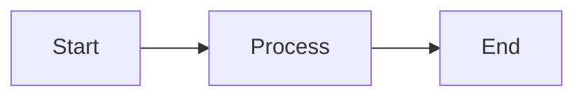
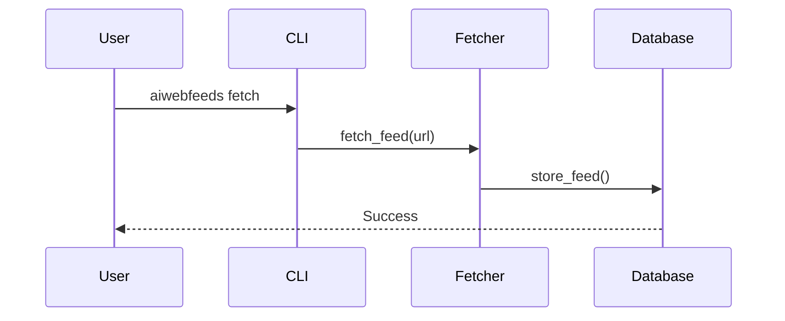

# Web Application - Agent Instructions

> **Component**: Documentation Website & Web Features\
> **Location**: `apps/web/`\
> **Parent**: [Root AGENTS.md](../../AGENTS.md)

## 📍 Essential Links

- **Full Documentation**: [llms-full.txt#web](https://aiwebfeeds.com/llms-full.txt#web)
- **Web Reference**: \[#file:web\](file:///Users/ww/dev/projects/ai-web-feeds/apps/web)
- **Root Instructions**: [../../AGENTS.md](../../AGENTS.md)
- **FumaDocs**: [fumadocs.dev](https://fumadocs.dev)

______________________________________________________________________

## 🎯 Purpose

Next.js 15 documentation site providing:

- **Documentation**: FumaDocs-powered MDX content
- **LLM Formats**: `/llms-full.txt`, `/llms.txt`, `/llms.md`, `/llms.mdx`
- **Data Explorer**: Interactive feeds/topics browser (`/explorer`)
- **Feeds**: RSS, Atom, JSON Feed
- **APIs**: Search, feeds, topics endpoints
- **Features**: Search, dark mode, OG images, Mermaid diagrams, math (KaTeX)

**Stack**: Next.js 15+, React 19, FumaDocs, Tailwind 4, TypeScript 5.9+, pnpm

**Data Integration**: Reads `data/feeds.yaml`, `data/topics.yaml`,
`data/feeds.enriched.yaml`

______________________________________________________________________

## 🏗️ Architecture

```
apps/web/
├── app/                      # Next.js App Router
│   ├── (home)/               # Homepage
│   ├── docs/                 # Documentation routes
│   │   ├── [[...slug]]/      # Dynamic MDX pages
│   │   └── layout.tsx        # Docs layout
│   ├── explorer/             # Data explorer (NEW)
│   │   ├── page.tsx          # Interactive feeds/topics browser
│   │   └── layout.tsx        # Explorer layout
│   ├── api/                  # API routes
│   │   ├── search/           # Search API
│   │   ├── feeds/            # Feeds API (NEW)
│   │   └── topics/           # Topics API (NEW)
│   ├── llms-full.txt/        # Full LLM docs
│   └── llms.txt/             # Concise LLM docs
├── content/docs/             # MDX documentation
│   ├── *.mdx                 # Doc pages
│   └── meta.json             # Navigation config
├── components/               # React components
│   ├── graph-visualizer.tsx  # Topic graph visualization (NEW)
│   ├── mdx/mermaid.tsx       # Mermaid diagrams
│   └── ui/                   # UI primitives
└── lib/
    ├── source.ts             # FumaDocs config
    └── rss.ts                # Feed generation
```

**See**: [llms-full.txt#web](https://aiwebfeeds.com/llms-full.txt#web) for complete
structure

______________________________________________________________________

## 📐 Development Rules

### 1. Content Management - ⚠️ CRITICAL DOCUMENTATION POLICY

**🚫 ABSOLUTE PROHIBITION: NO STANDALONE `.md` FILES ANYWHERE IN PROJECT**

**⚠️ THIS IS THE ONLY PLACE FOR ALL PROJECT DOCUMENTATION!**

- ✅ **ALL documentation MUST be `.mdx` files in `content/docs/`**
- ❌ **NEVER EVER create `.md` files** anywhere for documentation
- ❌ **NO EXCEPTIONS** - Not "temporary", not "supplementary", not "draft"
- ✅ **ALWAYS update `content/docs/meta.json`** to add pages to navigation
- ✅ **ALWAYS use proper frontmatter** with `title` and `description`

**Examples of ABSOLUTELY FORBIDDEN files (DELETE IF FOUND):**

```
❌ packages/ai_web_feeds/DATABASE.md
❌ packages/ai_web_feeds/GUIDE.md
❌ packages/ai_web_feeds/QUICK_START.md
❌ packages/ai_web_feeds/SIMPLIFIED_ARCHITECTURE.md
❌ apps/cli/USER_GUIDE.md
❌ apps/cli/COMMANDS.md
❌ apps/web/DATA_EXPLORER_README.md
❌ apps/web/FEATURES.md
❌ SIMPLIFICATION_SUMMARY.md
❌ NEW_FEATURE_DOCS.md
❌ ARCHITECTURE.md
❌ Any .md file except: README.md, CONTRIBUTING.md, CODE_OF_CONDUCT.md, LICENSE, AGENTS.md, WARP.md
```

**✅ CORRECT WORKFLOW FOR ANY DOCUMENTATION:**

1. Create `.mdx` file in `content/docs/`

   - Development guides → `content/docs/development/*.mdx`
   - User guides → `content/docs/guides/*.mdx`
   - Features → `content/docs/features/*.mdx`
   - API reference → `content/docs/reference/*.mdx`

1. Add proper frontmatter:

   ```mdx
   ---
   title: Page Title
   description: SEO description (required)
   ---

   # Page Title

   Content here...
   ```

1. Update `content/docs/meta.json`:

   ```json
   {
     "development": {
       "title": "Development",
       "pages": ["index", "your-new-page", "..."]
     }
   }
   ```

1. **NEVER** create a `.md` file as an alternative!

**Examples of CORRECT documentation locations:**

```mdx
✅ content/docs/development/database.mdx
✅ content/docs/development/architecture.mdx
✅ content/docs/guides/quickstart.mdx
✅ content/docs/guides/cli-usage.mdx
✅ content/docs/features/enrichment.mdx
✅ content/docs/reference/api.mdx
```

**IF YOU SEE A SPURIOUS `.md` FILE:**

1. Move its content to proper `.mdx` file in `content/docs/`
1. Delete the `.md` file
1. Update `meta.json`
1. Never create them again! } }

````

### 2. Navigation
Edit `content/docs/meta.json`:
```json
{
  "title": "Section",
  "pages": ["page-slug"]
}
````

### 3. MDX Components

```tsx
// Use custom components in MDX
import { Mermaid } from "@/components/mdx/mermaid";

<Mermaid chart={`graph TD; A-->B;`} />;
```

### 4. LLM Docs

- **Full docs**: Update in `app/llms-full.txt/route.ts`
- **Concise**: Update in `app/llms.txt/route.ts`
- Auto-generated from `content/docs/`

______________________________________________________________________

## 🧪 Testing

```bash
# Dev server
pnpm dev

# Build check
pnpm build

# Lint
pnpm lint

# Link validation
pnpm lint:links
```

**See**: [../../tests/AGENTS.md](../../tests/AGENTS.md) for testing patterns

______________________________________________________________________

## 🔄 Common Tasks

### Adding Documentation

1. Create `content/docs/new-page.mdx`
1. Add frontmatter (title, description)
1. Update `content/docs/meta.json`
1. Preview: `pnpm dev`
1. Verify LLM formats: `/llms-full.txt`

### Adding Components

1. Create in `components/` or `components/ui/`
1. Export from component file
1. Import in MDX or pages
1. Document in `content/docs/development/`

### Updating Feeds

- Edit `lib/rss.ts` for feed logic
- Regenerate: Automatically on build

### OG Images

- Auto-generated per page
- Customize: Edit `app/docs/opengraph-image.tsx`

______________________________________________________________________

## 🚨 Critical Patterns

### DO

✅ Use FumaDocs content structure\
✅ Add frontmatter to all MDX files\
✅ Update `meta.json` for navigation\
✅ Test LLM formats after doc changes\
✅ Use TypeScript strict mode\
✅ Run `pnpm lint` before commits

### DON'T

❌ Create standalone `.md` files\
❌ Skip frontmatter in MDX\
❌ Hard-code navigation (use `meta.json`)\
❌ Forget to update LLM docs\
❌ Use `any` types\
❌ Commit without linting

______________________________________________________________________

## 📚 Reference

**FumaDocs guide**: [fumadocs.dev/docs](https://fumadocs.dev/docs)\
**Next.js 15 docs**: [nextjs.org/docs](https://nextjs.org/docs)\
**Full implementation**: [llms-full.txt#web](https://aiwebfeeds.com/llms-full.txt#web)\
**Root workflow**: [../../AGENTS.md](../../AGENTS.md#standard-workflow)

______________________________________________________________________

_Updated: October 15, 2025 · Version: 0.1.0_

______________________________________________________________________

## 🆕 Recent Updates

### Data Explorer (October 2025)

New interactive explorer at `/explorer`:

- Browse all feeds with filters and search
- Visualize topic taxonomy as graph
- Explore feed-topic relationships
- Real-time data from YAML files

**Implementation**: React 19, Tailwind 4, responsive design

### API Endpoints (October 2025)

New REST APIs:

- `GET /api/feeds` - List all feeds with pagination
- `GET /api/feeds/[id]` - Get feed details
- `GET /api/topics` - Topic taxonomy with graph structure
- `GET /api/topics/[id]` - Topic details and relations

**Data Source**: `data/feeds.yaml`, `data/topics.yaml`, `data/feeds.enriched.yaml`

______________________________________________________________________

## 🛠️ Development Guidelines

### Development Workflow

```bash
cd apps/web

# Install dependencies
pnpm install

# Start dev server (with Turbo)
pnpm dev

# Open http://localhost:3000

# Build for production
pnpm build

# Start production server
pnpm start
```

### Code Style

**TypeScript**: Strict mode enabled

```typescript
// tsconfig.json
{
  "compilerOptions": {
    "strict": true,
    "noUncheckedIndexedAccess": true,
    "noImplicitAny": true
  }
}
```

**React Patterns**:

```typescript
import { type FC } from 'react'

interface Props {
  title: string
  description?: string
}

// Functional component with TypeScript
export const Component: FC<Props> = ({ title, description }) => {
  return (
    <div>
      <h1>{title}</h1>
      {description && <p>{description}</p>}
    </div>
  )
}
```

**File Naming**:

- Components: `kebab-case.tsx` (e.g., `page-actions.tsx`)
- Utilities: `kebab-case.ts` (e.g., `cn.ts`)
- Routes: Next.js conventions (e.g., `page.tsx`, `layout.tsx`, `route.ts`)

### Linting & Formatting

```bash
# ESLint
pnpm lint
pnpm lint --fix

# Link validation
pnpm lint:links
pnpm lint:links:bun  # Using Bun runtime
```

______________________________________________________________________

## 📝 Content Management

### Adding Documentation Pages

1. **Create MDX file** in `content/docs/`:

````mdx
---
title: Page Title
description: SEO description for this page
---

# Page Title

Your content here with **Markdown** formatting.

## Code Example

```python
def hello():
    print("Hello, world!")
```
````

## Math

Inline math: $E = mc^2$

Block math:

$$ \\int\_{0}^{\\infty} e^{-x^2} dx = \\frac{\\sqrt{\\pi}}{2} $$

## Diagram



````

2. **Update navigation** in `content/docs/meta.json`:

```json
{
  "section-name": {
    "title": "Section Title",
    "pages": ["page-slug"]
  }
}
````

3. **Test locally**:

```bash
pnpm dev
# Visit http://localhost:3000/docs/section-name/page-slug
```

### MDX Components

Custom components available in MDX:

````mdx
import { Callout } from "fumadocs-ui/components/callout";
import { Card, Cards } from "fumadocs-ui/components/card";
import { Tab, Tabs } from "fumadocs-ui/components/tabs";

<Callout type="info">Important information here</Callout>

<Cards>
  <Card title="Card 1" description="Description" href="/link" />
  <Card title="Card 2" description="Description" href="/link" />
</Cards>

<Tabs items={["npm", "pnpm", "yarn"]}>
  <Tab value="npm">```bash npm install package ```</Tab>
  <Tab value="pnpm">```bash pnpm add package ```</Tab>
</Tabs>
````

### FumaDocs Configuration

Edit `source.config.ts`:

```typescript
import { defineDocs, defineConfig } from "fumadocs-mdx/config";

export const { docs, meta } = defineDocs({
  dir: "content/docs",
});

export default defineConfig({
  lastModifiedTime: "git",
  mdxOptions: {
    rehypePlugins: [
      // Add rehype plugins
    ],
    remarkPlugins: [
      // Add remark plugins
    ],
  },
});
```

______________________________________________________________________

## ✨ Special Features

### LLM-Optimized Documentation

The site generates LLM-friendly documentation:

**`/llms-full.txt`**: Complete documentation in plain text

- Implementation: `app/llms-full.txt/route.ts`
- Concatenates all MDX content
- Removes formatting, keeps structure
- Perfect for AI context windows

**`/llms.txt`**: Concise summary

- Implementation: `app/llms.txt/route.ts`
- Key information only
- Quick reference format

### Feed Generation

Multiple feed formats automatically generated:

**RSS 2.0**: `app/rss.xml/route.ts`

```typescript
import RSS from "rss";
import { docs } from "@/lib/source";

export async function GET() {
  const feed = new RSS({
    title: "AI Web Feeds",
    description: "RSS/Atom feed management toolkit",
    site_url: "https://aiwebfeeds.com",
    feed_url: "https://aiwebfeeds.com/rss.xml",
  });

  for (const doc of docs) {
    feed.item({
      title: doc.title,
      description: doc.description,
      url: `https://aiwebfeeds.com${doc.url}`,
      date: doc.date,
    });
  }

  return new Response(feed.xml(), {
    headers: { "Content-Type": "application/xml" },
  });
}
```

**Atom**: `app/atom.xml/route.ts`\
**JSON Feed**: `app/feed.json/route.ts`

### OpenGraph Images

Dynamic OG images generated per page:

```typescript
// app/docs/opengraph-image.tsx
import { ImageResponse } from 'next/og'

export default async function Image({ params }: { params: { slug: string[] } }) {
  const page = await getPage(params.slug)

  return new ImageResponse(
    (
      <div style={{
        fontSize: 60,
        background: 'linear-gradient(to bottom right, #1e293b, #334155)',
        width: '100%',
        height: '100%',
        display: 'flex',
        alignItems: 'center',
        justifyContent: 'center',
        color: 'white',
      }}>
        {page.title}
      </div>
    ),
    {
      width: 1200,
      height: 630,
    }
  )
}
```

### PDF Export

Export documentation to PDF:

```bash
# Export all docs
pnpm export-pdf

# Export specific pages
pnpm export-pdf:specific

# Build and export
pnpm export-pdf:build
```

Implementation: `scripts/export-pdf.ts` using Puppeteer

### Math Rendering

KaTeX for mathematical notation:

```mdx
Inline: $\sum_{i=1}^{n} i = \frac{n(n+1)}{2}$

Block:

$$
\int_{-\infty}^{\infty} e^{-x^2} dx = \sqrt{\pi}
$$
```

### Mermaid Diagrams

````mdx

````

````

---

## 🎯 Common Tasks

### Adding a New Section

1. Create directory: `content/docs/new-section/`
2. Add `index.mdx` for section homepage
3. Add pages as MDX files
4. Update `content/docs/meta.json`:

```json
{
  "new-section": {
    "title": "New Section",
    "pages": ["index", "page-1", "page-2"]
  }
}
````

### Adding a React Component

1. Create in `components/`:

```typescript
// components/my-component.tsx
import { type FC } from 'react'

interface MyComponentProps {
  title: string
}

export const MyComponent: FC<MyComponentProps> = ({ title }) => {
  return <div className="rounded-lg border p-4">{title}</div>
}
```

2. Use in MDX:

```mdx
import { MyComponent } from "@/components/my-component";

<MyComponent title="Hello" />
```

### Updating Dependencies

```bash
cd apps/web

# Update specific package
pnpm update package-name

# Update all packages
pnpm update

# Interactive upgrade
pnpm upgrade --interactive

# Update Next.js
pnpm update next@latest react@latest react-dom@latest
```

### Adding API Routes

Create in `app/api/`:

```typescript
// app/api/hello/route.ts
import { NextResponse } from "next/server";

export async function GET(request: Request) {
  return NextResponse.json({ message: "Hello, world!" });
}

export async function POST(request: Request) {
  const body = await request.json();
  return NextResponse.json({ received: body });
}
```

______________________________________________________________________

## 🐛 Troubleshooting

### Build Errors

```bash
# Clear Next.js cache
rm -rf .next

# Reinstall dependencies
rm -rf node_modules pnpm-lock.yaml
pnpm install

# Rebuild
pnpm build
```

### MDX Processing Issues

```bash
# Regenerate MDX files
pnpm postinstall

# Check fumadocs-mdx
pnpm add fumadocs-mdx@latest
```

### Link Validation Failures

```bash
# Run link checker
pnpm lint:links

# Fix broken links in content/docs/
# Update URLs in MDX frontmatter or content
```

### Hot Reload Not Working

```bash
# Use Turbo mode
pnpm dev --turbo

# Or without Turbo
next dev
```

______________________________________________________________________

## 📚 Resources

- [Next.js Documentation](https://nextjs.org/docs)
- [FumaDocs Documentation](https://fumadocs.dev/docs)
- [FumaDocs LLM Format](https://fumadocs.dev/llms-full.txt)
- [MDX Documentation](https://mdxjs.com/)
- [Tailwind CSS](https://tailwindcss.com/docs)
- [React 19 Docs](https://react.dev/)

______________________________________________________________________

_Last Updated: October 2025_
