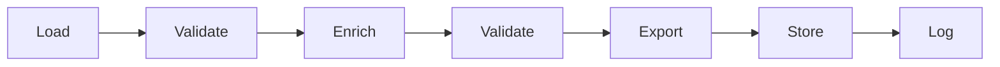
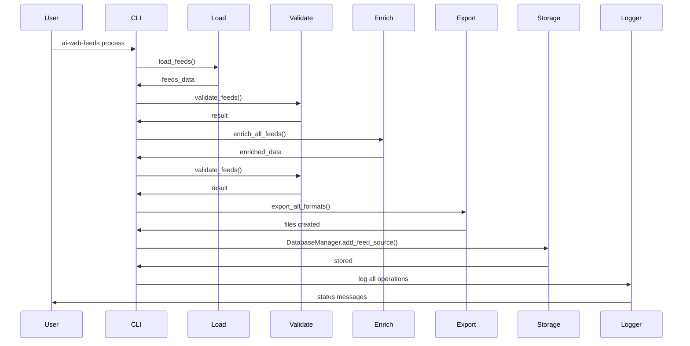

# Simplified Architecture

AIWebFeeds has been designed with a clean, linear processing pipeline that makes it easy to understand and use.

## Processing Pipeline

The core workflow follows a simple, predictable pattern:



## Core Modules

The project is organized into 8 primary modules:

### 1. Load (`load.py`)

Handles all YAML loading and saving operations.

**Functions:**
- `load_feeds(path)` - Load feeds from YAML file
- `load_topics(path)` - Load topics from YAML file
- `save_feeds(data, path)` - Save feeds to YAML file
- `save_topics(data, path)` - Save topics to YAML file

### 2. Validate (`validate.py`)

Validates feeds against JSON schemas and performs additional checks.

**Functions:**
- `validate_feeds(data, schema_path)` - Validate feeds against schema
- `validate_topics(data, schema_path)` - Validate topics against schema

**Returns:** `ValidationResult` object with `.valid` boolean and `.errors` list

### 3. Enrich (`enrich.py`)

Enriches feeds with metadata, quality scores, and AI-generated content.

**Functions:**
- `enrich_all_feeds(feeds_data)` - Enrich all feed sources
- `enrich_feed_source(source)` - Enrich a single feed source

### 4. Export (`export.py`)

Exports data to various formats (JSON, OPML).

**Functions:**
- `export_to_json(data, output_path)` - Export to JSON
- `export_to_opml(data, output_path, categorized)` - Export to OPML
- `export_all_formats(data, base_path, prefix)` - Export to all formats

### 5. Logger (`logger.py`)

Configures structured logging with loguru.

**Features:**
- Colored console output
- File logging with rotation
- Structured log messages

### 6. Models (`models.py`)

Data models using SQLModel (SQLAlchemy + Pydantic).

**Main Models:**
- `FeedSource` - Feed source with metadata
- `Topic` - Topic with graph structure
- `FeedItem` - Individual feed items
- Enums: `SourceType`, `FeedFormat`, `CurationStatus`, etc.

### 7. Storage (`storage.py`)

Database operations and persistence.

**DatabaseManager Methods:**
- `create_db_and_tables()` - Initialize database
- `add_feed_source(feed_source)` - Store feed source
- `get_all_feed_sources()` - Retrieve all sources
- `add_topic(topic)` - Store topic

### 8. Utils (`utils.py`)

Helper functions for various operations.

**Features:**
- Platform-specific feed URL generation
- Feed discovery
- URL validation
- Other utilities

## CLI Usage

### Complete Pipeline

Run the entire workflow with a single command:

```bash
ai-web-feeds process
```

**Options:**
- `--input`, `-i` - Input feeds YAML file (default: `data/feeds.yaml`)
- `--output`, `-o` - Output enriched YAML file (default: `data/feeds.enriched.yaml`)
- `--schema`, `-s` - JSON schema file for validation
- `--database`, `-d` - Database URL (default: `sqlite:///data/aiwebfeeds.db`)
- `--export/--no-export` - Export to additional formats
- `--skip-validation` - Skip validation steps
- `--skip-enrichment` - Skip enrichment step

### Individual Commands

For granular control:

```bash
# Load only
ai-web-feeds load data/feeds.yaml

# Validate only
ai-web-feeds validate data/feeds.yaml --schema data/feeds.schema.json

# Enrich only
ai-web-feeds enrich data/feeds.yaml --output data/feeds.enriched.yaml

# Export only
ai-web-feeds export data/feeds.yaml --output-dir data --prefix feeds
```

## Python API

You can also use the core package directly in Python:

```python
from ai_web_feeds import (
    load_feeds,
    validate_feeds,
    enrich_all_feeds,
    export_all_formats,
    DatabaseManager,
)

# Load
feeds_data = load_feeds("data/feeds.yaml")

# Validate
result = validate_feeds(feeds_data, "data/feeds.schema.json")
if not result.valid:
    print("Validation errors:", result.errors)

# Enrich
enriched_data = enrich_all_feeds(feeds_data)

# Export
export_all_formats(enriched_data, "output/", "feeds.enriched")

# Store
db = DatabaseManager("sqlite:///data/aiwebfeeds.db")
db.create_db_and_tables()
```

## Benefits

1. **Linear Flow** - Easy to understand: load → validate → enrich → export + store
2. **Modular** - Each step is independent and can be used separately
3. **Testable** - Simple functions with clear inputs/outputs
4. **Flexible** - Skip steps as needed, use CLI or Python API
5. **Clear Separation** - Core logic in package, user interface in CLI
6. **Type-Safe** - Full type annotations throughout
7. **Logged** - All operations are logged for debugging

## Data Flow



## Package Structure

```
packages/ai_web_feeds/src/ai_web_feeds/
├── __init__.py       # Public API exports
├── load.py          # Load/save YAML
├── validate.py      # Schema validation
├── enrich.py        # Metadata enrichment
├── export.py        # Format conversion
├── logger.py        # Logging setup
├── models.py        # Data models
├── storage.py       # Database operations
└── utils.py         # Helper functions
```

## Next Steps

- [CLI Guide](/docs/guides/cli-usage) - Learn how to use the CLI
- [Python API](/docs/reference/api) - Use the Python API
- [Development](/docs/development) - Contributing to AIWebFeeds
