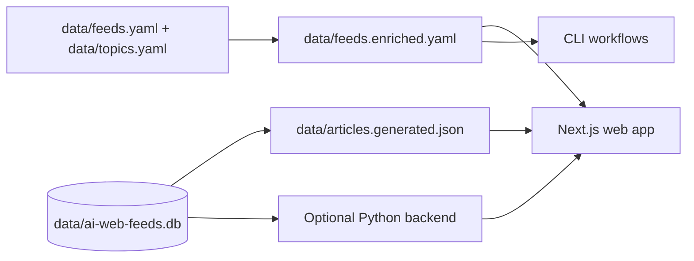

AI Web Feeds has one repository but several clear responsibilities inside it.

## High-Level Pieces

```mermaid
flowchart LR
    catalog[data/feeds.yaml + data/topics.yaml] --> enriched[data/feeds.enriched.yaml]
    enriched --> web[Next.js web app]
    enriched --> cli[CLI workflows]
    runtime[(data/ai-web-feeds.db)] --> corpus[data/articles.generated.json]
    corpus --> web
    runtime --> backend[Optional Python backend]
    backend --> web
```

## Catalog Layer

The catalog starts from checked-in YAML files and schemas under `data/`. Those files define which sources exist and how they are grouped.

## Runtime Layer

The runtime database stores fetched entries, validation history, analytics data, recommendation inputs, and other operational state. The generated article library is exported from that runtime data so the standalone web app can browse recent posts without depending on direct database access.

## Web Layer

The Next.js app serves:

- the public pages such as Reader, Sources, Topics, Dashboard, docs, and OPML export
- the docs site
- API routes that read from repository data and generated artifacts
- optional proxy routes that forward to the Python backend when configured

## CLI Layer

The CLI is the operator surface for tasks such as:

- validating catalog data
- enriching feed metadata
- refreshing runtime data
- exporting OPML and article artifacts

## Optional Backend Layer

The Python backend is only required for server-backed features such as recommendations and analytics endpoints. The main browsing and export flow works without it.

## Related

- [Data Sources and Ownership](/docs/development/runtime-authority)
- [Search Architecture](/docs/development/search-architecture)
- [Deployment Guide](/docs/guides/deployment)
