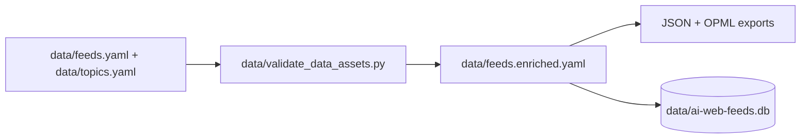
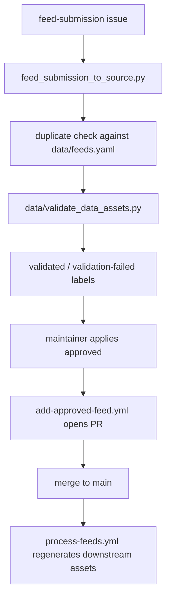

import { Callout } from "fumadocs-ui/components/callout";

# Data Lifecycle

This repository separates **authored data changes** from **derived outputs** and
**runtime materialization**. A change to the feed catalog should move through the
same sequence whether it starts locally or through GitHub issue intake.

## Local lifecycle



### Recommended local commands

```bash
uv run python data/validate_data_assets.py
uv run ai-web-feeds load from-yaml data/feeds.yaml --clear
uv run ai-web-feeds validate all --strict
uv run ai-web-feeds enrich all --input data/feeds.yaml --output data/feeds.enriched.yaml
uv run ai-web-feeds export all --input data/feeds.yaml --output-dir data
```

## Validation order

The current repository validator runs these checks in order:

1. JSON schemas
2. YAML data files
3. sample analytics JSON
4. SQLite database validation

That order is important: schema and catalog failures should stop a pipeline
before downstream runtime materialization.

## GitHub intake lifecycle

Feed submission workflows stage mutations instead of editing `main` directly.



## Authored vs derived files

| Asset                        | Role                           |
| ---------------------------- | ------------------------------ |
| `data/feeds.yaml`            | authored feed catalog          |
| `data/topics.yaml`           | authored taxonomy              |
| `data/feeds.enriched.yaml`   | derived enriched catalog       |
| `data/*.opml`, exported JSON | derived distribution artifacts |
| `data/ai-web-feeds.db`       | runtime materialization        |

<Callout type="info" title="Mutation rule">
  Change the authored YAML when the catalog itself changes. Regenerate enriched or exported assets after validation rather than hand-editing them first.
</Callout>

## Related documentation

- [Runtime authority](/docs/development/runtime-authority)
- [Workflow safety](/docs/development/workflow-safety)
- [CLI usage](/docs/development/cli)
