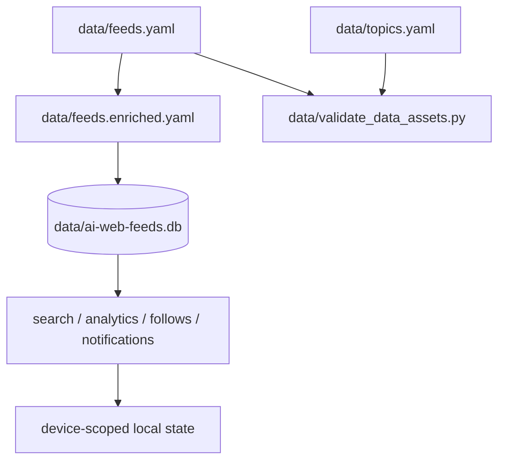

import { Callout } from "fumadocs-ui/components/callout";

# Runtime Authority

This page describes which asset is authoritative for each layer of the system.
Not every file in the repository has the same status.

## Authority tiers

| Tier | Canonical assets | Used for |
| --- | --- | --- |
| Authored repository truth | `data/feeds.yaml`, `data/topics.yaml`, JSON schemas | contributor-edited catalog and taxonomy |
| Derived repository assets | `data/feeds.enriched.yaml`, exported JSON/OPML | checked-in outputs generated from authored inputs |
| Runtime database | `data/ai-web-feeds.db` canonical; fallback to `data/aiwebfeeds.db` only when the canonical file is missing | search, analytics, follows, notifications, saved searches, validation history |
| Browser-local runtime | IndexedDB, localStorage, reader-local state | anonymous on-device reader preferences and article state |
| External backend proxy | `BACKEND_URL`-backed Python service | web routes that proxy runtime search/storage operations |

## Bounded app contexts

The repository still ships one Next.js application, but implementation work is
split across four bounded contexts:

| Context | Primary responsibility | Typical paths |
| --- | --- | --- |
| Docs shell | static docs, content rendering, and navigation | `app/docs`, `content/docs`, docs UI components |
| Public feeds workspace | catalog, article search, recommendations, saved state, and reader UX | `app/feeds`, `components/search`, `components/reader`, browser state helpers |
| Admin | operational dashboards, telemetry inspection, and admin session enforcement | `app/admin`, `components/admin`, `lib/admin-auth.ts` |
| Backend proxy | route handlers that normalize browser requests and forward them to Python services | `app/api/**`, `lib/backend.ts`, anonymous identity helpers |

Treat these as bounded code ownership areas inside one deployment, not as
separate deployables or packages.

## What each layer owns

### Authored repository truth

- `data/feeds.yaml` is the minimal curated source registry.
- `data/topics.yaml` is the topic taxonomy.
- schemas in `data/*.schema.json` define the validation contract for those files.

These files are the starting point for contributor changes and workflow intake.

### Derived repository assets

- `data/feeds.enriched.yaml` is derived from the authored feed catalog.
- exported JSON and OPML files are downstream artifacts, not the canonical input.

Treat these as generated or regenerated outputs whenever the authored catalog
changes.

### Runtime database

The runtime SQLite store is where the application materializes operational data:

- feed/search indices
- validation and monitoring history
- recommendation inputs
- user-scoped follows, preferences, notifications, and digests

Operational file handling is intentionally scoped:

- `data/ai-web-feeds.db` is the canonical runtime filename.
- `data/aiwebfeeds.db` remains a legacy compatibility fallback for older local
  installs when the canonical file has not been materialized yet.
- Extra scratch databases under `data/` are not authoritative repository assets
  and should be kept out of the tracked data root.

Bootstrap policy is intentionally split by environment:

- `DatabaseManager.create_db_and_tables()` is the supported entrypoint.
- File-backed databases upgrade through Alembic revisions in `packages/alembic/`.
- `sqlite:///:memory:` uses `SQLModel.metadata.create_all()` for test-only
  bootstrap parity.

Core runtime tables backing search, recommendations, analytics, and trending are:

- `sources`, `topics`, `validations`, `analytics`, `analytics_snapshots`, `topic_stats`
- `feed_embeddings`, `search_queries`, `saved_searches`
- `recommendation_interactions`, `user_profiles`, `user_feed_follows`
- `feed_entries`, `trending_topics`, `notification_preferences`, `email_digests`

Use the runtime database for behavior; use the YAML catalog for authorship.

### Browser-local runtime

Anonymous reader features are intentionally device-scoped.

- local reader state stays on the client
- local preferences and article state do not require an end-user account
- a server-issued anonymous binding cookie is used when server APIs must scope
  user-specific mutations

### Anonymous identity lifecycle

The public app intentionally avoids end-user login for reader features. The
identity flow is:

1. The browser reads any previously stored device UUID from `localStorage`.
2. The first server-scoped write or `/api/identity` bootstrap call establishes
   the authoritative anonymous identity.
3. The server returns that UUID in the response header and binds it to an
   HttpOnly cookie.
4. Browser helpers persist the echoed UUID locally, but the server-issued
   binding remains the only trusted identity for authorization checks.
5. Search-scoped analytics and saved-search mutations must await the shared
   bootstrap promise before they send, so the first persisted write cannot race
   the server-issued binding cookie.

Client-provided UUIDs are convenience hints. The binding cookie is the
authority.

### External backend proxy

Some web APIs proxy to a Python backend when `BACKEND_URL` is configured.
Examples include runtime search/storage paths that are not served straight from
repository data files.

## Precedence rules

## Web catalog loading behavior

The web app prefers repository catalog files in this order:

1. `data/feeds.enriched.yaml`
2. `data/feeds.yaml`
3. `data/feeds.json`

That means the public catalog can still render even when a backend service is
not running, but runtime-only features still depend on the database or backend
proxy layer.

<Callout type="info" title="Practical rule">
  Edit YAML when you are changing the catalog itself. Use the runtime database
  when you are inspecting operational behavior such as search, analytics, saved
  searches, follows, or monitoring state.
</Callout>

## Related documentation

- [Data lifecycle](/docs/development/data-lifecycle)
- [Search architecture](/docs/development/search-architecture)
- [Workflow safety](/docs/development/workflow-safety)
