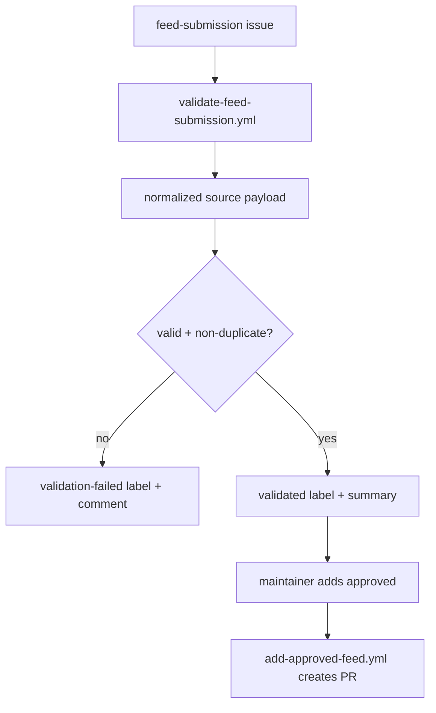

import { Callout } from "fumadocs-ui/components/callout";

# Workflow Safety

GitHub automation in this repository follows a narrow, reviewable mutation
model. Deterministic YAML workflows remain canonical, and experimental agentic
workflows are additive until they are explicitly adopted.

## Workflow types

| Path                      | Meaning                                                                           |
| ------------------------- | --------------------------------------------------------------------------------- |
| `.github/workflows/*.yml` | active GitHub Actions workflows                                                   |
| `.github/workflows/*.md`  | gh-aw source files that document or distill workflow logic, not active by default |

## Safety rules

- keep new automation additive and reviewable
- prefer read-only or report-only pilots first
- never mutate repository state directly from untrusted issue or PR text
- stage feed-submission mutations behind validation and maintainer approval
- use OIDC trusted publishing for releases instead of long-lived package tokens

## Feed-submission safety gates



### Why this matters

- validation happens before any repository mutation path is allowed
- approval creates a reviewable PR instead of pushing to `main`
- maintainers stay in the loop for the final mutation decision

## Auto-fix safety

The auto-fix workflow is intentionally limited:

- it only runs on same-repository pull requests
- it only commits when there is an actual diff after the fix command runs
- it does not push directly to `main`

## Trusted publishing

The release workflow uses GitHub OIDC trusted publishing:

- `id-token: write` is granted in `release.yml`
- package publishing is done through `pypa/gh-action-pypi-publish`
- build artifacts are created first and then published from those artifacts

<Callout type="info" title="Current gh-aw posture">
  Experimental `.md` workflow sources are an additive distillation layer on top of deterministic YAML workflows. Keep them read-only or report-only until there is an explicit replacement or compilation plan for any live `.yml` workflow.
</Callout>

## Local validation before workflow edits

```bash
uv run python data/validate_data_assets.py
uv run pytest
pnpm --dir apps/web build
pnpm --dir apps/web lint:links
```

## Related documentation

- [GitHub infrastructure](/docs/guides/github-infrastructure)
- [Workflow quick reference](/docs/guides/workflow-reference)
- [Security policy](/docs/security)
