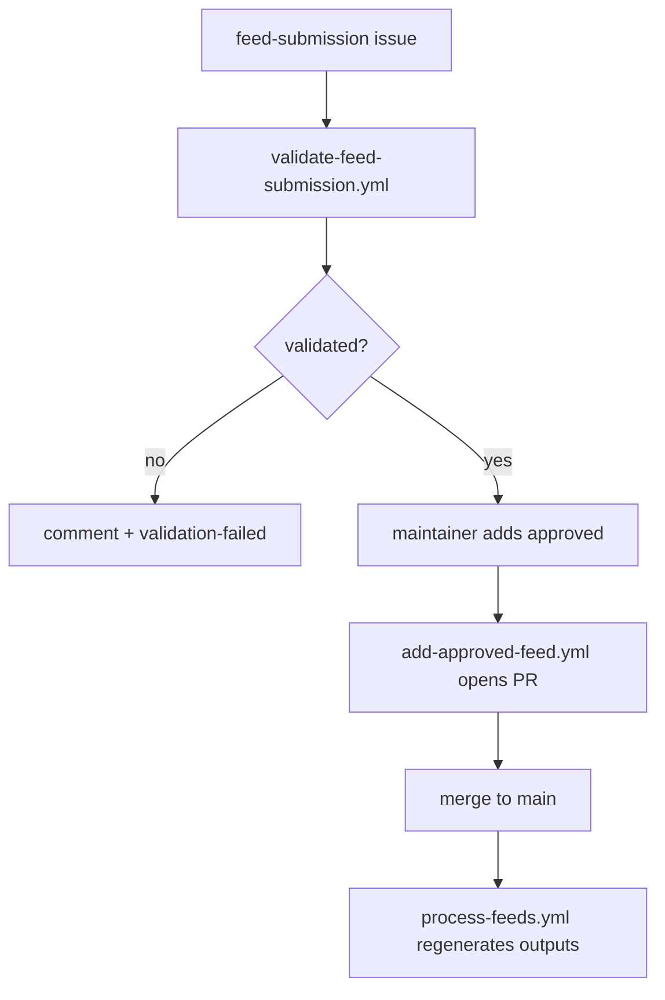
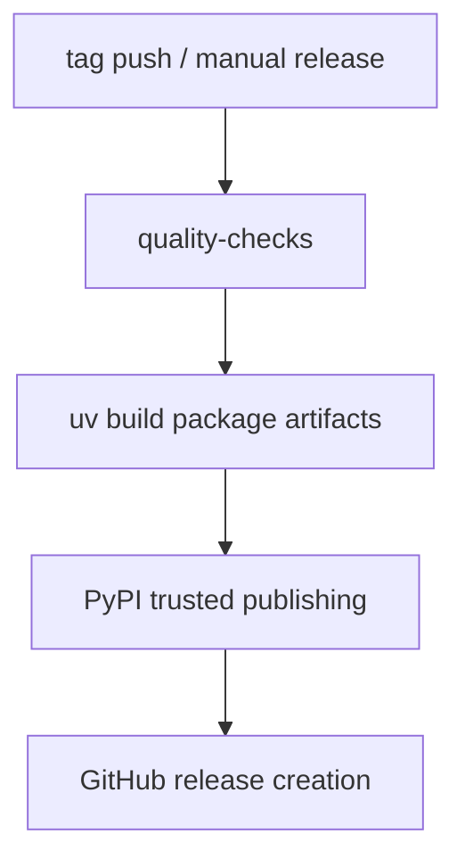

import { Callout } from "fumadocs-ui/components/callout";

# GitHub Actions Workflows

The repository uses conventional GitHub Actions YAML workflows for active
automation, with additive GitHub Agentic Workflow source files kept separately
as `.md` pilots.

## Workflow model

| Path                      | Meaning                                                                                                 |
| ------------------------- | ------------------------------------------------------------------------------------------------------- |
| `.github/workflows/*.yml` | active workflows                                                                                        |
| `.github/workflows/*.md`  | experimental gh-aw source files, a non-canonical distillation layer on top of the active YAML workflows |

## Active workflow categories

| Workflow                       | What it does                                                            |
| ------------------------------ | ----------------------------------------------------------------------- |
| `quality-enforcement.yml`      | lint, format, type, build, and CLI quality gate                         |
| `coverage.yml`                 | Python test coverage reporting                                          |
| `validate-feed-submission.yml` | normalize and validate feed-submission issues                           |
| `add-approved-feed.yml`        | open a PR from a previously validated submission                        |
| `validate-all-feeds.yml`       | scheduled/manual registry validation                                    |
| `process-feeds.yml`            | run the processing pipeline on `main` changes                           |
| `auto-fix.yml`                 | same-repo PR auto-fixes via `uv run fix`                                |
| `release.yml`                  | pre-release checks, build artifacts, trusted publishing, GitHub release |
| `dependency-updates.yml`       | dependency refresh and maintenance                                      |
| `dependency-review.yml`        | dependency security review on PRs                                       |
| `codeql-analysis.yml`          | code scanning                                                           |

## Feed submission lifecycle



## Release lifecycle



## Local mirrors for workflow checks

```bash
uv run python data/validate_data_assets.py
uv run pytest
uv run ai-web-feeds validate all --strict
pnpm --dir apps/web build
pnpm --dir apps/web lint:links
```

These commands are the safest way to reproduce the catalog, test, and docs
checks locally before changing workflow files.

<Callout type="info" title="Safety posture">
  Workflow mutations should stay narrow and reviewable. Feed intake must validate before it mutates anything, auto-fix only runs on same-repo PRs, and release publishing relies on GitHub OIDC trusted publishing. gh-aw pilots should stay read-only or report-only until they are explicitly adopted.
</Callout>

## Related documentation

- [Workflow safety](/docs/development/workflow-safety)
- [CLI workflows](/docs/development/cli-workflows)
- [Workflow quick reference](/docs/guides/workflow-reference)
