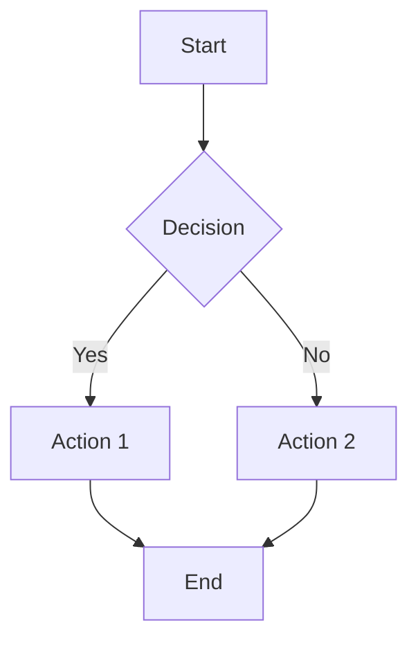
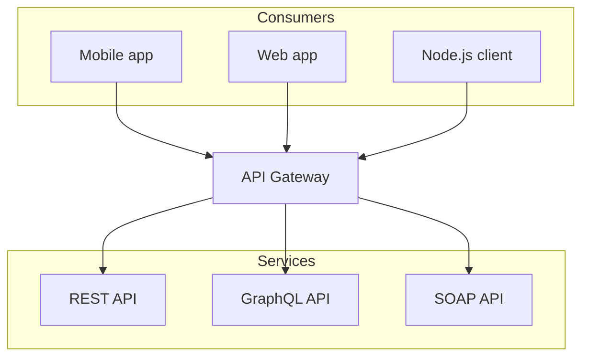
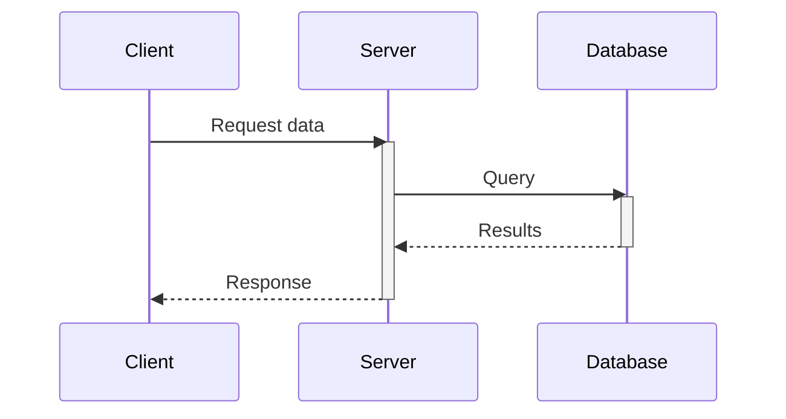
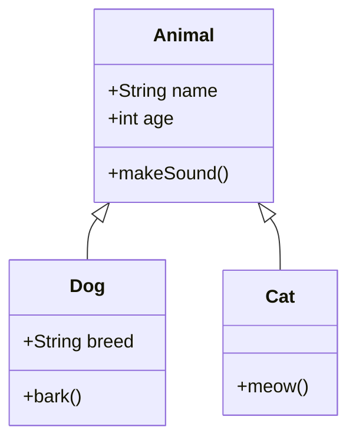
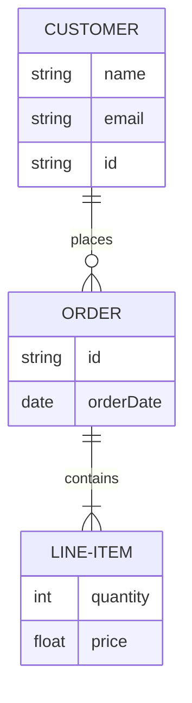
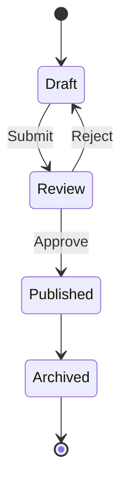
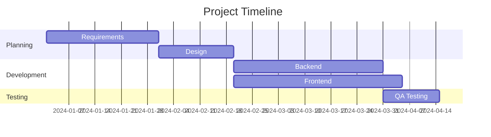
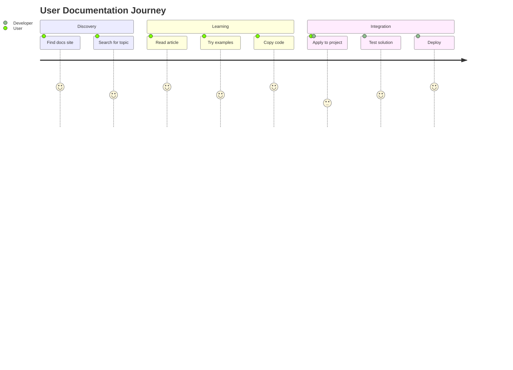
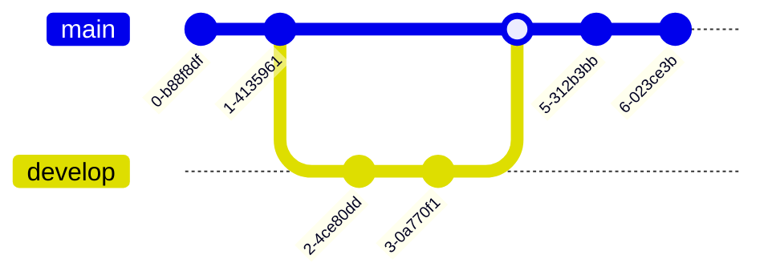
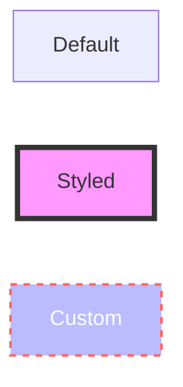

import { Mermaid } from '@/components/mdx/mermaid';
import { Tab, Tabs } from 'fumadocs-ui/components/tabs';

## Overview

Mermaid is a JavaScript-based diagramming and charting tool that uses Markdown-inspired syntax to create and modify diagrams dynamically. This site integrates Mermaid to enable rich, interactive diagrams in documentation.

## Features

- **Theme-aware**: Diagrams automatically adapt to light/dark mode
- **Interactive**: Clickable elements and tooltips
- **Multiple diagram types**: Flowcharts, sequence diagrams, class diagrams, ER diagrams, and more
- **Simple syntax**: Write diagrams using a Markdown-like syntax

## Basic Usage

### Method 1: Mermaid Code Blocks

The simplest way to add a Mermaid diagram is using a fenced code block with the `mermaid` language identifier:

````md

````


### Method 2: Component Syntax

You can also use the `<Mermaid>` component directly for more control:

```mdx
<Mermaid
  chart="
graph LR;
    A[Client] --> B[Load Balancer];
    B --> C[Server1];
    B --> D[Server2];"
/>
```

<Mermaid
  chart="
graph LR;
    A[Client] --> B[Load Balancer];
    B --> C[Server1];
    B --> D[Server2];"
/>

## Diagram Types

### Flowcharts

Create process flows and decision trees:



### Sequence Diagrams

Visualize interaction between components:



### Class Diagrams

Document object-oriented structures:



### Entity Relationship Diagrams

Model database schemas:



### State Diagrams

Show state transitions:



### Gantt Charts

Project timelines and scheduling:



### User Journey

Map user experiences:



### Git Graph

Visualize Git workflows:



## Advanced Features

### Subgraphs

Organize complex diagrams with subgraphs:

<Tabs items={['Diagram', 'Code']}>
  <Tab value="Diagram">
    ```mermaid
    graph TB
        subgraph Frontend
            A[React App]
            B[Vue App]
        end
        subgraph Backend
            C[API Server]
            D[Auth Service]
        end
        subgraph Database
            E[(PostgreSQL)]
            F[(Redis)]
        end
        A --> C
        B --> C
        C --> D
        C --> E
        D --> F
    ```
  </Tab>
  <Tab value="Code">
    ````md
    ```mermaid
    graph TB
        subgraph Frontend
            A[React App]
            B[Vue App]
        end
        subgraph Backend
            C[API Server]
            D[Auth Service]
        end
        subgraph Database
            E[(PostgreSQL)]
            F[(Redis)]
        end
        A --> C
        B --> C
        C --> D
        C --> E
        D --> F
    ```
    ````
  </Tab>
</Tabs>

### Styling

Customize diagram appearance with inline styles:



## Best Practices

### Keep It Simple

- Start with simple diagrams and add complexity gradually
- Use subgraphs to organize large diagrams
- Keep labels concise and clear

### Use Consistent Naming

- Use descriptive node IDs
- Follow a naming convention across diagrams
- Use consistent shapes for similar elements

### Example: Good vs. Not Ideal

<Tabs items={['Good ✅', 'Not Ideal ⚠️']}>
  <Tab value="Good ✅">
    ```mermaid
    graph TD
        user[User] --> auth[Authentication]
        auth --> validate{Valid?}
        validate -->|Yes| dashboard[Dashboard]
        validate -->|No| error[Error Page]
    ```
  </Tab>
  <Tab value="Not Ideal ⚠️">
    ```mermaid
    graph TD
        n1[User enters credentials and submits form] --> n2[System validates]
        n2 --> n3{Is username and password correct?}
        n3 -->|Validation successful| n4[Redirect to main dashboard view]
        n3 -->|Validation failed| n5[Display error message to user]
    ```
  </Tab>
</Tabs>

## Troubleshooting

### Diagram Not Rendering

- Ensure `mermaid` and `next-themes` are installed
- Check console for syntax errors
- Verify the diagram type is supported

### Theme Issues

- The component automatically detects light/dark mode
- If themes don't switch, check that `RootProvider` is properly configured

### Syntax Errors

- Use the [Mermaid Live Editor](https://mermaid.live/) to validate syntax
- Check the [official Mermaid documentation](https://mermaid.js.org/) for syntax reference

## Resources

- [Mermaid Official Documentation](https://mermaid.js.org/)
- [Mermaid Live Editor](https://mermaid.live/)
- [Mermaid Cheat Sheet](https://jojozhuang.github.io/tutorial/mermaid-cheat-sheet/)
- [Fumadocs Mermaid Guide](https://fumadocs.dev/docs/ui/markdown/mermaid)

## Next Steps

- Explore different diagram types in the examples above
- Check out the [Mermaid syntax documentation](https://mermaid.js.org/intro/syntax-reference.html)
- Review our [Documentation Guide](/docs/guides/documentation) for general writing tips
