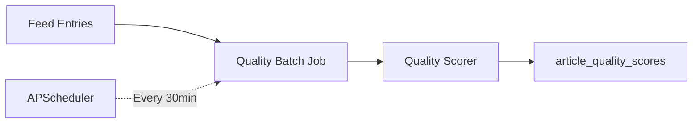

# Quality Scoring

Quality Scoring analyzes articles using heuristic metrics to compute quality scores ranging from 0-100. This helps surface high-quality content and filter low-quality articles.

## Overview

The quality scorer evaluates articles across multiple dimensions:

- **Depth**: Word count, paragraph structure, technical content (code blocks, diagrams)
- **References**: External links, academic citations, reputable domains
- **Author Authority**: Author credentials and expertise (planned)
- **Domain Reputation**: Feed source quality and reliability
- **Engagement**: Read time estimates and user signals (planned)

## Architecture



## Scoring Components

### Depth Score (0-100)

Evaluates content depth based on:

- **Word Count**: Higher scores for longer articles (500+ words)
- **Structure**: Rewards well-organized content with multiple paragraphs
- **Technical Content**: Bonus points for code blocks (\`\`\`) and images
- **Headings**: Recognition of structured content with markdown headings

**Example**:

```python
# Article with 1500 words, 5 paragraphs, code blocks → Depth Score: 85
```

### Reference Score (0-100)

Assesses external citations:

- **External Links**: Minimum 3 links recommended
- **Academic Citations**: DOI, arXiv references weighted highly
- **Reputable Domains**: .edu, .org domains receive bonus points

**Example**:

```python
# Article with 5 links, 2 from arxiv.org → Reference Score: 75
```

### Domain Score (0-100)

Based on feed reputation:

- **High-Quality Feeds**: arXiv, Nature, Science, ACM journals → 90
- **Standard Feeds**: General tech blogs → 60
- **Unknown Feeds**: Default score → 50

### Overall Score

Weighted combination of component scores:

```python
overall_score = (
    depth_score * 0.25 +
    reference_score * 0.20 +
    author_score * 0.15 +
    domain_score * 0.25 +
    engagement_score * 0.15
)
```

## Usage

### CLI Commands

#### Process Quality Scoring

Run quality scoring manually on unprocessed articles:

```bash
aiwebfeeds nlp quality
```

**Options**:

- `--batch-size`: Number of articles to process (default: 100)
- `--force`: Reprocess all articles, ignoring existing scores

```bash
# Process 50 articles
aiwebfeeds nlp quality --batch-size 50

# Reprocess all articles
aiwebfeeds nlp quality --force
```

#### View Statistics

```bash
aiwebfeeds nlp stats
```

Shows processing status for all NLP operations including quality scoring.

### Python API

```python
from ai_web_feeds.nlp import QualityScorer
from ai_web_feeds.config import Settings

scorer = QualityScorer(Settings())

article = {
    "id": 1,
    "title": "Attention Is All You Need",
    "content": "The Transformer architecture...",  # Long article
    "feed_id": "arxiv-nlp"
}

scores = scorer.score_article(article)
# Returns: {
#     "overall_score": 85,
#     "depth_score": 90,
#     "reference_score": 75,
#     "author_score": 50,
#     "domain_score": 90,
#     "engagement_score": 60
# }
```

### Batch Processing

Quality scoring runs automatically every 30 minutes via APScheduler:

```python
from ai_web_feeds.nlp.scheduler import NLPScheduler
from apscheduler.schedulers.asyncio import AsyncIOScheduler

scheduler = AsyncIOScheduler()
nlp_scheduler = NLPScheduler(scheduler)
nlp_scheduler.register_jobs()
scheduler.start()
```

## Database Schema

### article_quality_scores Table

```sql
CREATE TABLE article_quality_scores (
    article_id INTEGER PRIMARY KEY,
    overall_score INTEGER NOT NULL CHECK(overall_score BETWEEN 0 AND 100),
    depth_score INTEGER CHECK(depth_score BETWEEN 0 AND 100),
    reference_score INTEGER CHECK(reference_score BETWEEN 0 AND 100),
    author_score INTEGER CHECK(author_score BETWEEN 0 AND 100),
    domain_score INTEGER CHECK(domain_score BETWEEN 0 AND 100),
    engagement_score INTEGER CHECK(engagement_score BETWEEN 0 AND 100),
    computed_at DATETIME DEFAULT CURRENT_TIMESTAMP,
    FOREIGN KEY (article_id) REFERENCES feed_entries(id) ON DELETE CASCADE
);
```

### Processed Flags

Feed entries track processing status:

```sql
ALTER TABLE feed_entries ADD COLUMN quality_processed BOOLEAN DEFAULT FALSE;
ALTER TABLE feed_entries ADD COLUMN quality_processed_at DATETIME;
```

## Configuration

Configure quality scoring in `config.py` or via environment variables:

```python
class Phase5Settings(BaseSettings):
    quality_batch_size: int = 100  # Articles per batch
    quality_cron: str = "*/30 * * * *"  # Every 30 minutes
    quality_min_words: int = 100  # Minimum words to score
```

**Environment Variables**:

```bash
PHASE5_QUALITY_BATCH_SIZE=100
PHASE5_QUALITY_MIN_WORDS=100
```

## Performance

- **Throughput**: ~100 articles/minute
- **Memory**: &lt;50MB for batch of 100 articles
- **Storage**: ~100 bytes per article score

## Future Enhancements

Planned improvements for quality scoring:

1. **Author Authority**: H-index, publication history, expert verification
2. **Engagement Metrics**: Read time tracking, shares, comments
3. **Machine Learning**: Train models on user feedback to refine scoring
4. **Domain Reputation**: Crowdsourced feed quality ratings

## Troubleshooting

### No Articles Being Scored

**Symptom**: `aiwebfeeds nlp stats` shows 0 quality processed.

**Solution**:

```bash
# Check if articles exist
aiwebfeeds feeds list

# Manually trigger scoring
aiwebfeeds nlp quality --batch-size 10
```

### Low Scores for Good Articles

**Symptom**: High-quality articles receiving low scores.

**Cause**: Missing metadata (author, feed reputation not configured).

**Solution**: Update domain scoring logic in `quality_scorer.py` to recognize your feeds.

## See Also

- [Entity Extraction](/docs/features/entity-extraction) - Extract named entities from articles
- [Sentiment Analysis](/docs/features/sentiment-analysis) - Classify article sentiment
- [Topic Modeling](/docs/features/topic-modeling) - Discover subtopics automatically
