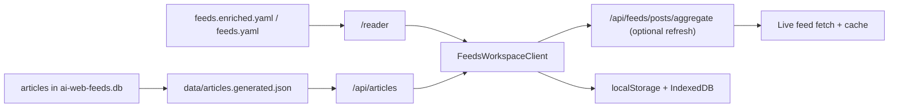

`/reader` is the main workspace in AI Web Feeds. It combines a generated article library with catalog filters from the curated source list.

> **Status**: ✅ Available
> **Surface**: `/reader` > **Source catalog**: `/sources`

The reader is the canonical feeds workspace for AI Web Feeds. It uses the generated
article corpus as its base dataset, keeps local reading state on-device, and
adds live feed refreshes only as an explicit overlay.

## Reader and Source Catalog

- **Reader** opens the article workspace on `/reader`.
- **Source catalog** lives at `/sources` when you want to inspect or refine the source list.
- **Source pages** live under `/sources/[sourceId]` and provide crawlable source metadata.
- **Topic pages** live under `/topics/[topicId]` and group sources for long-tail discovery.
- **Corpus-backed article list** reads normalized article rows from
  `data/articles.generated.json`.
- **Preview pane** opens only after an explicit article selection and closes back
  to a true list-only state.
- **Local state** keeps read, starred, saved, and archived status on-device.
- **Reader preferences** store presentation controls such as compact vs card
  layout and summary visibility in browser storage.
- **Query-stateful URLs** keep the current feed scope, filters, reader state,
  and pagination cursor in the address bar.
- **Refresh latest** fetches live posts for the current feed slice, dedupes
  them against the corpus, and prepends only genuinely new items.

There is no separate `/feeds` page. New docs and links should point to `/reader`,
`/sources`, source pages, topic pages, or article reference pages.

## Immersive reader

Open `/reader/article/[articleId]` for a focused reading layout with scroll progress, triage toolbar, and `reader-prose` typography. Article preview panes in the workspace link here via **Immersive read**.

## Hub routes

- **Search** — `/search` corpus query with teaser results
- **For You** — `/for-you` recommendations and saved searches
- **Blog** — `/blog` product updates with RSS at `/blog/rss.xml`

## Offline and client storage

Article triage state hydrates from localStorage into IndexedDB. A service worker caches shell assets; use `/offline` when disconnected. See [Reader Utility](/docs/features/utility) for shortcuts, share, and import/export.

## URL parameters

## Filters and URL State

The current query and filters are stored in the URL. That means you can:

- reload the page without losing your current view
- share a filtered view with someone else
- jump back into the same set of sources later

The catalog decides which feeds are available. The generated article corpus
provides the default article list. The live aggregation API is only used when
the user explicitly refreshes the current slice. The canonical reader lives at
`/reader`.

- the catalog comes from `data/feeds.enriched.yaml`
- the article library comes from `data/articles.generated.json`
- live refreshes use `/api/feeds/posts/aggregate` as an overlay on top of the generated article library

- the left rail holds search, topic/source filters, verification, view, sort,
  and explicit apply/reset actions
- the center list stays focused on the corpus-backed article stream
- the preview starts closed on first render and opens only when the reader asks
  for details
- the desktop preview is a non-modal right panel, so the list and filter rail
  remain clickable while it is open
- mobile keeps the article list first, moves controls into a disclosure, and
  shows the selected preview inline under the chosen article card

Read, saved, starred, and archived state stays in browser storage. That keeps the main workspace usable without forcing end-user accounts into the basic reading flow.

## Refreshing Recent Posts

The **Refresh latest** action fetches recent posts for the current source list and merges only genuinely new items into the page. It does not replace the generated article library.

## When the Article Library Is Missing

If `data/articles.generated.json` is missing or empty, the reader asks the web
app server to fetch recent posts from the current filters through
`/api/feeds/posts/aggregate`. The browser does not fetch arbitrary RSS origins
directly; the server route handles feed requests, normalization, caching, and
partial failures.

- the generated corpus remains the preferred fast path when available
- live refresh starts with a bounded sample of matching sources for the current slice
- refresh requests use `/api/feeds/posts/aggregate`
- live results are deduped by article identity before being merged
- new live-only rows are marked with a freshness badge
- refresh failures surface as non-blocking errors and keep the catalog available

## Empty states

If the generated corpus is unavailable and a bounded live refresh fails, the
reader shows a compact recovery state with source browsing and retry actions.

## Related

- [Search & Discovery](./search) for finding sources and recent posts inside the same workspace
- [Getting started](/docs/guides/getting-started) for the main local workflow and export setup
- [Runtime authority](/docs/development/runtime-authority) for the split between
  repository data, generated corpus artifacts, and browser-local state
