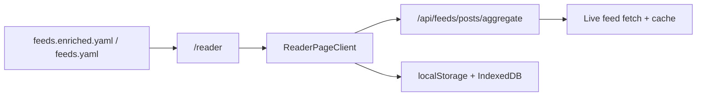

# Reader

> **Status**: ✅ Available
> **Surface**: `/reader`

The reader is the live aggregation surface for AI Web Feeds. It takes the checked-in
source catalog, resolves a feed set, fetches recent posts from those sources, and
renders one merged timeline in the browser.

## What it does

- **Broad mode** scans the first matching active feeds for a topic or the full catalog
  subset and pulls a bounded number of recent posts per source.
- **Selected-feed mode** focuses on one feed and expands the post budget for that
  source.
- **Local state** keeps read, starred, saved, and archived status on-device.
- **Reader preferences** store presentation controls such as compact vs card layout
  and summary visibility in browser storage.
- **Query-stateful URLs** keep the current feed, topic, view, sort, and text filter
  in the address bar.

## URL parameters

The reader is meant to be linkable and restorable directly from the URL.

| Parameter | Purpose                                                                    |
| --------- | -------------------------------------------------------------------------- |
| `feed`    | Limit the reader to one source ID from the catalog                         |
| `topic`   | Filter the candidate feed set by topic                                     |
| `q`       | Filter visible articles by title, feed title, summary, author, or category |
| `view`    | Switch between `latest`, `unread`, `starred`, `saved`, and `archived`      |
| `sort`    | Order the visible timeline by `latest`, `oldest`, or `source`              |

## Data flow



The catalog decides which feeds are available. The reader route resolves the current
scope and calls the aggregation API for recent posts. Reading state and presentation
preferences stay in browser storage.

## Current limits

- Broad mode scans up to **18 feeds** from the current candidate set.
- Broad mode fetches up to **3 posts per source**.
- Selected-feed mode fetches up to **8 posts** for that source.
- Aggregated fetches are cached server-side when available and surfaced in the reader
  status card as `live` or `cached`.

These limits keep the page responsive without pretending the reader is a full
infinite-scroll news client yet.

## Related APIs

```ts
// Load recent posts for one or more feeds
const response = await fetch("/api/feeds/posts/aggregate?feed=c2e8f1ffb0b2b48b&limit=8");

const payload = await response.json();
```

`/api/feeds/posts/aggregate` requires at least one `feed` query parameter. The reader
constructs this automatically from the current scope.

## Reader behavior

- Source search results link directly into the reader using the feed ID.
- Topic filtering happens before aggregation, so the reader only fetches the active
  feeds that match the current topic.
- Empty states are local and reversible: broaden the scope, clear the text filter, or
  refresh the stream.

## Related

- [Search & Discovery](./search) for finding sources before opening them in the reader
- [OPML Viewer](/docs/guides/opml-viewer) for export-oriented timeline previews
- [Runtime authority](/docs/development/runtime-authority) for the split between
  repository data, runtime fetches, and browser-local state
