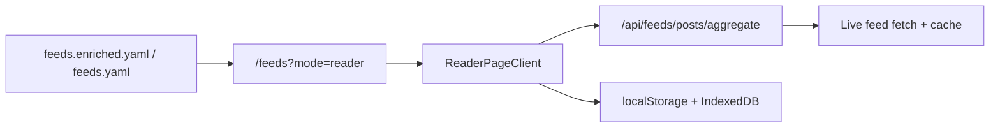

# Reader

> **Status**: ✅ Available
> **Surface**: `/feeds?mode=reader`

The reader is the live aggregation surface for AI Web Feeds. It takes the checked-in
source catalog, resolves a feed set, fetches recent posts from those sources, and
renders one merged timeline in the browser without leaving the unified `/feeds`
workspace.

## What it does

- **Broad mode** scans the first matching active feeds for a topic or the full catalog
  subset and pulls a bounded number of recent posts per source.
- **Selected-feed mode** focuses on one feed and expands the post budget for that
  source.
- **Local state** keeps read, starred, saved, and archived status on-device.
- **Enhanced UI/UX** featuring a sticky reading progress bar for trackable scroll depth and estimated reading times per article.
- **Reader preferences** store presentation controls such as compact vs card layout
  and summary visibility in browser storage.
- **Query-stateful URLs** keep the current feed scope, filters, reader state, and
  pagination cursor in the address bar.

## URL parameters

The reader is meant to be linkable and restorable directly from the URL.

| Parameter | Purpose                                                                    |
| --------- | -------------------------------------------------------------------------- |
| `feed`         | Limit the reader to one or more source IDs from the catalog; repeated params preserve pinned slices |
| `topics`       | Filter the candidate feed set by one or more topic labels                             |
| `source_type`  | Limit the candidate set by source format                                              |
| `verified`     | Limit the candidate set by verification state                                         |
| `q`            | Filter visible articles by title, feed title, summary, author, or category            |
| `reader_view`  | Switch between `latest`, `unread`, `starred`, `saved`, and `archived`                 |
| `reader_sort`  | Order the visible timeline by `latest`, `oldest`, or `source`                         |
| `stream`       | Choose between the fast sampled stream and the full cursor-paginated stream            |
| `cursor`       | Track pagination state for `stream=all`                                                |

## Data flow



The catalog decides which feeds are available. Reader mode resolves the current scope
from the `/feeds` URL state and calls the aggregation API for recent posts. Reading
state and presentation preferences stay in browser storage.

## User Experience Enhancements

Recent updates to the reader mode provide a more refined reading experience:
- **Sticky Progress Bar**: A visual indicator tracks your scroll progress as you read through articles.
- **Estimated Reading Time**: Articles display an estimated reading time based on content length, helping you manage your reading queue.
- **Polished Interface**: Improved hover states, borders, and typography throughout the article cards make scanning and reading easier.

## Current limits

- Sample mode scans up to **18 feeds** from the current candidate set.
- Sample mode fetches up to **3 posts per source**.
- Selected-feed mode fetches up to **8 posts** for that source.
- Full stream mode pages through the matching feed set with `stream=all` and `cursor`.
- Aggregated fetches are cached server-side when available and surfaced in the reader
  status card as `live` or `cached`.

These limits keep the page responsive while still allowing opt-in infinite scroll
for the broader merged stream.

## Related APIs

```ts
// Load recent posts for one or more feeds
const response = await fetch("/api/feeds/posts/aggregate?feed=c2e8f1ffb0b2b48b&limit=8");

const payload = await response.json();
```

`/api/feeds/posts/aggregate` requires at least one `feed` query parameter. The reader
constructs this automatically from the current scope.

## Reader behavior

- Catalog and article-search results link directly into reader mode using the feed ID, and
  multi-feed catalog slices are preserved with repeated `feed=` params when needed.
- Topic filtering happens before aggregation, so the reader only fetches the active
  feeds that match the current topic.
- Empty states are local and reversible: broaden the scope, clear the text filter, or
  refresh the stream.

## Related

- [Search & Discovery](./search) for finding sources and recent posts before opening reader mode
- [OPML Viewer](/docs/guides/opml-viewer) for export-oriented timeline previews
- [Runtime authority](/docs/development/runtime-authority) for the split between
  repository data, runtime fetches, and browser-local state
