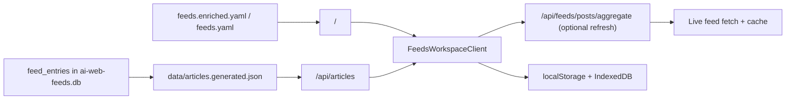

# Reader

> **Status**: ✅ Available
> **Surface**: `/` > **Catalog submode**: `/?mode=catalog` > **Compatibility route**: `/feeds`

The reader is the canonical homepage surface for AI Web Feeds. It uses the generated
article corpus as its base dataset, keeps local reading state on-device, and
adds live feed refreshes only as an explicit overlay.

## What it does

- **Reader-first default** opens the article workspace on `/`.
- **Catalog mode** lives at `/?mode=catalog` when you want to
  change the source slice.
- **Corpus-backed article list** reads normalized article rows from
  `data/articles.generated.json`.
- **Preview pane** shows sanitized rich summary/content, metadata, and direct
  article actions.
- **Local state** keeps read, starred, saved, and archived status on-device.
- **Reader preferences** store presentation controls such as compact vs card
  layout and summary visibility in browser storage.
- **Query-stateful URLs** keep the current feed scope, filters, reader state,
  and pagination cursor in the address bar.
- **Refresh latest** fetches live posts for the current feed slice, dedupes
  them against the corpus, and prepends only genuinely new items.

`/feeds` still renders the same workspace for compatibility, but new docs and links should point to `/` unless backward compatibility is the point.

## URL parameters

The reader is meant to be linkable and restorable directly from the URL.

| Parameter              | Purpose                                                                                             |
| ---------------------- | --------------------------------------------------------------------------------------------------- |
| `mode`                 | `catalog` opens the source picker; omitted defaults to the reader workspace                         |
| `feed`                 | Limit the reader to one or more source IDs from the catalog; repeated params preserve pinned slices |
| `topics`               | Filter the candidate feed set by one or more topic labels                                           |
| `source_type`          | Limit the candidate set by source format                                                            |
| `verified`             | Limit the candidate set by verification state                                                       |
| `q`                    | Filter visible articles by title, feed title, summary, author, or category                          |
| `reader_view`          | Switch between `latest`, `unread`, `starred`, `saved`, and `archived`                               |
| `sort` / `reader_sort` | Order the visible timeline by `latest`, `oldest`, or `source`                                       |
| `cursor`               | Track pagination state for the corpus-backed article list                                           |
| `limit`                | Tune page size for `/api/articles` hydration and follow-up loads                                    |

## Data flow



The catalog decides which feeds are available. The generated article corpus
provides the default article list. The live aggregation API is only used when
the user explicitly refreshes the current slice. The canonical reader lives at
`/`; `/feeds` is the compatibility surface.

## Reader behavior

- the left rail controls query, source type, topics, verification, layout, and
  reader view
- the center list shows corpus-backed article results for the current slice
- the right preview pane shows the selected article summary/content and local
  reading actions
- mobile collapses the same model into a stacked flow with filters and preview
  surfaced inline

## Preview sanitization

The preview pane preserves safe rich article markup, but it no longer renders
feed-supplied HTML verbatim.

- allowed markup includes structural text formatting, links, images, lists,
  code blocks, and tables
- links and images are resolved against the article URL before rendering
- active embeds such as scripts, forms, iframes, and inline event handlers are
  stripped before the preview is inserted into the DOM
- unsafe URL schemes are dropped instead of being rendered as clickable or
  loadable content

## Freshness overlay

`Refresh latest` keeps the reader current without changing the authority model.

- the base list still comes from the generated corpus
- refresh requests use `/api/feeds/posts/aggregate`
- live results are deduped by article identity before being merged
- new live-only rows are marked with a freshness badge
- refresh failures surface as non-blocking errors and preserve the base corpus list

## Empty states

If `data/articles.generated.json` is missing or empty, the reader shows a
dedicated corpus-unavailable state with rebuild commands instead of silently
sampling live feeds.

```bash
uv run ai-web-feeds corpus refresh
uv run ai-web-feeds corpus export
```

## Related

- [Search & Discovery](./search) for finding sources and recent posts inside the same workspace
- [Getting started](/docs/guides/getting-started) for the main local workflow and export setup
- [Runtime authority](/docs/development/runtime-authority) for the split between
  repository data, generated corpus artifacts, and browser-local state
