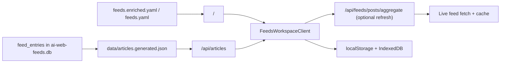

`/feeds` is the main workspace in AI Web Feeds. It combines a generated article library with the catalog filters from the curated source list.

> **Status**: ✅ Available
> **Surface**: `/` > **Catalog submode**: `/?mode=catalog` > **Compatibility route**: `/feeds`

The reader is the canonical homepage surface for AI Web Feeds. It uses the generated
article corpus as its base dataset, keeps local reading state on-device, and
adds live feed refreshes only as an explicit overlay.

## Two Modes on One Route

- **Reader-first default** opens the article workspace on `/`.
- **Catalog mode** lives at `/?mode=catalog` when you want to
  change the source slice.
- **Corpus-backed article list** reads normalized article rows from
  `data/articles.generated.json`.
- **Preview pane** opens only after an explicit article selection and closes back
  to a true list-only state.
- **Local state** keeps read, starred, saved, and archived status on-device.
- **Reader preferences** store presentation controls such as compact vs card
  layout and summary visibility in browser storage.
- **Query-stateful URLs** keep the current feed scope, filters, reader state,
  and pagination cursor in the address bar.
- **Refresh latest** fetches live posts for the current feed slice, dedupes
  them against the corpus, and prepends only genuinely new items.

`/feeds` still renders the same workspace for compatibility, but new docs and links should point to `/` unless backward compatibility is the point.

## URL parameters

## Filters and URL State

The current query and filters are stored in the URL. That means you can:

- reload the page without losing your current view
- share a filtered view with someone else
- jump back into the same set of sources later

The catalog decides which feeds are available. The generated article corpus
provides the default article list. The live aggregation API is only used when
the user explicitly refreshes the current slice. The canonical reader lives at
`/`; `/feeds` is the compatibility surface.

- the catalog comes from `data/feeds.enriched.yaml` or the fallback source files
- the article library comes from `data/articles.generated.json`
- live refreshes use `/api/feeds/posts/aggregate` as an overlay on top of the generated article library

- the left rail holds search, topic/source filters, verification, view, sort,
  and explicit apply/reset actions
- the center list stays focused on the corpus-backed article stream
- the preview starts closed on first render and opens only when the reader asks
  for details
- the desktop preview is a non-modal right panel, so the list and filter rail
  remain clickable while it is open
- mobile keeps the article list first, moves controls into a disclosure, and
  shows the selected preview inline under the chosen article card

Read, saved, starred, and archived state stays in browser storage. That keeps the main workspace usable without forcing end-user accounts into the basic reading flow.

## Refreshing Recent Posts

The **Refresh latest** action fetches recent posts for the current source list and merges only genuinely new items into the page. It does not replace the generated article library.

## When the Article Library Is Missing

If `data/articles.generated.json` is missing or empty, Feeds shows an explicit unavailable state instead of silently falling back to a partial live sample.

- the base list still comes from the generated corpus
- refresh requests use `/api/feeds/posts/aggregate`
- live results are deduped by article identity before being merged
- new live-only rows are marked with a freshness badge
- refresh failures surface as non-blocking errors and preserve the base corpus list

## Empty states

If `data/articles.generated.json` is missing or empty, the reader shows a
dedicated product-facing snapshot-unavailable state instead of silently
sampling live feeds or showing operator-oriented CLI guidance in the main
surface.

## Related

- [Search & Discovery](./search) for finding sources and recent posts inside the same workspace
- [Getting started](/docs/guides/getting-started) for the main local workflow and export setup
- [Runtime authority](/docs/development/runtime-authority) for the split between
  repository data, generated corpus artifacts, and browser-local state
