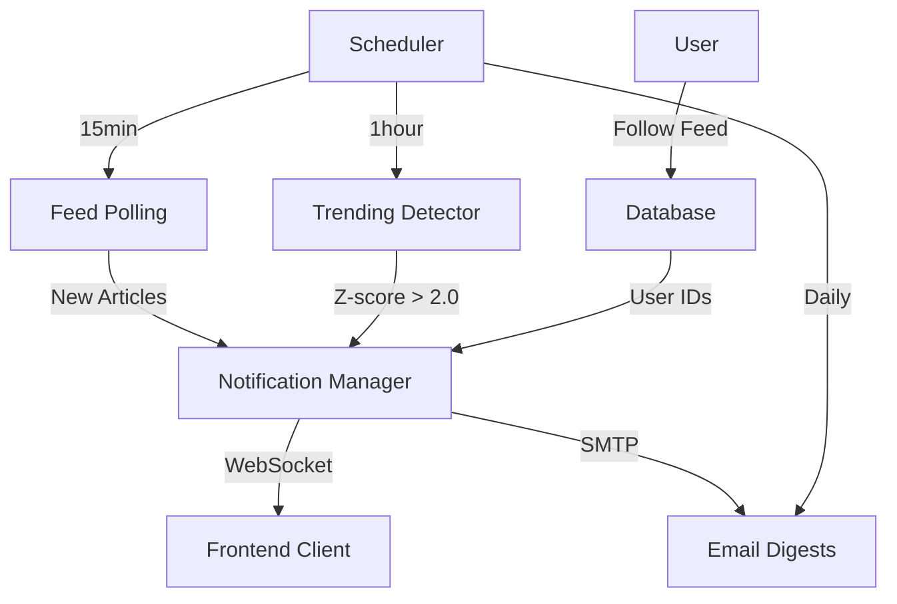

# Real-Time Feed Monitoring & Alerts

**Phase 3B Implementation** - Get instant notifications for new articles, trending topics, and customizable email digests.

## Overview

The real-time monitoring system provides:

- **Live Notifications**: WebSocket-powered instant alerts for new articles
- **Trending Detection**: Z-score analysis for identifying hot topics
- **Email Digests**: Customizable daily/weekly digest subscriptions
- **Feed Follows**: Subscribe to specific feeds for targeted notifications
- **Smart Bundling**: Automatic notification grouping to prevent spam

## Architecture



### Components

1. **Feed Poller** (`polling.py`):

   - Periodic feed fetching with retry logic
   - Article deduplication via GUID
   - Response time tracking

2. **Notification Manager** (`notifications.py`):

   - Notification creation and bundling
   - WebSocket broadcasting
   - User preference filtering

3. **Trending Detector** (`trending.py`):

   - Z-score statistical analysis
   - Baseline calculation (mean/std dev)
   - Representative article selection

4. **Digest Manager** (`digests.py`):

   - HTML email generation
   - Cron-based scheduling
   - SMTP delivery

5. **WebSocket Server** (`websocket_server.py`):

   - Socket.IO real-time server
   - User authentication and rooms
   - Event broadcasting

6. **Scheduler** (`scheduler.py`):
   - APScheduler background jobs
   - 4 periodic tasks (polling, trending, digests, cleanup)

## Getting Started

### 1. Start Monitoring Server

```bash
# Start backend monitoring (WebSocket + scheduler)
uv run aiwebfeeds monitor start

# Output:
# ✓ Background scheduler started
# ✓ WebSocket server started on port 8000
#
# Scheduled Jobs:
#   poll_feeds       | Every 15 min   | Poll all active feeds
#   detect_trending  | Every 1 hour   | Z-score trend detection
#   send_digests     | Every minute   | Check for due email digests
#   cleanup_notifications | Daily 3:00 AM | Delete old notifications
```

### 2. Follow Feeds

```bash
# Get your user ID from browser localStorage
# (automatically generated on first visit)

# Follow a feed to receive notifications
uv run aiwebfeeds monitor follow <user-id> <feed-id>

# Example:
uv run aiwebfeeds monitor follow a1b2c3d4-... ai-news

# List your follows
uv run aiwebfeeds monitor list-follows <user-id>

# Unfollow
uv run aiwebfeeds monitor unfollow <user-id> <feed-id>
```

### 3. Frontend Integration

```tsx
import { useState } from "react";
import { NotificationBell, NotificationCenter, FollowButton, TrendingTopics } from "@/components/notifications";

export default function Page() {
  const [showNotifications, setShowNotifications] = useState(false);

  return (
    <div>
      {/* Header with notification bell */}
      <header className="flex items-center justify-between">
        <h1>AI Web Feeds</h1>
        <NotificationBell onOpenCenter={() => setShowNotifications(true)} />
      </header>

      {/* Notification panel */}
      <NotificationCenter isOpen={showNotifications} onClose={() => setShowNotifications(false)} />

      {/* Feed page */}
      <div className="grid grid-cols-3 gap-6">
        <div className="col-span-2">
          <h2>AI News Feed</h2>

          {/* Follow button */}
          <FollowButton feedId="ai-news" variant="compact" />

          {/* Articles... */}
        </div>

        {/* Sidebar */}
        <aside>
          <TrendingTopics limit={5} />
        </aside>
      </div>
    </div>
  );
}
```

## Features

### Real-Time Notifications

Instant WebSocket alerts for:

- **New Articles**: Individual notifications for each new article (below bundle threshold)
- **Bundled Updates**: Single notification for multiple articles (>3 in 5 minutes)
- **Trending Topics**: Alerts when topics exceed Z-score threshold (>2.0)
- **System Alerts**: Important system messages

**Notification Types**:

```typescript
type NotificationType =
  | "new_article" // Single new article
  | "trending_topic" // Hot topic alert
  | "feed_updated" // Multiple articles (bundled)
  | "system_alert"; // System message
```

### Notification Bundling

Prevents notification spam with smart bundling:

```
IF articles_count >= threshold (default: 3)
AND within_window (default: 5 minutes)
THEN send_bundled_notification()
ELSE send_individual_notifications()
```

**Configuration** (`.env`):

```bash
AIWF_NOTIFICATION_BUNDLE_THRESHOLD=3
AIWF_NOTIFICATION_BUNDLE_WINDOW_SECONDS=300
```

### Trending Detection

Z-score statistical analysis:

**Algorithm**:

1. **Baseline Calculation**: Mean & StdDev of article counts over N days (default: 3)
2. **Current Period**: Article counts in last 1 hour
3. **Z-Score**: `(current - baseline_mean) / baseline_std`
4. **Threshold**: Alert if Z-score > 2.0 AND articles > 5

**Formula**:

$$
Z = \frac{X - \mu}{\sigma}
$$

Where:

- $X$ = Current article count
- $\mu$ = Baseline mean
- $\sigma$ = Baseline standard deviation

**Configuration**:

```bash
AIWF_TRENDING_BASELINE_DAYS=3
AIWF_TRENDING_Z_SCORE_THRESHOLD=2.0
AIWF_TRENDING_MIN_ARTICLES=5
AIWF_TRENDING_UPDATE_INTERVAL_HOURS=1
```

### Email Digests

Customizable email summaries:

**Schedule Types**:

- **Daily**: Every day at 9:00 AM
- **Weekly**: Every Monday at 9:00 AM
- **Custom**: Cron expression (e.g., `0 9 * * *`)

**Configuration**:

```bash
# SMTP Settings
AIWF_SMTP_HOST=localhost
AIWF_SMTP_PORT=25
AIWF_SMTP_USER=
AIWF_SMTP_PASSWORD=
AIWF_SMTP_FROM=noreply@aiwebfeeds.com

# Digest Settings
AIWF_DIGEST_MAX_ARTICLES=20
```

**API Usage**:

```typescript
// Subscribe to daily digest
await fetch("/api/digests", {
  method: "POST",
  headers: { "Content-Type": "application/json" },
  body: JSON.stringify({
    user_id: "user-uuid",
    email: "user@example.com",
    schedule_type: "daily",
    schedule_cron: "0 9 * * *",
    timezone: "America/New_York",
  }),
});
```

### Feed Follows

User-feed relationships for notification targeting:

```typescript
// Follow a feed
await fetch("/api/follows", {
  method: "POST",
  headers: { "Content-Type": "application/json" },
  body: JSON.stringify({
    user_id: "user-uuid",
    feed_id: "ai-news",
  }),
});

// Get followed feeds
const response = await fetch(`/api/follows?user_id=${userId}`);
const { follows } = await response.json();
```

## API Reference

### REST Endpoints

#### Notifications

**GET /api/notifications**

List user notifications.

```typescript
// Query params
?user_id=<uuid>&unread_only=true&limit=50

// Response
{
  "user_id": "...",
  "notifications": [...],
  "count": 10
}
```

**PATCH /api/notifications/:id**

Mark notification as read or dismissed.

```typescript
// Body
{
  "action": "mark_read" | "dismiss"
}
```

#### Follows

**GET /api/follows**

List followed feeds.

```typescript
?user_id=<uuid>
```

**POST /api/follows**

Follow a feed.

```typescript
{
  "user_id": "...",
  "feed_id": "..."
}
```

**DELETE /api/follows**

Unfollow a feed.

```typescript
?user_id=<uuid>&feed_id=<id>
```

#### Trending

**GET /api/trending**

Get current trending topics.

```typescript
?limit=10

// Response
{
  "trending": [
    {
      "topic_id": "artificial-intelligence",
      "z_score": 2.5,
      "article_count": 50,
      "rank": 1
    }
  ]
}
```

#### Preferences

**GET /api/preferences**

Get notification preferences.

**POST /api/preferences**

Set notification preferences.

```typescript
{
  "user_id": "...",
  "feed_id": "..." | null,  // null for global
  "delivery_method": "websocket" | "email" | "in_app",
  "frequency": "instant" | "hourly" | "daily" | "weekly" | "off",
  "quiet_hours_start": "22:00",
  "quiet_hours_end": "08:00"
}
```

#### Digests

**GET /api/digests**

Get digest subscriptions.

**POST /api/digests**

Create digest subscription.

**DELETE /api/digests**

Unsubscribe from digests.

### WebSocket Protocol

**Connection**:

```typescript
import { io } from "socket.io-client";

const socket = io("http://localhost:8000");

// Authenticate
socket.emit("authenticate", { user_id: "user-uuid" });
```

**Events**:

```typescript
// Incoming
socket.on("notification", (data: Notification) => {
  console.log("New notification:", data);
});

socket.on("trending_alert", (data: TrendingAlert) => {
  console.log("Trending:", data.topic_id);
});

socket.on("notifications_history", (data: { notifications: Notification[] }) => {
  console.log("History:", data.notifications);
});

// Outgoing
socket.emit("mark_read", { notification_id: 123 });
socket.emit("dismiss", { notification_id: 123 });
```

## Configuration

### Environment Variables

```bash
# WebSocket Server
AIWF_WEBSOCKET_PORT=8000
AIWF_WEBSOCKET_CORS_ORIGINS=http://localhost:3000,https://aiwebfeeds.com
NEXT_PUBLIC_WEBSOCKET_URL=http://localhost:8000

# Feed Polling
AIWF_FEED_POLL_INTERVAL_MIN=15
AIWF_FEED_POLL_TIMEOUT=30
AIWF_FEED_POLL_MAX_CONCURRENT=10

# Notifications
AIWF_NOTIFICATION_RETENTION_DAYS=7
AIWF_NOTIFICATION_BUNDLE_THRESHOLD=3
AIWF_NOTIFICATION_BUNDLE_WINDOW_SECONDS=300

# Trending Detection
AIWF_TRENDING_BASELINE_DAYS=3
AIWF_TRENDING_Z_SCORE_THRESHOLD=2.0
AIWF_TRENDING_MIN_ARTICLES=5
AIWF_TRENDING_UPDATE_INTERVAL_HOURS=1

# Email Digests
AIWF_SMTP_HOST=localhost
AIWF_SMTP_PORT=25
AIWF_SMTP_USER=
AIWF_SMTP_PASSWORD=
AIWF_SMTP_FROM=noreply@aiwebfeeds.com
AIWF_DIGEST_MAX_ARTICLES=20
```

### Database Schema

**7 New Tables**:

1. `feed_entries` - Article metadata from polling
2. `feed_poll_jobs` - Polling job tracking
3. `notifications` - User notifications
4. `user_feed_follows` - Feed follow relationships
5. `trending_topics` - Trending topic calculations
6. `notification_preferences` - User preferences
7. `email_digests` - Digest subscriptions

See [Database Architecture](/docs/development/database) for full schema.

## Components

### NotificationBell

Bell icon with unread count badge.

```tsx
<NotificationBell onOpenCenter={() => setShowCenter(true)} className="..." />
```

**Props**:

- `onOpenCenter`: Callback when bell is clicked
- `className`: Additional CSS classes

### NotificationCenter

Slide-in notification panel.

```tsx
<NotificationCenter isOpen={isOpen} onClose={() => setIsOpen(false)} className="..." />
```

**Features**:

- All/Unread filter tabs
- Mark read, dismiss, view actions
- Time-ago relative timestamps
- Type-specific icons and colors

### FollowButton

Toggle feed follow status.

```tsx
<FollowButton
  feedId="ai-news"
  variant="default" | "compact"
  initialFollowing={false}
  onFollowChange={(following) => console.log(following)}
/>
```

**Variants**:

- `default`: Full button with icons and text
- `compact`: Small button for inline use

### TrendingTopics

Display top trending topics.

```tsx
<TrendingTopics limit={5} className="..." />
```

## CLI Commands

### Monitor

**Start server**:

```bash
uv run aiwebfeeds monitor start [--port 8000]
```

**Check status**:

```bash
uv run aiwebfeeds monitor status
```

**Stop server**:

```bash
# Use Ctrl+C to stop
```

### Follows

**Follow a feed**:

```bash
uv run aiwebfeeds monitor follow <user-id> <feed-id>
```

**Unfollow a feed**:

```bash
uv run aiwebfeeds monitor unfollow <user-id> <feed-id>
```

**List follows**:

```bash
uv run aiwebfeeds monitor list-follows <user-id>
```

## Testing

Run the test suite:

```bash
cd tests
uv run pytest tests/packages/test_polling.py -v
uv run pytest tests/packages/test_notifications.py -v
uv run pytest tests/packages/test_scheduler.py -v
```

**Coverage**:

```bash
uv run pytest --cov=ai_web_feeds --cov-report=html
```

## Troubleshooting

### WebSocket Connection Issues

**Problem**: Frontend can't connect to WebSocket server.

**Solution**:

1. Check server is running: `uv run aiwebfeeds monitor status`
2. Verify CORS origins in `.env`: `AIWF_WEBSOCKET_CORS_ORIGINS`
3. Check browser console for connection errors
4. Ensure `NEXT_PUBLIC_WEBSOCKET_URL` matches server URL

### No Notifications Received

**Problem**: Following feeds but not getting notifications.

**Solution**:

1. Verify feed is being polled: Check scheduler status
2. Confirm follow relationship: `aiwebfeeds monitor list-follows <user-id>`
3. Check notification creation: Query database for recent notifications
4. Verify WebSocket authentication: Browser should emit `authenticate` event

### Trending Topics Not Updating

**Problem**: Trending topics list is stale.

**Solution**:

1. Check scheduler: `aiwebfeeds monitor status`
2. Verify trending job next run time
3. Ensure sufficient baseline data (>= 3 days of articles)
4. Check Z-score threshold configuration

### Email Digests Not Sending

**Problem**: Digest subscriptions created but emails not delivered.

**Solution**:

1. Verify SMTP configuration in `.env`
2. Check digest schedule (cron expression)
3. Test SMTP connection manually
4. Check scheduler logs for digest job errors

## Performance

### Optimization Tips

1. **Feed Polling**:

   - Adjust interval based on feed update frequency
   - Use `AIWF_FEED_POLL_MAX_CONCURRENT` to limit concurrent requests
   - Monitor response times in `feed_poll_jobs` table

2. **WebSocket**:

   - Enable connection pooling for high traffic
   - Use Redis adapter for multi-server deployments
   - Monitor active connections

3. **Database**:

   - Enable WAL mode for SQLite (default)
   - Add indexes on frequently queried columns
   - Cleanup old notifications regularly

4. **Trending Detection**:
   - Cache baseline calculations
   - Reduce baseline period for faster computation
   - Limit to top N topics

## Security

### User Identity

- Anonymous identification via localStorage UUID
- No authentication required (Phase 3B MVP)
- Migration path to user accounts planned (Phase 3A)

### WebSocket

- CORS validation on connection
- User ID authentication required
- Room-based message targeting

### API

- Rate limiting (planned)
- Input validation on all endpoints
- SQL injection prevention via SQLModel

## Roadmap

### Phase 3A: User Accounts

- Email/password authentication
- User profile management
- Account migration for existing localStorage users

### Phase 3C: Community Curation

- Feed ratings and reviews
- User-submitted feeds
- Collaborative filtering

### Phase 3D: Advanced AI

- Content summarization
- Sentiment analysis
- Smart article recommendations

## Resources

- [Specification](/docs/development/real-time-monitoring-spec)
- [Database Schema](/docs/development/database)
- [API Reference](/docs/reference/api)
- [CLI Reference](/docs/reference/cli)

---

_Implemented: October 2025 · Version: Phase 3B_
