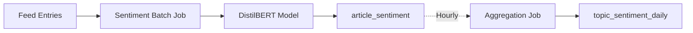

# Sentiment Analysis

Sentiment Analysis classifies article sentiment using transformer models (DistilBERT) and tracks sentiment trends over time by topic.

## Overview

The sentiment analyzer:

1. **Classifies** article sentiment: positive, neutral, or negative
2. **Computes** sentiment scores (-1.0 to +1.0)
3. **Aggregates** daily sentiment by topic
4. **Detects** sentiment shifts using moving averages

## Architecture



## Sentiment Classification

### Model

Uses Hugging Face's `distilbert-base-uncased-finetuned-sst-2-english`:

- **Model Size**: 67MB
- **Accuracy**: ~92% on SST-2 benchmark
- **Inference Time**: ~50ms per article (CPU)
- **Context Window**: 512 tokens (truncates longer articles)

### Sentiment Score Mapping

```python
# Model output → Sentiment score
"POSITIVE" (confidence 0.85) → +0.85
"NEGATIVE" (confidence 0.92) → -0.92
"NEUTRAL" → 0.0
```

### Classification Thresholds

```python
if sentiment_score > 0.3:
    classification = "positive"
elif sentiment_score < -0.3:
    classification = "negative"
else:
    classification = "neutral"
```

## Usage

### CLI Commands

#### Analyze Sentiment

```bash
aiwebfeeds nlp sentiment
```

**Options**:
- `--batch-size`: Number of articles (default: 100)
- `--force`: Reprocess all articles

```bash
# Process 50 articles
aiwebfeeds nlp sentiment --batch-size 50
```

#### View Sentiment Trends

```bash
# 30-day sentiment trend for "AI Safety"
aiwebfeeds nlp sentiment-trend "AI Safety" --days 30
```

**Output**:
```
AI Safety - Sentiment Trend (30 days)
━━━━━━━━━━━━━━━━━━━━━━━━━━━━━━━━━━━━━━━━
Date       Avg Sentiment  Articles  Positive  Neutral  Negative
2023-10-01    +0.45         24        18        4         2
2023-10-02    +0.32         19        12        5         2
2023-10-03    -0.15         28         8       12         8  ⚠️  Shift
```

#### Detect Sentiment Shifts

```bash
# Show topics with sentiment shifts (>0.3 change in 7-day MA)
aiwebfeeds nlp sentiment-shifts
```

**Output**:
```
Recent Sentiment Shifts
━━━━━━━━━━━━━━━━━━━━━━━━━━━━━━━━━━━━━━━━
Topic          Previous  Current  Change  Status
AI Safety        +0.25    -0.18    -0.43   🔴 Major shift
AI Regulation    -0.10    +0.35    +0.45   🟢 Improving
```

#### Compare Topics

```bash
aiwebfeeds nlp sentiment-compare "AI Safety" "AI Capabilities"
```

Shows side-by-side sentiment trends for two topics.

### Python API

```python
from ai_web_feeds.nlp import SentimentAnalyzer
from ai_web_feeds.config import Settings

analyzer = SentimentAnalyzer(Settings())

article = {
    "id": 1,
    "title": "RLHF Concerns",
    "content": "Critics have raised serious concerns about RLHF..."
}

sentiment = analyzer.analyze_sentiment(article)
# Returns: {
#     "sentiment_score": -0.65,
#     "classification": "negative",
#     "confidence": 0.89,
#     "model_name": "distilbert-base-uncased-finetuned-sst-2-english"
# }
```

### Batch Processing

Sentiment analysis runs hourly:

```python
from ai_web_feeds.nlp.scheduler import NLPScheduler

nlp_scheduler = NLPScheduler(scheduler)
nlp_scheduler.register_jobs()
# Registers:
# - Sentiment analysis (every hour)
# - Sentiment aggregation (15 min after analysis)
```

## Database Schema

### article_sentiment Table

```sql
CREATE TABLE article_sentiment (
    article_id INTEGER PRIMARY KEY,
    sentiment_score REAL NOT NULL CHECK(sentiment_score BETWEEN -1.0 AND 1.0),
    classification TEXT NOT NULL CHECK(classification IN ('positive', 'neutral', 'negative')),
    model_name TEXT NOT NULL,
    confidence REAL NOT NULL CHECK(confidence BETWEEN 0 AND 1),
    computed_at DATETIME DEFAULT CURRENT_TIMESTAMP,
    FOREIGN KEY (article_id) REFERENCES feed_entries(id)
);
```

### topic_sentiment_daily Table

Aggregated daily sentiment by topic:

```sql
CREATE TABLE topic_sentiment_daily (
    id INTEGER PRIMARY KEY AUTOINCREMENT,
    topic TEXT NOT NULL,
    date DATE NOT NULL,
    avg_sentiment REAL NOT NULL,
    article_count INTEGER NOT NULL,
    positive_count INTEGER DEFAULT 0,
    neutral_count INTEGER DEFAULT 0,
    negative_count INTEGER DEFAULT 0,
    UNIQUE(topic, date)
);
```

## Sentiment Aggregation

### Daily Aggregation

Runs 15 minutes after sentiment analysis:

```python
# Group sentiment scores by (topic, date)
aggregates = {}
for article in recent_articles:
    for topic in article.topics:
        key = (topic, article.date)
        aggregates[key]["scores"].append(article.sentiment_score)
        aggregates[key][article.classification] += 1

# Compute average
for (topic, date), data in aggregates.items:
    avg_sentiment = sum(data["scores"]) / len(data["scores"])
    storage.upsert_topic_sentiment_daily(
        topic=topic,
        date=date,
        avg_sentiment=avg_sentiment,
        article_count=len(data["scores"]),
        positive_count=data["positive"],
        neutral_count=data["neutral"],
        negative_count=data["negative"]
    )
```

### Shift Detection

7-day moving average:

```python
def detect_shift(topic: str, threshold: float = 0.3) -> bool:
    """Detect sentiment shift using 7-day moving average"""
    trend = storage.get_topic_sentiment_trend(topic, days=14)

    # Compute 7-day MA for last 2 weeks
    ma_recent = mean([day.avg_sentiment for day in trend[:7]])
    ma_previous = mean([day.avg_sentiment for day in trend[7:14]])

    shift = abs(ma_recent - ma_previous)
    return shift > threshold
```

## Configuration

```python
class Phase5Settings(BaseSettings):
    sentiment_batch_size: int = 100
    sentiment_cron: str = "0 * * * *"  # Every hour
    sentiment_model: str = "distilbert-base-uncased-finetuned-sst-2-english"
    sentiment_shift_threshold: float = 0.3
```

**Environment Variables**:
```bash
PHASE5_SENTIMENT_BATCH_SIZE=100
PHASE5_SENTIMENT_SHIFT_THRESHOLD=0.3
PHASE5_SENTIMENT_MODEL=distilbert-base-uncased-finetuned-sst-2-english
```

## Performance

- **Throughput**: ~100 articles/hour (CPU)
- **Memory**: ~500MB (model loaded)
- **Storage**: ~50 bytes per sentiment record

## Use Cases

### Monitor Topic Sentiment

Track sentiment for specific topics:

```bash
# Daily check for "AI Safety" sentiment
aiwebfeeds nlp sentiment-trend "AI Safety" --days 7
```

### Detect Controversies

Identify topics with negative sentiment spikes:

```bash
# Topics with sentiment < -0.5 in last 7 days
aiwebfeeds nlp sentiment-shifts --threshold -0.5
```

### Compare Competing Approaches

```bash
# Compare sentiment for competing techniques
aiwebfeeds nlp sentiment-compare "RLHF" "Constitutional AI"
```

## Model Details

### DistilBERT Architecture

- **Base Model**: BERT distilled to 66M parameters (40% smaller)
- **Training**: Fine-tuned on SST-2 (Stanford Sentiment Treebank)
- **Input**: Max 512 tokens (articles truncated to ~2000 chars)
- **Output**: Binary classification (positive/negative) with confidence

### Limitations

1. **Context Window**: Only first 512 tokens considered
2. **Binary Classification**: Model trained for binary sentiment (positive/negative), neutral inferred
3. **Domain Shift**: SST-2 is movie reviews; AI articles may differ
4. **No Fine-tuning**: Pre-trained model used as-is (no domain adaptation)

## Troubleshooting

### Low Confidence Scores

**Symptom**: All sentiment predictions have low confidence (<0.6).

**Cause**: Articles too long, model only sees truncated beginning.

**Solution**: Increase truncation window or use extractive summarization before analysis.

### Model Download Fails

**Symptom**: `OSError: Can't find model`

**Solution**:
```bash
# Models auto-download to ~/.cache/huggingface/hub
# Ensure internet connection and disk space (~67MB)

# Manual download:
python -c "from transformers import pipeline; pipeline('sentiment-analysis', model='distilbert-base-uncased-finetuned-sst-2-english')"
```

### Sentiment Shifts Not Detected

**Symptom**: No shifts reported despite obvious sentiment changes.

**Cause**: Threshold too high.

**Solution**:
```bash
# Lower threshold to 0.2
export PHASE5_SENTIMENT_SHIFT_THRESHOLD=0.2
```

## Future Enhancements

1. **Domain-Specific Fine-tuning**: Train on AI article sentiment labels
2. **Aspect-Based Sentiment**: Sentiment for specific entities/topics within articles
3. **Multilingual Support**: Add models for non-English content
4. **Real-Time Alerts**: Webhook notifications for sentiment shifts

## See Also

- [Quality Scoring](/docs/features/quality-scoring) - Article quality assessment
- [Entity Extraction](/docs/features/entity-extraction) - Named entity recognition
- [Topic Modeling](/docs/features/topic-modeling) - Discover subtopics
