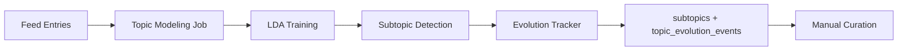

# Topic Modeling

Topic Modeling automatically discovers subtopics within parent topics using Latent Dirichlet Allocation (LDA) and tracks topic evolution over time.

## Overview

The topic modeler:

1. **Discovers** subtopics using LDA clustering
2. **Tracks** topic evolution (splits, merges, emergence, decline)
3. **Enables** manual curation of discovered subtopics
4. **Computes** topic coherence scores for quality assessment

## Architecture



## LDA Topic Modeling

### Algorithm

Latent Dirichlet Allocation (LDA) discovers latent topics in document collections:

1. **Preprocessing**: Tokenize, remove stopwords, apply TF-IDF
2. **Model Training**: Learn topic distributions using Gensim LDA
3. **Topic Extraction**: Extract keywords and descriptions
4. **Coherence Scoring**: Validate topic quality using C_v coherence

### Model Parameters

```python
lda_config = {
    "num_topics": 10,              # Number of subtopics per parent
    "passes": 10,                  # Training iterations
    "iterations": 400,             # Inference iterations
    "alpha": "auto",               # Document-topic density
    "eta": "auto",                 # Topic-word density
    "minimum_probability": 0.01,   # Minimum topic probability
}
```

## Usage

### CLI Commands

#### Run Topic Modeling

```bash
aiwebfeeds nlp topics
```

**Options**:

- `--parent-topic`: Parent topic to model (default: all)
- `--num-topics`: Number of subtopics to discover (default: 10)
- `--min-articles`: Minimum articles required (default: 100)

```bash
# Discover 5 subtopics in "NLP" with minimum 50 articles
aiwebfeeds nlp topics --parent-topic "NLP" --num-topics 5 --min-articles 50
```

#### Review Unapproved Subtopics

```bash
aiwebfeeds nlp review-subtopics
```

**Interactive Workflow**:

```
Unapproved Subtopics (3)
━━━━━━━━━━━━━━━━━━━━━━━━━━━━━━━━━━━━━━━━
[1] NLP > Transformer Architectures
    Keywords: transformer, attention, bert, gpt, architecture
    Articles: 45
    Coherence: 0.68

    Actions: [a]pprove, [r]ename, [d]elete, [s]kip

> a

✓ Approved: Transformer Architectures
```

#### Approve Subtopic

```bash
aiwebfeeds nlp approve-subtopic <subtopic-id>
```

#### Rename Subtopic

```bash
aiwebfeeds nlp rename-subtopic <subtopic-id> "New Name"
```

#### List Subtopics

```bash
# List all approved subtopics for "AI Safety"
aiwebfeeds nlp list-subtopics "AI Safety"
```

#### View Topic Evolution

```bash
# Show topic evolution events (splits, merges, etc.)
aiwebfeeds nlp topic-evolution --days 30
```

**Output**:

```
Topic Evolution Events (Last 30 Days)
━━━━━━━━━━━━━━━━━━━━━━━━━━━━━━━━━━━━━━━━
Date       Event      Source Topic       Target Topics
2023-10-15 split      Transformers       [BERT-variants, GPT-variants]
2023-10-22 emergence  -                  [Constitutional AI]
2023-10-28 merge      [RLHF, HHH]        Alignment Techniques
```

### Python API

```python
from ai_web_feeds.nlp import TopicModeler
from ai_web_feeds.storage import Storage

modeler = TopicModeler()
storage = Storage()

# Get articles for parent topic
articles = storage.get_articles_by_topic("NLP", limit=1000)

# Train LDA model
subtopics = modeler.extract_subtopics(
    parent_topic="NLP",
    articles=articles,
    num_topics=10
)

# subtopics = [
#     {
#         "name": "Transformer Architectures",
#         "keywords": ["transformer", "attention", "bert", "gpt"],
#         "description": "Articles about transformer models...",
#         "article_count": 45,
#         "coherence": 0.68
#     },
#     ...
# ]

# Store subtopics
for subtopic_data in subtopics:
    storage.create_subtopic(
        parent_topic="NLP",
        name=subtopic_data["name"],
        keywords=subtopic_data["keywords"],
        description=subtopic_data["description"],
        article_count=subtopic_data["article_count"]
    )
```

### Batch Processing

Topic modeling runs monthly (1st of month, 3 AM):

```python
from ai_web_feeds.nlp.scheduler import NLPScheduler

nlp_scheduler = NLPScheduler(scheduler)
nlp_scheduler.register_jobs()
# Registers: Topic modeling job (monthly)
```

## Database Schema

### subtopics Table

```sql
CREATE TABLE subtopics (
    id TEXT PRIMARY KEY,  -- UUID
    parent_topic TEXT NOT NULL,
    name TEXT NOT NULL,
    keywords TEXT NOT NULL,  -- JSON array
    description TEXT,
    article_count INTEGER DEFAULT 0,
    detected_at DATETIME DEFAULT CURRENT_TIMESTAMP,
    approved BOOLEAN DEFAULT FALSE,
    created_by TEXT DEFAULT 'system',
    UNIQUE(parent_topic, name)
);
```

### topic_evolution_events Table

```sql
CREATE TABLE topic_evolution_events (
    id INTEGER PRIMARY KEY AUTOINCREMENT,
    event_type TEXT NOT NULL CHECK(event_type IN ('split', 'merge', 'emergence', 'decline')),
    source_topic TEXT,
    target_topics TEXT,  -- JSON array
    article_count INTEGER NOT NULL,
    growth_rate REAL,
    detected_at DATETIME DEFAULT CURRENT_TIMESTAMP
);
```

## Topic Evolution Detection

### Evolution Types

**Split**: One topic divides into multiple subtopics

```
Transformers → [BERT-variants, GPT-variants, ViT]
```

**Merge**: Multiple subtopics combine into one

```
[Supervised Learning, Unsupervised Learning] → Machine Learning Fundamentals
```

**Emergence**: New topic appears (growth rate > 100%)

```
- → Constitutional AI (50 articles in 1 month)
```

**Decline**: Topic activity decreases (growth rate < -50%)

```
GANs → (declining mention frequency)
```

### Detection Algorithm

```python
def detect_evolution(
    current_topics: List[Subtopic],
    previous_topics: List[Subtopic]
) -> List[EvolutionEvent]:
    """Compare current vs previous month's topics"""

    events = []

    # Detect splits
    for prev_topic in previous_topics:
        similar_topics = find_similar_topics(prev_topic, current_topics)
        if len(similar_topics) >= 2:
            events.append({
                "type": "split",
                "source": prev_topic.name,
                "targets": [t.name for t in similar_topics]
            })

    # Detect emergence
    for curr_topic in current_topics:
        if not any(is_similar(curr_topic, pt) for pt in previous_topics):
            growth_rate = compute_growth_rate(curr_topic)
            if growth_rate > 1.0:  # >100% growth
                events.append({
                    "type": "emergence",
                    "target": curr_topic.name,
                    "growth_rate": growth_rate
                })

    return events
```

## Topic Coherence

### Coherence Metric

Topic coherence (C_v) measures topic quality:

- **Range**: 0.0 (poor) to 1.0 (excellent)
- **Threshold**: Reject topics with coherence < 0.5
- **Interpretation**:
  - 0.7+: Excellent, semantically coherent
  - 0.5-0.7: Good, acceptable
  - &lt;0.5: Poor, review manually

### Computation

```python
from gensim.models.coherencemodel import CoherenceModel

coherence_model = CoherenceModel(
    model=lda_model,
    texts=tokenized_docs,
    dictionary=dictionary,
    coherence='c_v'
)

coherence_score = coherence_model.get_coherence()
```

## Configuration

```python
class Phase5Settings(BaseSettings):
    topic_modeling_cron: str = "0 3 1 * *"  # 3 AM on 1st of month
    topic_model: str = "lda"  # Algorithm: lda, nmf, or bertopic
    topic_coherence_min: float = 0.5
    nlp_workers: int = 4  # Parallel processing
```

**Environment Variables**:

```bash
PHASE5_TOPIC_MODEL=lda
PHASE5_TOPIC_COHERENCE_MIN=0.5
PHASE5_NLP_WORKERS=4
```

## Performance

- **Training Time**: ~5-10 minutes for 1000 articles
- **Memory**: ~1GB peak during training
- **Storage**: ~200 bytes per subtopic

## Manual Curation Workflow

### 1. Run Topic Modeling

```bash
aiwebfeeds nlp topics --parent-topic "AI Safety"
```

### 2. Review Unapproved Subtopics

```bash
aiwebfeeds nlp review-subtopics
```

### 3. Approve/Rename/Delete

**Approve**:

```bash
aiwebfeeds nlp approve-subtopic <id>
```

**Rename**:

```bash
aiwebfeeds nlp rename-subtopic <id> "Better Name"
```

**Delete** (low coherence):

```bash
aiwebfeeds nlp delete-subtopic <id>
```

### 4. Verify Approved Subtopics

```bash
aiwebfeeds nlp list-subtopics "AI Safety" --approved-only
```

## Use Cases

### Discover Emerging Subtopics

Monitor new research areas:

```bash
# Monthly check for new subtopics in "AI"
aiwebfeeds nlp topics --parent-topic "AI"
aiwebfeeds nlp topic-evolution --event-type emergence
```

### Track Topic Fragmentation

Identify when broad topics split:

```bash
# Check if "Deep Learning" has fragmented
aiwebfeeds nlp topic-evolution --event-type split --source "Deep Learning"
```

### Content Organization

Use subtopics for navigation and filtering:

```bash
# Show articles in specific subtopic
aiwebfeeds articles list --subtopic "Transformer Architectures"
```

## Troubleshooting

### Low Coherence Scores

**Symptom**: All subtopics have coherence < 0.5.

**Causes**:

1. Too few articles (< 100)
2. Too many subtopics requested
3. Poor text preprocessing

**Solutions**:

```bash
# Reduce number of topics
aiwebfeeds nlp topics --num-topics 5

# Increase minimum articles
aiwebfeeds nlp topics --min-articles 200
```

### Topics Too Broad

**Symptom**: Subtopics are generic and overlap.

**Solution**: Increase `num_topics` parameter to get more specific clusters:

```bash
aiwebfeeds nlp topics --num-topics 15
```

### Model Training Fails

**Symptom**: `MemoryError` or training hangs.

**Solution**:

- Reduce batch size
- Limit article count: `--max-articles 500`
- Increase system memory or use cloud instance

## Advanced Features

### BERTopic (Future)

Alternative to LDA using transformer embeddings:

```python
# Planned: BERTopic support
modeler = TopicModeler(algorithm="bertopic")
subtopics = modeler.extract_subtopics(parent_topic="NLP", articles=articles)
```

**Advantages**:

- Better semantic understanding
- No need to specify number of topics
- Higher coherence scores

**Trade-offs**:

- Slower training (GPU recommended)
- Higher memory usage (~2GB)

## See Also

- [Quality Scoring](/docs/features/quality-scoring) - Article quality assessment
- [Entity Extraction](/docs/features/entity-extraction) - Named entity recognition
- [Sentiment Analysis](/docs/features/sentiment-analysis) - Sentiment classification
