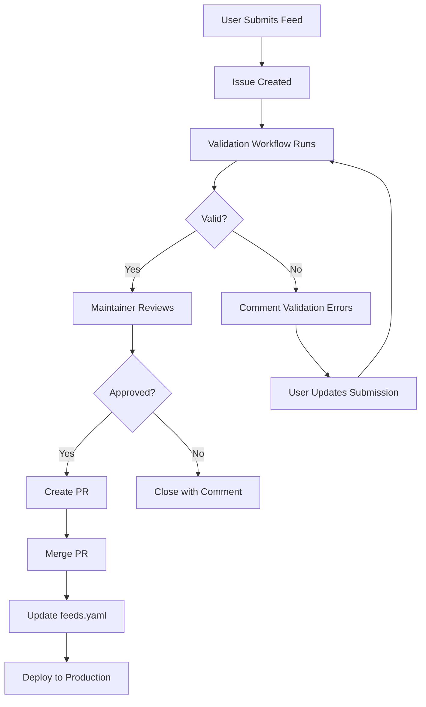
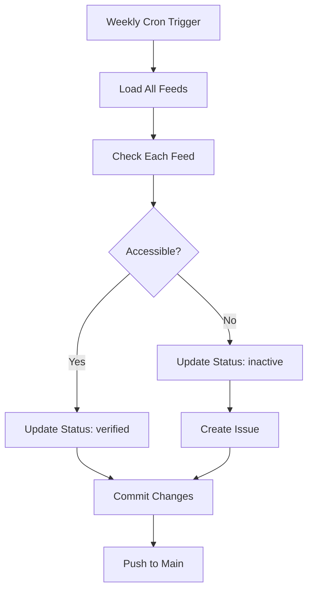

# GitHub Infrastructure

The AI Web Feeds project includes comprehensive GitHub infrastructure for managing feed submissions, pull requests, and automated validation.

## Overview

Our GitHub setup includes:

- **Issue Forms** - Structured templates for feed submissions and bug reports
- **Pull Request Templates** - Standardized PR descriptions with checklists
- **GitHub Actions** - Automated validation, testing, and deployment
- **Scripts** - Helper utilities for testing and validation

## Issue Templates

### Feed Submission Form

The feed submission form (`.github/ISSUE_TEMPLATE/feed-submission.yml`) provides a structured way to submit new feeds to the registry.

**Features:**
- Validates feed URLs and site URLs
- Ensures topic selection from canonical list
- Collects metadata (language, format, source type)
- Auto-labels issues as `feed-submission`
- Automatically assigns to project board

**Fields:**

| Field | Type | Required | Description |
|-------|------|----------|-------------|
| Feed ID | Text | ✅ | Unique identifier (slug format) |
| Feed URL | Text | Optional | Direct RSS/Atom/JSON feed URL |
| Site URL | Text | Optional | Homepage or section URL |
| Title | Text | ✅ | Descriptive title for the feed |
| Topics | Dropdown | ✅ | 1-6 canonical topics |
| Source Type | Dropdown | ✅ | blog, newsletter, podcast, etc. |
| Content Mediums | Checkboxes | Optional | text, audio, video, code, data |
| Language | Text | Optional | ISO 639-1 code (e.g., 'en') |
| Feed Format | Dropdown | Optional | RSS, Atom, JSONFeed |

**Usage Example:**

When a user submits a feed through the form:
1. GitHub creates an issue with all structured data
2. Issue is auto-labeled `feed-submission`
3. Validation workflow can parse the issue body
4. Approved submissions append to `data/feeds.yaml`

### Bug Report Template

Standard bug report template (`.github/ISSUE_TEMPLATE/bug-report.yml`) for reporting issues.

**Fields:**
- Bug description
- Steps to reproduce
- Expected vs actual behavior
- Environment details
- Screenshots/logs

### Feature Request Template

Feature request template (`.github/ISSUE_TEMPLATE/feature-request.yml`) for suggesting enhancements.

**Fields:**
- Feature description
- Use case/motivation
- Proposed solution
- Alternatives considered

### Documentation Update

Documentation template (`.github/ISSUE_TEMPLATE/documentation.yml`) for doc improvements.

**Fields:**
- Documentation area
- Issue description
- Proposed changes
- Related pages/sections

## Pull Request Templates

### Standard PR Template

Located at `.github/pull_request_template.md`, provides:

**Structure:**
- Description section with placeholder
- Type of change checkboxes (bug fix, feature, docs, etc.)
- Comprehensive checklist:
  - Code quality checks
  - Testing requirements
  - Documentation updates
  - Schema validation
  - Feed validation
  - Breaking changes review

**Checklist Items:**

```markdown
## Checklist

### Code Quality
- [ ] Code follows project style guidelines
- [ ] Self-review completed
- [ ] Comments added for complex code
- [ ] No new warnings generated

### Testing
- [ ] Tests added/updated for changes
- [ ] All tests pass locally
- [ ] Edge cases covered

### Documentation
- [ ] README updated (if needed)
- [ ] API docs updated (if needed)
- [ ] Changelog updated
- [ ] Comments/docstrings added

### Feed Changes (if applicable)
- [ ] Schema validation passes
- [ ] Feed URLs validated
- [ ] Topics match canonical list
- [ ] No duplicate entries
- [ ] Follows feeds.yaml format

### Breaking Changes
- [ ] No breaking changes OR
- [ ] Breaking changes documented
- [ ] Migration guide provided
```

## GitHub Actions Workflows

### Feed Validation Workflow

**File:** `.github/workflows/validate-feeds.yml`

**Triggers:**
- Manual dispatch (`workflow_dispatch`)
- Pull requests modifying `data/feeds.yaml`
- Issues with label `feed-submission`

**Jobs:**

1. **Setup** - Install Python, uv, dependencies
2. **Schema Validation** - Validate against JSON schema
3. **Feed Validation** - Check feed URLs are accessible
4. **Topic Validation** - Verify topics exist in `data/topics.yaml`
5. **Comment Results** - Post validation results to PR/issue

**Example Usage:**

```yaml
name: Validate Feeds
on:
  pull_request:
    paths:
      - 'data/feeds.yaml'
  workflow_dispatch:

jobs:
  validate:
    runs-on: ubuntu-latest
    steps:
      - uses: actions/checkout@v4
      - name: Validate Schema
        run: |
          uv run python -c "
          import json, yaml
          from jsonschema import validate
          
          with open('data/feeds.yaml') as f:
              feeds = yaml.safe_load(f)
          with open('data/feeds.schema.json') as f:
              schema = json.load(f)
          
          validate(instance=feeds, schema=schema)
          print('✅ Schema validation passed')
          "
```

### Feed Status Checker

**File:** `.github/workflows/check-feed-status.yml`

**Purpose:** Periodically check all feeds in the registry for availability and update status.

**Schedule:** Runs weekly (configurable)

**Features:**
- Checks HTTP status codes
- Validates feed format
- Updates `curation.status` field
- Creates issues for broken feeds
- Updates feed metadata

**Status Values:**
- `verified` - Feed is accessible and valid
- `unverified` - Feed not yet checked
- `archived` - Feed intentionally archived
- `inactive` - Feed returns 404 or other error

## Helper Scripts

### Local Feed Submission Testing

**File:** `scripts/test-feed-submission.py`

Test feed submissions locally before creating a GitHub issue.

**Usage:**

```bash
# Test a feed submission
python scripts/test-feed-submission.py \
  --id "example-blog" \
  --feed "https://example.com/feed.xml" \
  --title "Example Blog" \
  --topics "ml" "nlp" \
  --source-type "blog"

# Test with site URL (discovery)
python scripts/test-feed-submission.py \
  --id "example-site" \
  --site "https://example.com" \
  --discover \
  --title "Example Site" \
  --topics "research"
```

**Features:**
- ✅ Validates feed ID format
- ✅ Checks feed URL accessibility
- ✅ Validates topics against canonical list
- ✅ Verifies JSON schema compliance
- ✅ Checks for duplicate entries
- ✅ Previews YAML output
- ✅ Optionally appends to `feeds.yaml`

**Output:**

```
🔍 Validating feed submission...

✅ Feed ID 'example-blog' is valid
✅ Feed URL is accessible (200 OK)
✅ Topics are valid
✅ Schema validation passed
✅ No duplicate entry found

📝 Preview of feed entry:
---
- id: "example-blog"
  feed: "https://example.com/feed.xml"
  title: "Example Blog"
  topics: ["ml", "nlp"]
  source_type: "blog"
  meta:
    updated: "2025-10-15"
    contributor: "your-github-username"

💾 Append to data/feeds.yaml? [y/N]:
```

### GitHub Infrastructure Setup

**File:** `scripts/setup-github-infra.sh`

One-command setup for all GitHub infrastructure.

**Usage:**

```bash
bash scripts/setup-github-infra.sh
```

**Actions:**
1. Creates `.github/` directory structure
2. Generates all issue templates
3. Creates PR templates
4. Sets up workflows
5. Configures GitHub settings (via API)

**Requirements:**
- GitHub CLI (`gh`) for API access
- Repository write permissions

## Configuration Files

### Issue Template Configuration

**File:** `.github/ISSUE_TEMPLATE/config.yml`

Controls the "New Issue" experience:

```yaml
blank_issues_enabled: false
contact_links:
  - name: 💬 Discussions
    url: https://github.com/wyattowalsh/ai-web-feeds/discussions
    about: Ask questions and discuss with the community
  - name: 📖 Documentation
    url: https://ai-web-feeds.vercel.app
    about: Read the documentation
```

## Best Practices

### For Contributors

1. **Use Issue Templates** - Don't create blank issues
2. **Test Locally First** - Use `test-feed-submission.py` before submitting
3. **Follow Schema** - Ensure submissions match `feeds.schema.json`
4. **Check Duplicates** - Search existing feeds before submitting
5. **Provide Context** - Add notes explaining the feed's value

### For Maintainers

1. **Review Automation** - Check workflow runs regularly
2. **Update Status** - Keep feed status current
3. **Merge Carefully** - Ensure validation passes before merging
4. **Document Changes** - Update changelog for significant changes
5. **Monitor Issues** - Respond to submissions promptly

## Automation Workflow

### Feed Submission Lifecycle



### Weekly Status Check



## Troubleshooting

### Common Issues

**Issue: "Schema validation failed"**

Solution:
```bash
# Validate schema locally
uv run python -c "
import json, yaml
from jsonschema import validate

with open('data/feeds.yaml') as f:
    feeds = yaml.safe_load(f)
with open('data/feeds.schema.json') as f:
    schema = json.load(f)

try:
    validate(instance=feeds, schema=schema)
    print('✅ Valid')
except Exception as e:
    print(f'❌ Error: {e}')
"
```

**Issue: "Feed URL not accessible"**

Solution:
```bash
# Test feed URL
curl -I https://example.com/feed.xml

# Check with Python
python -c "
import requests
resp = requests.get('https://example.com/feed.xml', timeout=10)
print(f'Status: {resp.status_code}')
print(f'Content-Type: {resp.headers.get(\"content-type\")}')
"
```

**Issue: "Topics not found in canonical list"**

Solution:
```bash
# List valid topics
cat data/topics.yaml | grep "^  - id:"

# Or use Python
python -c "
import yaml
with open('data/topics.yaml') as f:
    topics = yaml.safe_load(f)
print('Valid topics:', [t['id'] for t in topics.get('topics', [])])
"
```

## API Integration

### GitHub CLI Examples

```bash
# Create feed submission issue
gh issue create \
  --title "Add: Example Feed" \
  --body-file issue-body.md \
  --label "feed-submission"

# List feed submissions
gh issue list --label "feed-submission"

# Approve and close
gh issue close 123 --comment "Merged in PR #456"
```

### GitHub Actions Context

Access issue data in workflows:

```yaml
- name: Parse Feed Submission
  run: |
    echo "${{ github.event.issue.body }}" | \
    python scripts/parse-issue-body.py > feed-data.json
```

## Future Enhancements

Planned improvements:

- [ ] Automated feed testing in PR checks
- [ ] RSS/Atom feed preview in PR comments
- [ ] Feed health scoring automation
- [ ] Duplicate detection in CI
- [ ] Auto-categorization with ML
- [ ] Feed analytics dashboard
- [ ] Community voting system

## Related Documentation

- [Contributing Guide](/docs/development/contributing)
- [Feed Schema Reference](/docs/guides/feed-schema)
- [CLI Documentation](/docs/development/cli)
- [Testing Guide](/docs/guides/testing)
