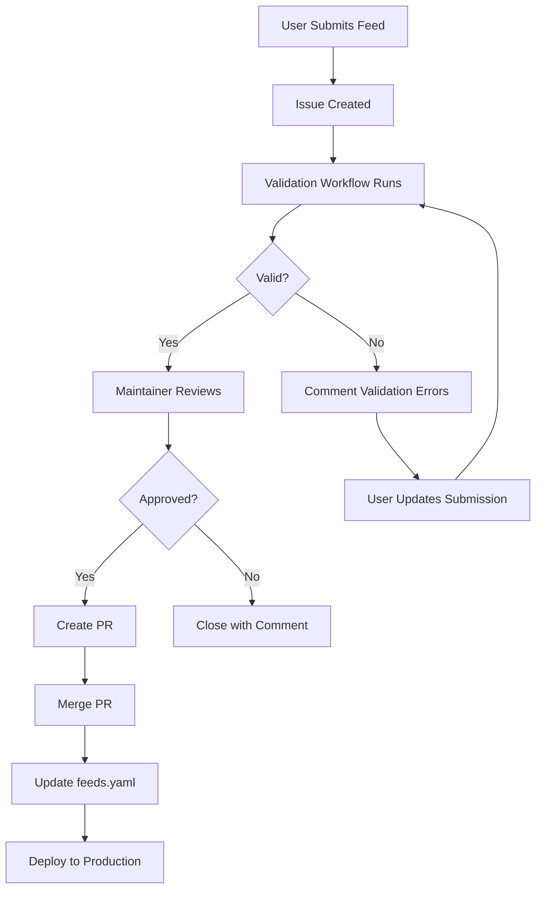
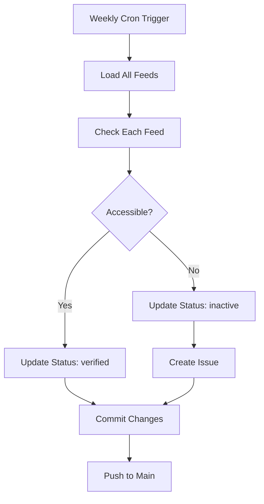

import { Callout } from "fumadocs-ui/components/callout";

# GitHub Infrastructure

The `.github/` directory owns issue intake, workflow automation, prompts, and
repository-specific agents. This page summarizes the live structures contributors
should know before editing workflow or intake files.

## Issue forms

Current issue templates include:

- `add-feed.yml`
- `feed-update.yml`
- `bug-report.yml`
- `feature-request.yml`
- `documentation.yml`
- `cli-issue.yml`
- `workflow-issue.yml`

These forms are configured through `.github/ISSUE_TEMPLATE/config.yml`, which
controls the issue-creation experience and directs users toward supported paths.

## Pull request template

`.github/pull_request_template.md` is the shared PR checklist for code quality,
testing, docs, and data changes.

## Workflow structure

| Workflow family                  | Representative files                                                                                   |
| -------------------------------- | ------------------------------------------------------------------------------------------------------ |
| quality and CI                   | `quality-enforcement.yml`, `coverage.yml`, `python-quality.yml`, `ci.yml`                              |
| feed intake and catalog mutation | `validate-feed-submission.yml`, `add-approved-feed.yml`, `validate-all-feeds.yml`, `process-feeds.yml` |
| release and maintenance          | `release.yml`, `release-drafter.yml`, `dependency-updates.yml`, `stale.yml`, `sync-labels.yml`         |
| security and review              | `dependency-review.yml`, `codeql-analysis.yml`, `pr-validation.yml`, `label-manager.yml`               |

## Validation and approval model

1. a feed issue is normalized with `.github/scripts/feed_submission_to_source.py`
2. duplicate URLs are rejected before mutation
3. repository data assets are validated
4. the issue receives `validated` or `validation-failed`
5. a maintainer may then apply `approved`
6. approval opens a PR instead of editing `main` directly

The deterministic workflows now also emit machine-readable summaries for the
distillation layer and extract them into stable additive workspace paths for
gh-aw consumption:

- `reports/github/catalog/feed-processing-summary.json`
- `reports/github/feed-submissions/issue-<number>/normalized-source.json`
- `reports/github/feed-submissions/issue-<number>/validation-summary.md`
- `reports/github/feed-submissions/issue-<number>/snapshot-manifest.json`
- `reports/github/feed-submissions/issue-<number>/feed-submission-validation-summary.json`

These `reports/github/...` paths are extracted workflow evidence, not checked-in
catalog data.

<Callout type="info" title="Why this is safe">
  The workflow chain is intentionally additive. Validation comments and labels are cheap to rerun; repository mutation only happens through a reviewable PR.
</Callout>

## Agentic workflow pilots

The repository also contains `.github/workflows/*.md` gh-aw source files. These
are **not** active workflows until they are explicitly compiled, reviewed, and
adopted. Treat them as an additive distillation layer on top of the canonical
YAML workflows, and keep pilots read-only or report-only unless there is a
reviewed adoption plan.

## Local dry run commands

```bash
uv run python .github/scripts/feed_submission_to_source.py \
  --event-path reports/feed-submission-event.json \
  --output-source reports/parsed_feed.json \
  --output-summary reports/parsed_feed_summary.md
uv run python data/validate_data_assets.py
```

## Related documentation

- ✅ Validates feed ID format
- ✅ Checks feed URL accessibility
- ✅ Validates topics against canonical list
- ✅ Verifies JSON schema compliance
- ✅ Checks for duplicate entries
- ✅ Previews YAML output
- ✅ Optionally appends to `feeds.yaml`

**Output:**

```
🔍 Validating feed submission...

✅ Feed ID 'example-blog' is valid
✅ Feed URL is accessible (200 OK)
✅ Topics are valid
✅ Schema validation passed
✅ No duplicate entry found

📝 Preview of feed entry:
---
- id: "example-blog"
  feed: "https://example.com/feed.xml"
  title: "Example Blog"
  topics: ["ml", "nlp"]
  source_type: "blog"
  meta:
    updated: "2025-10-15"
    contributor: "your-github-username"

💾 Append to data/feeds.yaml? [y/N]:
```

### GitHub Infrastructure Setup

**File:** `scripts/setup-github-infra.sh`

One-command setup for all GitHub infrastructure.

**Usage:**

```bash
bash scripts/setup-github-infra.sh
```

**Actions:**

1. Creates `.github/` directory structure
2. Generates all issue templates
3. Creates PR templates
4. Sets up workflows
5. Configures GitHub settings (via API)

**Requirements:**

- GitHub CLI (`gh`) for API access
- Repository write permissions

## Configuration Files

### Issue Template Configuration

**File:** `.github/ISSUE_TEMPLATE/config.yml`

Controls the "New Issue" experience:

```yaml
blank_issues_enabled: false
contact_links:
  - name: 💬 Discussions
    url: https://github.com/wyattowalsh/ai-web-feeds/discussions
    about: Ask questions and discuss with the community
  - name: 📖 Documentation
    url: https://aiwebfeeds.vercel.app/docs
    about: Read the documentation
```

## Best Practices

### For Contributors

1. **Use Issue Templates** - Don't create blank issues
2. **Test Locally First** - Use `test-feed-submission.py` before submitting
3. **Follow Schema** - Ensure submissions match `feeds.schema.json`
4. **Check Duplicates** - Search existing feeds before submitting
5. **Provide Context** - Add notes explaining the feed's value

### For Maintainers

1. **Review Automation** - Check workflow runs regularly
2. **Update Status** - Keep feed status current
3. **Merge Carefully** - Ensure validation passes before merging
4. **Document Changes** - Update changelog for significant changes
5. **Monitor Issues** - Respond to submissions promptly

## Automation Workflow

### Feed Submission Lifecycle


```mermaid
graph TD
    A[User Submits Feed] --> B[Issue Created]
    B --> C[Validation Workflow Runs]
    C --> D{Valid?}
    D -->|Yes| E[Maintainer Reviews]
    D -->|No| F[Comment Validation Errors]
    F --> G[User Updates Submission]
    G --> C
    E --> H{Approved?}
    H -->|Yes| I[Create PR]
    H -->|No| J[Close with Comment]
    I --> K[Merge PR]
    K --> L[Update feeds.yaml]
    L --> M[Deploy to Production]
```

### Weekly Status Check


```mermaid
graph TD
    A[Weekly Cron Trigger] --> B[Load All Feeds]
    B --> C[Check Each Feed]
    C --> D{Accessible?}
    D -->|Yes| E[Update Status: verified]
    D -->|No| F[Update Status: inactive]
    E --> G[Commit Changes]
    F --> H[Create Issue]
    H --> G
    G --> I[Push to Main]
```

## Troubleshooting

### Common Issues

**Issue: "Schema validation failed"**

Solution:

```bash
# Validate schema locally
uv run python -c "
import json, yaml
from jsonschema import validate

with open('data/feeds.yaml') as f:
    feeds = yaml.safe_load(f)
with open('data/feeds.schema.json') as f:
    schema = json.load(f)

try:
    validate(instance=feeds, schema=schema)
    print('✅ Valid')
except Exception as e:
    print(f'❌ Error: {e}')
"
```

**Issue: "Feed URL not accessible"**

Solution:

```bash
# Test feed URL
curl -I https://example.com/feed.xml

# Check with Python
python -c "
import requests
resp = requests.get('https://example.com/feed.xml', timeout=10)
print(f'Status: {resp.status_code}')
print(f'Content-Type: {resp.headers.get(\"content-type\")}')
"
```

**Issue: "Topics not found in canonical list"**

Solution:

```bash
# List valid topics
cat data/topics.yaml | grep "^  - id:"

# Or use Python
python -c "
import yaml
with open('data/topics.yaml') as f:
    topics = yaml.safe_load(f)
print('Valid topics:', [t['id'] for t in topics.get('topics', [])])
"
```

## API Integration

### GitHub CLI Examples

```bash
# Create feed submission issue
gh issue create \
  --title "Add: Example Feed" \
  --body-file issue-body.md \
  --label "feed-submission"

# List feed submissions
gh issue list --label "feed-submission"

# Approve and close
gh issue close 123 --comment "Merged in PR #456"
```

### GitHub Actions Context

Access issue data in workflows:

```yaml
- name: Parse Feed Submission
  run: |
    echo "${{ github.event.issue.body }}" | \
    python scripts/parse-issue-body.py > feed-data.json
```

## Future Enhancements

Planned improvements:

- [ ] Automated feed testing in PR checks
- [ ] RSS/Atom feed preview in PR comments
- [ ] Feed health scoring automation
- [ ] Duplicate detection in CI
- [ ] Auto-categorization with ML
- [ ] Feed analytics dashboard
- [ ] Community voting system

## Related Documentation

- [Contributing Guide](/docs/development/contributing)
- [Feed Schema Reference](/docs/guides/feed-schema)
- [CLI Documentation](/docs/development/cli)
- [Testing Guide](/docs/guides/testing)
