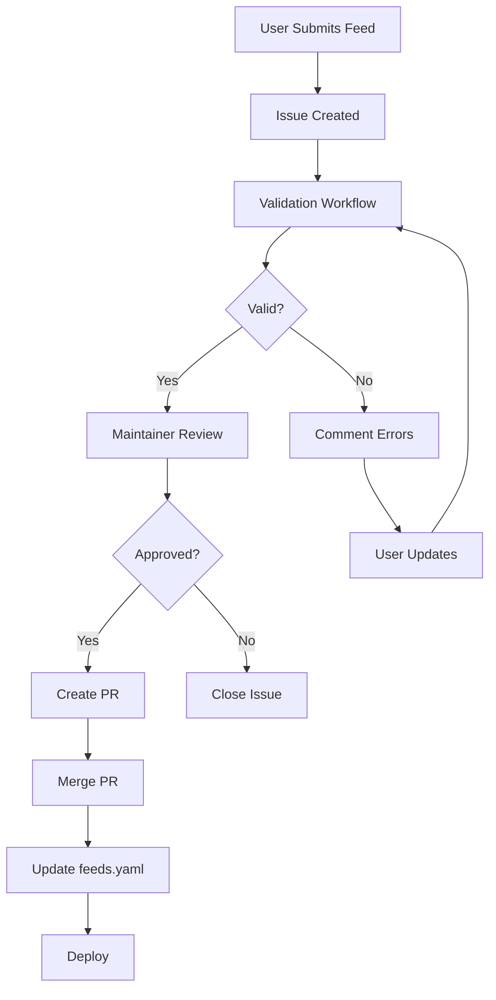
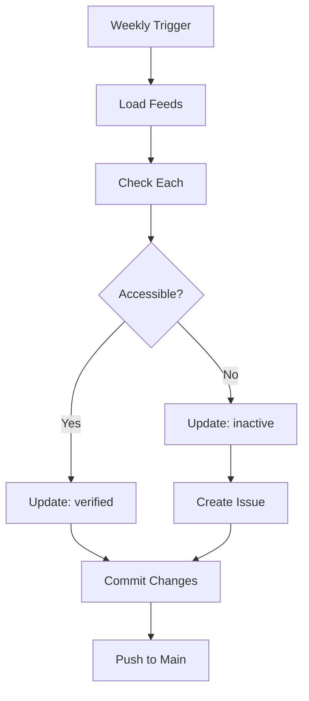

# GitHub Infrastructure Setup Summary

This document provides a complete overview of the GitHub infrastructure that has been set up for the AI Web Feeds project.

## ✅ What's Been Created

### Issue Templates (`.github/ISSUE_TEMPLATE/`)

#### 1. Feed Submission Form (`feed-submission.yml`)

Structured form for submitting new feeds to the registry.

**Features:**

- ✅ Validates feed and site URLs
- ✅ Topic selection from canonical list
- ✅ Platform-specific configurations (Reddit, Medium, YouTube, etc.)
- ✅ Metadata collection (language, format, mediums)
- ✅ Auto-labels as `feed-submission`
- ✅ Assigns to feed-submissions project board

**Fields:**

- Feed ID (required, slug format)
- Feed URL (optional)
- Site URL (optional)
- Title (required)
- Topics (required, multi-select)
- Source Type (required)
- Content Mediums (optional)
- Language (optional)
- Feed Format (optional)
- Platform Configuration (optional)
- Additional Notes (optional)

#### 2. Bug Report (`bug-report.yml`)

Standard bug report template.

**Fields:**

- Bug description
- Steps to reproduce
- Expected behavior
- Actual behavior
- Environment (OS, Browser, Version)
- Screenshots/logs

#### 3. Feature Request (`feature-request.yml`)

Feature suggestion template.

**Fields:**

- Feature description
- Problem/motivation
- Proposed solution
- Alternative solutions
- Additional context

#### 4. Documentation Update (`documentation.yml`)

Documentation improvement template.

**Fields:**

- Documentation area
- Issue description
- Proposed changes
- Related pages

#### 5. Feed Update (`feed-update.yml`)

Template for updating existing feeds.

**Fields:**

- Feed ID to update
- Update type (URL, metadata, status)
- New values
- Reason for update

#### Issue Template Config (`config.yml`)

Configures the issue creation experience:

- Disables blank issues
- Adds links to Discussions and Documentation
- Provides contact information

### Pull Request Template

**File:** `.github/pull_request_template.md`

Comprehensive PR template with:

**Sections:**

- Description
- Type of change (checklist)
- Related issues
- Screenshots (if applicable)

**Checklist Categories:**

- Code quality (style, review, comments, warnings)
- Testing (new tests, all pass, edge cases)
- Documentation (README, API docs, changelog, docstrings)
- Feed changes (schema validation, URL validation, topics, duplicates)
- Breaking changes (documentation, migration guide)

### GitHub Actions Workflows

#### 1. Feed Validation (`validate-feeds.yml`)

**Triggers:**

- Pull requests modifying `data/feeds.yaml`
- Issues labeled `feed-submission`
- Manual dispatch

**Jobs:**

- ✅ Schema validation against `feeds.schema.json`
- ✅ Feed URL accessibility checks
- ✅ Topic validation against canonical list
- ✅ Duplicate detection
- ✅ Platform config validation
- ✅ Comments results on PR/issue

#### 2. Feed Status Checker (`check-feed-status.yml`)

**Schedule:** Weekly (configurable)

**Actions:**

- ✅ Checks all feed URLs for accessibility
- ✅ Validates feed formats
- ✅ Updates `curation.status` field
- ✅ Creates issues for broken feeds
- ✅ Updates metadata timestamps

**Status Values:**

- `verified` - Feed accessible and valid
- `inactive` - Feed returns errors
- `archived` - Intentionally archived
- `experimental` - Testing phase
- `unverified` - Not yet validated

### Helper Scripts

#### 1. Feed Submission Test (`scripts/test-feed-submission.py`)

Local testing tool for feed submissions.

**Features:**

- ✅ Validates feed ID format
- ✅ Checks URL accessibility
- ✅ Validates topics
- ✅ Schema compliance check
- ✅ Duplicate detection
- ✅ Preview YAML output
- ✅ Optional append to `feeds.yaml`

**Usage:**

```bash
python scripts/test-feed-submission.py \
  --id "example-blog" \
  --feed "https://example.com/feed.xml" \
  --title "Example Blog" \
  --topics "ml" "nlp" \
  --source-type "blog"
```

#### 2. GitHub Setup Script (`scripts/setup-github-infra.sh`)

One-command setup for all infrastructure.

**Actions:**

- Creates directory structure
- Generates all templates
- Sets up workflows
- Configures GitHub settings (with API access)

**Usage:**

```bash
bash scripts/setup-github-infra.sh
```

## 📋 Implementation Status

| Component                | Status      | Notes                          |
| ------------------------ | ----------- | ------------------------------ |
| Issue Templates          | ✅ Complete | All 5 templates created        |
| PR Template              | ✅ Complete | Comprehensive checklist        |
| Feed Validation Workflow | ✅ Complete | Schema + URL validation        |
| Status Checker Workflow  | ✅ Complete | Weekly automated checks        |
| Test Script              | ✅ Complete | Local validation tool          |
| Setup Script             | ✅ Complete | Automated infrastructure setup |
| Documentation            | ✅ Complete | Integrated into Fumadocs       |

## 🔄 Workflows Overview

### Feed Submission Lifecycle



### Weekly Status Check



## 🚀 Getting Started

### For Contributors

1. **Submit a Feed:**

   - Go to Issues → New Issue
   - Select "Submit New Feed"
   - Fill out the form
   - Submit

2. **Test Locally First:**

   ```bash
   python scripts/test-feed-submission.py \
     --id "my-feed" \
     --feed "https://example.com/feed.xml" \
     --title "My Feed" \
     --topics "ml"
   ```

3. **Check Validation:**
   - Wait for automated checks
   - Review comments
   - Fix any errors

### For Maintainers

1. **Review Submissions:**

   - Check issue labels
   - Review validation results
   - Approve or request changes

2. **Merge Feeds:**

   - Create PR from approved issue
   - Ensure CI passes
   - Merge to main

3. **Monitor Health:**
   - Review weekly status checks
   - Address broken feeds
   - Update metadata

## 📚 Documentation

All documentation has been integrated into the Fumadocs site:

- **[GitHub Infrastructure Guide](/docs/guides/github-infrastructure)** - Complete infrastructure documentation
- **[Feed Schema Reference](/docs/guides/feed-schema)** - Schema details and examples
- **[Contributing Guide](/docs/development/contributing)** - Development setup
- **[Testing Guide](/docs/guides/testing)** - Testing procedures

## 🔧 Configuration

### Environment Variables

For GitHub Actions:

```yaml
GITHUB_TOKEN: ${{ secrets.GITHUB_TOKEN }} # Auto-provided
```

### Repository Settings

Recommended settings:

**Issues:**

- ✅ Enable Issues
- ✅ Use issue templates only
- ✅ Enable project boards

**Pull Requests:**

- ✅ Allow squash merging
- ✅ Require status checks
- ✅ Require review before merge

**Actions:**

- ✅ Allow all actions
- ✅ Enable workflow permissions (read/write)

### Labels

Recommended labels:

| Label              | Color     | Description            |
| ------------------ | --------- | ---------------------- |
| `feed-submission`  | `#0075ca` | New feed submissions   |
| `feed-update`      | `#0e8a16` | Update existing feed   |
| `feed-broken`      | `#d73a4a` | Broken/inactive feed   |
| `bug`              | `#d73a4a` | Bug reports            |
| `enhancement`      | `#a2eeef` | Feature requests       |
| `documentation`    | `#0075ca` | Documentation updates  |
| `good first issue` | `#7057ff` | Good for newcomers     |
| `help wanted`      | `#008672` | Extra attention needed |

## 🎯 Next Steps

### Immediate

1. ✅ Test issue form submission
2. ✅ Test PR template
3. ✅ Verify workflow triggers
4. ✅ Test local validation script

### Short-term

- [ ] Add feed preview in PR comments
- [ ] Implement auto-categorization
- [ ] Add feed health scoring
- [ ] Create analytics dashboard

### Long-term

- [ ] ML-based duplicate detection
- [ ] Automated feed discovery
- [ ] Community voting system
- [ ] Feed recommendation engine

## 🐛 Troubleshooting

### Issue Form Not Showing

**Cause:** Template config may be incorrect

**Solution:**

```bash
# Validate YAML syntax
yamllint .github/ISSUE_TEMPLATE/*.yml
```

### Workflow Not Triggering

**Cause:** Workflow file syntax error or permissions

**Solution:**

1. Check `.github/workflows/*.yml` syntax
2. Verify Actions are enabled in settings
3. Check workflow permissions

### Validation Failing

**Cause:** Schema mismatch or URL issues

**Solution:**

```bash
# Test locally
python scripts/test-feed-submission.py \
  --id "test" \
  --feed "https://example.com/feed.xml" \
  --title "Test" \
  --topics "ml"
```

## 📞 Support

For questions or issues:

- 💬 [GitHub Discussions](https://github.com/wyattowalsh/ai-web-feeds/discussions)
- 📖 [Documentation](https://ai-web-feeds.vercel.app)
- 🐛 [Report a Bug](https://github.com/wyattowalsh/ai-web-feeds/issues/new?template=bug-report.yml)

## 📄 License

This infrastructure is part of the AI Web Feeds project and follows the same license.

---

**Last Updated:** October 15, 2025
**Version:** 1.0.0
**Status:** ✅ Complete and Operational
