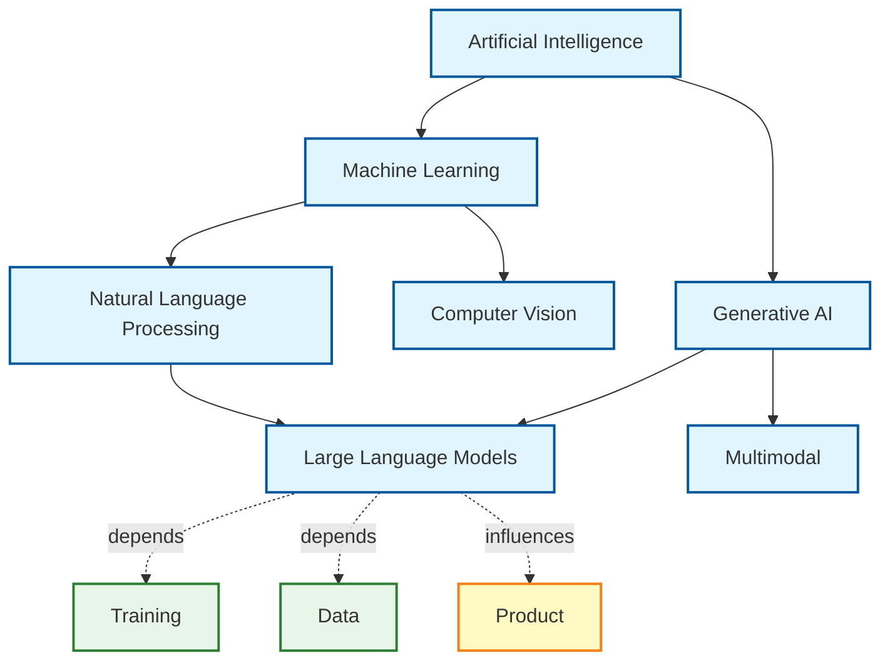

## Overview

AIWebFeeds provides a comprehensive **tags taxonomy** that organizes AI/ML topics into a hierarchical ontology. This system supports:

- **Hierarchical relationships** (parent/child)
- **Semantic relations** (depends_on, implements, influences, etc.)
- **Facet classification** (domain, task, methodology, etc.)
- **Multiple visualization formats** (Mermaid, JSON graphs, DOT)

## Taxonomy Structure

The taxonomy is defined in `/data/topics.yaml` and includes:

- **~100+ topics** across AI/ML domains
- **4 facet groups**: conceptual, technical, contextual, communicative
- **Directed relations**: depends_on, implements, influences
- **Symmetric relations**: related_to, same_as, contrasts_with

### Example Topic

```yaml
- id: llm
  label: Large Language Models
  facet: task
  facet_group: conceptual
  parents: [genai, nlp]
  relations:
    depends_on: [training, data]
    influences: [product, education]
    related_to: [agents, evaluation]
  rank_hint: 0.99
```

## Visualization Methods

### 1. CLI Visualization

Generate Mermaid diagrams, JSON graphs, or view statistics:

```bash
# Generate Mermaid diagram
aiwebfeeds visualize mermaid -o taxonomy.mermaid

# With options
aiwebfeeds visualize mermaid \
  --direction LR \
  --max-depth 3 \
  --facets "domain,task" \
  --no-relations

# Generate JSON graph for D3.js/visualization libraries
aiwebfeeds visualize json -o taxonomy.json

# View statistics
aiwebfeeds visualize stats
```

### 2. Python API

Use the taxonomy module programmatically:

```python
from ai_web_feeds.taxonomy import load_taxonomy, TaxonomyVisualizer

# Load taxonomy
taxonomy = load_taxonomy()

# Create visualizer
visualizer = TaxonomyVisualizer(taxonomy)

# Generate Mermaid diagram
mermaid_code = visualizer.to_mermaid(
    direction="TD",
    max_depth=3,
    include_relations=True
)

# Get JSON graph for D3.js
graph = visualizer.to_json_graph()
print(f"Nodes: {len(graph['nodes'])}, Links: {len(graph['links'])}")

# Get statistics
stats = visualizer.get_statistics()
print(f"Total topics: {stats['total_topics']}")
print(f"Max depth: {stats['max_depth']}")
```

### 3. Interactive Mermaid Diagram

Below is an interactive visualization of the core AI/ML taxonomy (depth=2):



## Facet Groups

Topics are organized into four facet groups with distinct visual styling:

<div className="grid grid-cols-2 gap-4 my-4">
  <div className="p-4 rounded border" style={{ backgroundColor: "#e1f5ff", borderColor: "#01579b" }}>
    <strong>Conceptual</strong>
    <p className="text-sm text-gray-600">Core AI/ML concepts, domains, and tasks</p>
  </div>
  <div className="p-4 rounded border" style={{ backgroundColor: "#e8f5e9", borderColor: "#2e7d32" }}>
    <strong>Technical</strong>
    <p className="text-sm text-gray-600">Infrastructure, tools, and technical components</p>
  </div>
  <div className="p-4 rounded border" style={{ backgroundColor: "#fff9c4", borderColor: "#f57f17" }}>
    <strong>Contextual</strong>
    <p className="text-sm text-gray-600">Industry, governance, and application domains</p>
  </div>
  <div className="p-4 rounded border" style={{ backgroundColor: "#fce4ec", borderColor: "#c2185b" }}>
    <strong>Communicative</strong>
    <p className="text-sm text-gray-600">Media types and communication channels</p>
  </div>
</div>

## Use Cases

### Feed Categorization

Topics are used to categorize and filter RSS/Atom feeds:

```python
from ai_web_feeds.taxonomy import load_taxonomy

taxonomy = load_taxonomy()

# Get all LLM-related topics
llm_topic = taxonomy.get_topic("llm")
llm_children = taxonomy.get_children("llm")

# Filter feeds by topic
conceptual_topics = taxonomy.get_topics_by_facet_group("conceptual")
```

### Recommendation Systems

Use the taxonomy for content recommendations:

```python
# Find related topics
topic = taxonomy.get_topic("llm")
related = topic.relations.get("related_to", [])

# Get topic dependencies
dependencies = topic.relations.get("depends_on", [])
```

### Analytics & Insights

Generate insights about your feed collection:

```python
visualizer = TaxonomyVisualizer(taxonomy)
stats = visualizer.get_statistics()

print(f"Facet distribution: {stats['facets']}")
print(f"Average depth: {stats['avg_depth']:.2f}")
```

## Advanced Features

### Filtering by Depth

Visualize only top-level topics:

```python
mermaid_code = visualizer.to_mermaid(max_depth=2)
```

### Filtering by Facet

Focus on specific topic types:

```python
mermaid_code = visualizer.to_mermaid(
    filter_facets=["domain", "task"]
)
```

### Custom Styling

The Mermaid diagrams include custom CSS classes based on facet groups, which you can override in your rendering environment.

## Data Format

The taxonomy follows a strict JSON Schema (see `/data/topics.schema.json`):

```json
{
  "id": "string (kebab-case)",
  "label": "Human-readable name",
  "facet": "Category type",
  "facet_group": "conceptual | technical | contextual | communicative",
  "parents": ["parent-topic-ids"],
  "relations": {
    "depends_on": ["topic-ids"],
    "implements": ["topic-ids"],
    "influences": ["topic-ids"]
  },
  "rank_hint": 0.0-1.0
}
```

## Export Formats

### Mermaid

Best for documentation and GitHub/GitLab READMEs.

### JSON Graph

Compatible with D3.js, Cytoscape.js, and other graph visualization libraries:

```json
{
  "nodes": [
    {
      "id": "ai",
      "label": "Artificial Intelligence",
      "facet": "domain",
      "facet_group": "conceptual"
    }
  ],
  "links": [
    {
      "source": "ai",
      "target": "ml",
      "type": "parent"
    }
  ]
}
```

### DOT (Graphviz)

For high-quality static diagrams (requires Graphviz):

```bash
# Generate DOT file
python -c "
from ai_web_feeds.taxonomy import load_taxonomy, TaxonomyVisualizer
viz = TaxonomyVisualizer(load_taxonomy())
print(viz.to_dot())
" > taxonomy.dot

# Render with Graphviz
dot -Tpng taxonomy.dot -o taxonomy.png
```

## Contributing

To add or modify topics:

1. Edit `/data/topics.yaml`
2. Validate against `/data/topics.schema.json`
3. Run `aiwebfeeds validate data/topics.yaml`
4. Generate updated visualizations
5. Submit a pull request

## API Reference

See the [Python API documentation](/docs/api/taxonomy) for complete details on:

- `TopicNode` - Topic model
- `TopicsTaxonomy` - Taxonomy container
- `TaxonomyVisualizer` - Visualization generator
- `load_taxonomy()` - Load from YAML
- `export_mermaid()` - Export Mermaid diagram
- `export_json_graph()` - Export JSON graph
