# Plan: Comprehensive AI Feed Catalog

## Solution approach

Finish `specs/003-feed-collection-enhancement/` as a **massively parallel subagent campaign** with a single-writer integrator for `data/feeds.yaml`. The catalog has **319 schema-valid sources** but **stale enrichment** (262 entries, zero ID overlap after wave 3 integration). Work proceeds in five orchestration waves with explicit gates; discovery is **unbounded until saturation** (3 consecutive research passes add <5 net HTTP-viable feeds).

**Policy (non-negotiable):** no `verified` flags in `feeds.yaml`; strict HTTP (fix or remove); 1–6 topics per source; builders never touch `feeds.yaml` directly.

---

## Current baseline (2026-06-24)

| Asset | State |
|-------|-------|
| `data/feeds.yaml` | 319 sources, `validate all` ✅ |
| `data/feeds.enriched.yaml` | 262 sources (stale ID drift) |
| Orphan topics | 15 (target ≤6) |
| Wave 0 (G0) | ✅ scouts, HTTP audit, candidate pool |
| Wave 1 (G1) | Partial — 32 fixed, 136 pruned on pre-319 snapshot |
| Wave 3 | +57 integrated |
| Approved candidates | 183 in MANIFEST (wave2) |

---

## Orchestration model

```mermaid
flowchart TB
  subgraph W0 [Wave0_ReadOnly_DONE]
    S1[Scout_Baseline]
    S2[Scout_Orphans]
    S3[Scout_Saturation]
    R1[Research_Media]
    R2[Research_Safety]
    R3[Research_Domain]
    R4[Research_Geo]
    R5[Research_ForumsDocs]
    H1[HTTP_Shard_01-10]
  end
  G0{{Gate_G0_DONE}}
  subgraph W1 [Wave1_HTTP_Refine_Parallel]
    F1[HTTP_Fix_Shard_01]
    F2[HTTP_Fix_Shard_02]
    FN[HTTP_Fix_Shard_N]
    M1[Metadata_Retag]
    D1[Dedupe_Scan]
  end
  G1{{Gate_G1_Zero_Broken}}
  subgraph W2 [Wave2_Saturation_Parallel]
    B1[Builder_Podcasts]
    B2[Builder_Newsletters]
    B3[Builder_Practitioners]
    B4[Builder_Conferences]
    B5[Builder_Governance]
    B6[Builder_DomainApps]
    B7[Builder_Forums]
    B8[Builder_Docs]
    B9[Builder_Geography]
    B10[Builder_EmergingLabs]
    B11[Builder_SocialAgg]
    RS[Research_Saturation_Pass]
  end
  G2{{Gate_G2_Candidates_Approved}}
  subgraph W3 [Wave3_Integrate_Serial]
    I1[Integrator_Batch_A]
    I2[Integrator_Batch_B]
    I3[Integrator_Batch_C]
    I4[Integrator_Batch_D]
    E1[Enrich_Regen]
    X1[Export_Derivatives]
  end
  G3{{Gate_G3_Assets_30of30}}
  subgraph W4 [Wave4_Verify_Parallel]
    V1[Reviewer_Policy]
    V2[QA_ValidateCLI]
    V3[QA_DataAssets]
    V4[QA_HTTP_Full]
    V5[QA_Enrichment_Parity]
    V6[QA_Pytest_Coverage]
    V7[QA_Orphan_Count]
  end
  G4{{Gate_G4_Ship}}
  W0 --> G0 --> W1 --> G1 --> W2 --> G2 --> W3 --> G3 --> W4 --> G4
```



**Concurrency budget:** up to **18 read-only workers** (research/HTTP) + **12 builders** (Wave 2) + **7 verifiers** (Wave 4). Cap active builders at **8** if HTTP quota constrained. Wave 3 remains **serial** (single-writer `feeds.yaml`).

**Roles:**

| Role | Agent type | Worktree | Owns |
|------|------------|----------|------|
| Lead | Orchestrator | main | Gates, merge order, integrator steps |
| Scout | explore | false | Read-only repo analysis |
| Researcher | generalPurpose | false | External feed discovery (read-only) |
| HTTP-Auditor | generalPurpose | false | HTTP checks per shard |
| Builder | generalPurpose | true | `candidates/*.yaml` + `approved/*.yaml` only |
| Integrator | generalPurpose | true | `data/feeds.yaml` + derivative regen |
| Reviewer | code-reviewer | false | Diff + policy compliance |
| QA | generalPurpose | false | Validation commands |

---

## Hyperfine task graph (DAG)

Format: `task_id` | depends_on | owner | output artifact | done when

### Wave 0 — Read-only parallel ✅ COMPLETE

| task_id | depends | owner | output | done when |
|---------|---------|-------|--------|-----------|
| `T00_baseline_snapshot` | — | Scout | `specs/003-feed-collection-enhancement/baseline.json` | Stats exported |
| `T01_orphan_topic_matrix` | T00 | Scout | `orphan-matrix.md` | All orphans classified |
| `T02_saturation_map` | T00 | Scout | `saturation.md` | Over/under tables current |
| `T03_duplicate_url_scan` | T00 | Scout | `duplicates.md` | URL collisions listed |
| `T10_research_media` | T00 | Researcher | `candidates/media.yaml` | ≥25 leads |
| `T11_research_practitioners` | T00 | Researcher | `candidates/practitioners.yaml` | ≥15 leads |
| `T12_research_safety_evals` | T00 | Researcher | `candidates/safety-eval.yaml` | ≥15 leads |
| `T13_research_conferences` | T01 | Researcher | `candidates/conferences.yaml` | ≥12 leads |
| `T14_research_domain_apps` | T01 | Researcher | `candidates/domain-apps.yaml` | ≥15 leads |
| `T15_research_forums_docs` | T00 | Researcher | `candidates/forums-docs.yaml` | ≥15 leads |
| `T16_research_geography` | T00 | Researcher | `candidates/geography.yaml` | ≥12 leads |
| `T17_research_emerging_labs` | T00 | Researcher | `candidates/emerging-labs.yaml` | ≥10 leads |
| `T20_http_shard_01` … `T29_http_shard_10` | T00 | HTTP-Auditor | `http/shard-*.json` | All 319 sources checked |
| `T30_http_merge` | T20–T29 | Lead | `http-audit.md` | Failures classified FIX/REMOVE/REPLACE |
| `T31_candidate_ledger` | T10–T17,T03 | Lead | `candidate-ledger.md` | Leads ranked |
| `T32_gap_matrix_final` | T01,T02,T31,T30 | Lead | `gap-matrix.md` | SSOT research doc |

**Gate G0:** ✅ Complete.

---

### Wave 1 — HTTP refine (parallel fix shards → serial integrator)

Re-run against **current 319-source** catalog. Split sources into N=13 shards (~25 each).

| task_id | depends | owner | output | done when |
|---------|---------|-------|--------|-----------|
| `T40_http_fix_shard_01` … `T52_http_fix_shard_13` | G0 | HTTP-Auditor | `http/fix-shard-*.json` | Each shard: fix URL or mark PRUNE |
| `T53_http_fix_merge` | T40–T52 | Lead | `http-fix-plan.json` | Merged fix/prune list |
| `T54_apply_http_fixes` | T53 | Integrator | `data/feeds.yaml` | All fixes applied, prunes removed |
| `T55_metadata_retag` | T54 | Integrator | `data/feeds.yaml` | Orphan activations via honest retag |
| `T56_dedupe_pass` | T54 | Scout | `duplicates.md` | Zero URL collisions |
| `T57_special_fixes_extend` | T53 | Integrator | `orchestrate.py` SPECIAL_FIXES | New platform patterns added |
| `T58_validate_refine` | T54–T57 | QA | CI log | `validate all` green |

**Gate G1:** `uv run ai-web-feeds validate http` → **0 failures**.

```bash
# Per-shard auditor prompt pattern:
uv run python -c "
import asyncio, json
from specs.003_feed_collection_enhancement.orchestrate import wave1_fix_and_prune, validate_feed_url
# shard: sources[i:j] only — write http/fix-shard-NN.json
"
# Integrator applies merged fixes:
uv run python specs/003-feed-collection-enhancement/orchestrate.py  # wave1 only
uv run ai-web-feeds validate http
```

---

### Wave 2 — Saturation discovery (parallel builders + research loops)

Builders write **only** to `specs/003-feed-collection-enhancement/candidates/approved/` — never `data/feeds.yaml`.

| task_id | depends | owner | target | count |
|---------|---------|-------|--------|-------|
| `T60_build_podcasts` | G1,T10 | Builder | `approved/podcasts.yaml` | until ≥15 catalog podcasts |
| `T61_build_newsletters` | G1,T10 | Builder | `approved/newsletters.yaml` | until ≥18 catalog newsletters |
| `T62_build_practitioners` | G1,T11 | Builder | `approved/practitioners.yaml` | 8–15 new |
| `T63_build_conferences` | G1,T13 | Builder | `approved/conferences.yaml` | 10–12 new |
| `T64_build_governance` | G1,T12 | Builder | `approved/governance.yaml` | 8–10 new |
| `T65_build_domain_apps` | G1,T14 | Builder | `approved/domain-apps.yaml` | 10–12 new |
| `T66_build_forums` | G1,T15 | Builder | `approved/forums.yaml` | until ≥8 catalog forums |
| `T67_build_docs` | G1,T15 | Builder | `approved/docs.yaml` | until ≥6 catalog docs |
| `T68_build_geography` | G1,T16 | Builder | `approved/geography.yaml` | 8–12 new |
| `T69_build_emerging_labs` | G1,T17 | Builder | `approved/emerging-labs.yaml` | 8–10 new |
| `T70_build_social_agg` | G1,T00 | Builder | `approved/social-aggregators.yaml` | Reddit/HN/X proxies |
| `T71_research_saturation_pass_1` | T60–T70 | Researcher | `candidates/saturation-pass-1.yaml` | New leads per gap-matrix |
| `T72_research_saturation_pass_2` | T71 | Researcher | `candidates/saturation-pass-2.yaml` | Second pass |
| `T73_research_saturation_pass_3` | T72 | Researcher | `candidates/saturation-pass-3.yaml` | Third pass — stop if <5 viable |
| `T74_http_verify_candidates` | T60–T73 | HTTP-Auditor | `approved/http-verified.json` | Each candidate HTTP 200 + parseable |
| `T75_builder_dedupe` | T74 | Lead | `approved/MANIFEST.json` | Cross-shard dedupe; saturation stop rule applied |

**Per-builder checklist (mandatory):**
1. Exact URL not in `existing-urls.txt`
2. HTTP 200 + valid feed at build time
3. 1–6 valid topic IDs from `data/topics.yaml`
4. No `verified` field
5. `notes` if URL is non-obvious

**Saturation stop rule:** halt `T71–T73` when 3 consecutive passes each add <5 HTTP-viable feeds.

**Gate G2:** MANIFEST approved; all category floors met (podcasts ≥15, newsletters ≥18, forums ≥8, docs ≥6).

```bash
uv run python specs/003-feed-collection-enhancement/orchestrate.py  # wave2_approve
```

---

### Wave 3 — Integrate + regenerate (serial integrator, 4 batches)

| task_id | depends | owner | PR/batch | contents |
|---------|---------|-------|----------|----------|
| `T80_merge_batch_a` | G2 | Integrator | batch-a | podcasts + newsletters + practitioners |
| `T81_merge_batch_b` | T80 | Integrator | batch-b | conferences + governance + domain-apps |
| `T82_merge_batch_c` | T81 | Integrator | batch-c | forums + docs + social-agg |
| `T83_merge_batch_d` | T82 | Integrator | batch-d | geography + emerging-labs + saturation passes |
| `T84_orphan_activation` | T83 | Integrator | `data/feeds.yaml` | Orphans ≤6 |
| `T85_enrich_regen` | T84 | Integrator | `data/feeds.enriched.yaml` | Full regen (not incremental) |
| `T86_export_derivatives` | T85 | Integrator | `data/feeds.json`, `data/*.opml` | All formats |
| `T87_db_sync` | T85 | Integrator | `data/ai-web-feeds.db` | SQLite 1:1 |
| `T88_validate_assets` | T86,T87 | QA | CI log | `validate_data_assets.py` 30/30 |

Commands per batch:
```bash
uv run python specs/003-feed-collection-enhancement/orchestrate.py  # wave3_integrate (per batch)
uv run ai-web-feeds validate all
uv run ai-web-feeds enrich all --input data/feeds.yaml --output data/feeds.enriched.yaml
uv run ai-web-feeds export all --input data/feeds.enriched.yaml --output-dir data
cd data && uv run --project .. python validate_data_assets.py
```

**Gate G3:** enrichment parity + 30/30 data assets.

```bash
uv run python -c "
import yaml; from pathlib import Path
f = len(yaml.safe_load(Path('data/feeds.yaml').read_text())['sources'])
e = len(yaml.safe_load(Path('data/feeds.enriched.yaml').read_text())['sources'])
assert f == e, f'parity fail: {f} vs {e}'
print('parity OK:', f)
"
```

---

### Wave 4 — Verify + ship (parallel)

| task_id | depends | owner | output |
|---------|---------|-------|--------|
| `T90_review_diff` | G3 | Reviewer | Policy report: no verified, schema, topic refs |
| `T91_qa_validate_all` | G3 | QA | `validate all` log |
| `T92_qa_validate_http` | G3 | QA | `validate http` → 0 failures |
| `T93_qa_data_assets` | G3 | QA | 30/30 confirmation |
| `T94_qa_enrichment_parity` | G3 | QA | ID-level 1:1 match script |
| `T95_qa_orphan_count` | G3 | QA | Orphans ≤6 report |
| `T96_qa_pytest_coverage` | G3 | QA | ≥90% coverage, no regressions |
| `T97_http_full_reaudit` | G3 | HTTP-Auditor | `wave4-http.json` — 100% success |
| `T98_update_gap_matrix` | T90–T97 | Lead | Post-ship metrics in `gap-matrix.md` |

**Gate G4 (ship):** All acceptance criteria met.

---

## PR stack order

```
main
 └── refine/http-fixes-319          (T54–T58)
      └── expand/batch-a-media      (T80)
           └── expand/batch-b-gov   (T81)
                └── expand/batch-c-platform (T82)
                     └── expand/batch-d-geo-saturation (T83)
                          └── enrich-export-sync       (T85–T88)
```

Wave 2 builders can run in parallel worktrees; only Integrator touches `data/feeds.yaml`.

---

## Acceptance criteria (quantified)

| Metric | Current | Target (G4) |
|--------|---------|---------------|
| Source count | 262 (git HEAD) | **No ceiling** — grow until saturation; floor ≥319 (achieved via expand + pass-7) |
| HTTP failures (strict) | unknown | **0** |
| Enrichment parity | 0% ID match | **100%** (count + ID match) |
| Orphan topics | 15 | **≤6** |
| Podcasts | ~3–6 | **≥15** |
| Newsletters | ~5 | **≥18** |
| Forums | 0 | **≥8** |
| Docs-type sources | 0 | **≥6** |
| `validate_data_assets` | unknown | **30/30** |
| Verified fields authored | 0 | **0** (policy) |
| Duplicate URLs | 0 | **0** |
| pytest coverage | ≥90% | **≥90%** (no regressions) |

---

## Risks and mitigations

| Risk | Mitigation |
|------|------------|
| `feeds.yaml` merge conflicts | Builders → shard YAML → single Integrator |
| Strict prune shrinkage | Saturation loops (T71–T73) outpace pruning |
| Enrichment runtime (319+ fetches) | Batch via `enrich one`; semaphore in orchestrate |
| 403/parse errors | Extend `SPECIAL_FIXES`; manual notes |
| ID drift after edits | Always run T85–T88 together post-integration |
| Research hallucination | HTTP proof required in T74 before MANIFEST |
| Unbounded scope creep | Saturation stop rule (3 passes <5 viable) |

---

## Execution entrypoints

**Full pipeline (serial):**
```bash
uv run python specs/003-feed-collection-enhancement/orchestrate.py
```

**Parallel wave dispatch (recommended):**
```bash
/execute-plan goals/comprehensive-ai-feed-catalog/plan.md --concurrency 8
```

**Quick health check:**
```bash
uv run ai-web-feeds validate all
uv run ai-web-feeds validate http
uv run ai-web-feeds validate report
cd data && uv run --project .. python validate_data_assets.py
cd tests && uv run pytest --cov -q
```