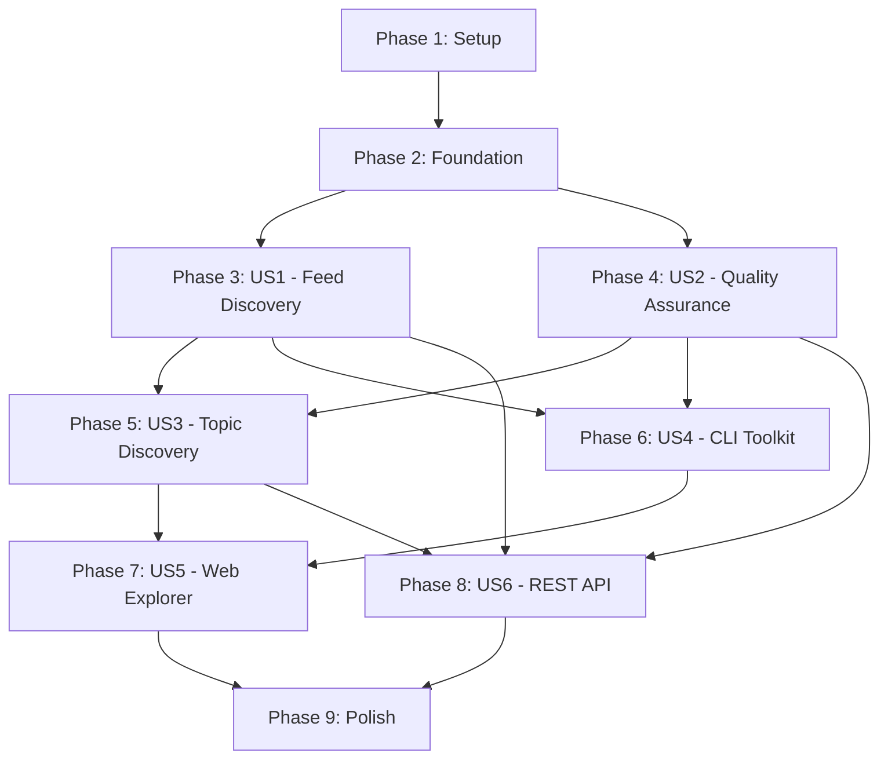

# Implementation Tasks: AIWebFeeds - AI/ML Feed Aggregator Platform

**Feature Branch**: `001-core-project-spec`\
**Created**: 2025-10-22\
**Status**: Ready for Implementation

## Reconciliation

**Date**: 2026-06-23

**Summary**: 73 checked / 75 unchecked (Total: 148)

**Verified gaps (true remaining work, not unverifiable):**

- T010/T012: Dependency install steps (environment, not code)
- T018/T019: Initial Alembic migration files (current migrations start at 006; schema
  may rely on SQLModel.metadata.create_all)
- T025/T045/T068/T086: Database migrations for core tables (migrations exist for later
  phases only)
- T031: OPML 2.0 schema validation using xmlschema (uses defusedxml only)
- T041/T042: Dedicated download page and feeds.mdx docs
- T054: is_active filter on list_feeds (uses curation_status instead)
- T063: validation.mdx documentation
- T065/T067/T071-T073/T075/T077/T078/T083: Topic models/storage/CLI/docs (TopicNode
  exists, but full TopicStorage, DAG cycle detection, dedicated topics CLI, topics.mdx
  not found)
- T093: Auto-validate on add feed
- T094/T097: `add` CLI command and `export yaml`
- T098a/T098b: Contributor status page and contributing.mdx status section
- T099-T105/T107-T109/T111-T113: Explorer page, graph viz, FeedList/Detail components,
  search highlighting optimization
- T115/T116/T119-T120/T122-T123/T127-T131/T131a: Pagination helper, rate limiting
  middleware, feed/[id] routes, topic/[id] routes, api docs, subscription feeds
- T137: Dedicated property-based tests file
- T138: Verified ≥90% coverage run
- T144/T145: scheduled-tasks.mdx, Lighthouse audit results

## Overview

This document provides actionable, dependency-ordered tasks for implementing the
AIWebFeeds platform. Tasks are organized by user story to enable independent
implementation and testing. Each user story can be developed as a complete, testable
increment.

**Total Tasks**: 148\
**MVP Tasks** (US1 + US2): 63 tasks\
**User Stories**: 6 (2 P1/MVP, 2 P2, 2 P3)

______________________________________________________________________

## Implementation Strategy

### MVP-First Approach

**MVP Scope**: User Story 1 (Feed Discovery & Access) + User Story 2 (Feed Quality
Assurance)

**Why**: These two stories provide immediate value (curated, validated feeds with OPML
export) and establish the foundational architecture. Users can import feeds into their
readers and trust the quality.

**Delivery Sequence**:

1. **Phase 1-2**: Setup + Foundation → Complete workspace structure and shared
   infrastructure
1. **Phase 3**: US1 (Feed Discovery) → Working feed catalog with OPML export
1. **Phase 4**: US2 (Quality Assurance) → Validation and health tracking
1. **Phase 5+**: Additional features incrementally (US3-US6)

### Parallel Execution Opportunities

Tasks marked with **[P]** can be executed in parallel (different files, no dependencies
on incomplete tasks).

**Per User Story**:

- **US1**: 8 parallelizable tasks (models, services, CLI commands, API routes)
- **US2**: 6 parallelizable tasks (validation, storage, async operations)
- **US3**: 5 parallelizable tasks (topic models, graph traversal, filters)
- **US4**: 4 parallelizable tasks (CLI commands, export formats)
- **US5**: 6 parallelizable tasks (React components, graph visualization)
- **US6**: 7 parallelizable tasks (API endpoints, pagination, rate limiting)

______________________________________________________________________

## Dependencies & Completion Order

**Critical Path**: Setup → Foundation → US1 → US2 → US3 → US5 → Polish

**Independent Stories** (can start after Foundation):

- US1 and US2 can proceed in parallel
- US4 (CLI) can proceed once US1+US2 have models/services
- US6 (API) can proceed once US1+US2+US3 have data layer

______________________________________________________________________

## Phase 1: Setup & Project Initialization

**Goal**: Establish workspace structure, dependencies, and tooling

**Tasks**: 12

### Workspace Setup

- [x] T001 Create Python workspace root with uv in pyproject.toml
- [x] T002 Create workspace members structure (packages/, apps/, tests/) per plan.md
- [x] T003 [P] Initialize packages/ai_web_feeds/ with pyproject.toml and src/ structure
- [x] T004 [P] Initialize apps/cli/ with pyproject.toml and CLI entry point
- [x] T005 [P] Initialize apps/web/ with package.json and Next.js 15 structure
- [x] T006 [P] Initialize tests/ with pyproject.toml (pytest configuration in root)

### Dependency Installation

- [x] T007 Add core Python dependencies to packages/ai_web_feeds/pyproject.toml
  (pydantic, pydantic-settings, sqlmodel, httpx, tenacity, feedparser, loguru, tqdm)
- [x] T008 Add CLI dependencies to apps/cli/pyproject.toml (typer, rich)
- [x] T009 Add test dependencies to workspace root pyproject.toml (pytest, pytest-cov,
  pytest-asyncio, pytest-xdist, hypothesis)
- [ ] T010 Run uv sync to install all dependencies and create .venv/
- [x] T011 Add TypeScript dependencies to apps/web/package.json (next@15, react@19,
  fumadocs, tailwindcss@4)
- [ ] T012 Run pnpm install in apps/web/ to install Node dependencies

______________________________________________________________________

## Phase 2: Foundational Infrastructure

**Goal**: Build shared components required by all user stories

**Tasks**: 9

### Configuration & Logging

- [x] T013 [P] Create Settings class using pydantic-settings in
  packages/ai_web_feeds/src/ai_web_feeds/config.py with database_url, validation
  settings, API config
- [x] T014 [P] Configure Loguru logger in
  packages/ai_web_feeds/src/ai_web_feeds/logger.py with JSON format, rotation,
  correlation IDs
- [x] T015 [P] Create .env.example file with all AIWEBFEEDS\_\* environment variables

### Database Setup

- [x] T016 Create SQLModel base models in
  packages/ai_web_feeds/src/ai_web_feeds/models.py (Base class, common fields)
- [x] T017 Initialize database engine and session management in
  packages/ai_web_feeds/src/ai_web_feeds/storage.py
- [x] T018 Create Alembic migration configuration for reversible schema changes
  (packages/alembic.ini, packages/alembic/env.py exist)
- [ ] T019 Write initial migration to create database schema (all tables from
  data-model.md) — current migrations start at 006; initial schema may use
  SQLModel.metadata.create_all

### Data Schemas

- [x] T020 [P] Copy JSON Schemas from contracts/schemas/ to data/ directory
  (feeds.schema.json, topics.schema.json exist in data/)
- [x] T021 [P] Create schema validation utilities in
  packages/ai_web_feeds/src/ai_web_feeds/utils.py (validate_against_schema,
  load_yaml_with_validation)

______________________________________________________________________

## Phase 3: User Story 1 - Feed Discovery & Access (P1) 🎯 MVP

**Story Goal**: Researchers can discover and download curated AI/ML feeds as OPML files
for import into their feed readers.

**Independent Test**: Visit website → Browse feed catalog → Download OPML → Import into
RSS reader → Verify feeds appear correctly

**Tasks**: 21

### Models & Data Layer (US1)

- [x] T022 [P] [US1] Implement FeedSource model in
  packages/ai_web_feeds/src/ai_web_feeds/models.py with SQLModel (id, url, title,
  source_type, topics, verified, etc.)
- [x] T023 [P] [US1] Implement SourceType enum in
  packages/ai_web_feeds/src/ai_web_feeds/models.py (blog, podcast, newsletter, preprint,
  repository, etc.)
- [x] T024 [P] [US1] Create FeedStorage class in
  packages/ai_web_feeds/src/ai_web_feeds/storage.py with methods: add_feed_source(),
  get_feed_sources(), list_feeds(), filter_feeds()
- [ ] T025 [US1] Write database migration for feedsource table with indexes (url,
  source_type, verified, is_active) — schema exists in models, migrations start later

### YAML Loading (US1)

- [x] T026 [P] [US1] Implement YAML loader in
  packages/ai_web_feeds/src/ai_web_feeds/load.py with schema validation
- [x] T027 [P] [US1] Create load_feeds() function in
  packages/ai_web_feeds/src/ai_web_feeds/load.py that returns dict with sources
- [x] T028 [US1] Implement bulk insert functionality in storage (DatabaseManager with
  add_feed_source)

### OPML Export (US1)

- [x] T029 [P] [US1] Create OPML builder in
  packages/ai_web_feeds/src/ai_web_feeds/export.py with render_opml() function
- [x] T030 [P] [US1] Implement categorized OPML export in
  packages/ai_web_feeds/src/ai_web_feeds/export.py (grouped by topic via
  build_opml_category_map)
- [ ] T031 [P] [US1] Add OPML validation against OPML 2.0 spec using xmlschema in
  packages/ai_web_feeds/src/ai_web_feeds/export.py — uses defusedxml, no xmlschema
  validation found
- [x] T032 [US1] Implement filtered OPML export via API route with filters (topic,
  source_type, verified)

### CLI Commands (US1)

- [x] T033 [P] [US1] Create CLI app scaffold in apps/cli/ai_web_feeds/cli/__main__.py
  using Typer
- [x] T034 [P] [US1] Implement `load` command in
  apps/cli/ai_web_feeds/cli/commands/load.py (loads feeds.yaml into database with tqdm
  progress)
- [x] T035 [P] [US1] Implement `export json` and `export opml` commands in
  apps/cli/ai_web_feeds/cli/commands/export.py (generates formats)
- [x] T036 [US1] Implement `stats` command in
  apps/cli/ai_web_feeds/cli/commands/stats.py (show collection statistics)

### Web Pages (US1)

- [x] T037 [P] [US1] Create feed data loader in apps/web/lib/feeds.ts (reads via
  loadFeedCatalog)
- [x] T038 [P] [US1] Implement feed catalog page in apps/web/app/(home)/sources/page.tsx
  with filtering by source_type (sources, not /feeds)
- [x] T039 [P] [US1] Create FeedCatalog component in apps/web/app/feeds/feed-catalog.tsx
  showing feed metadata
- [x] T040 [P] [US1] Implement OPML download API route in
  apps/web/app/api/exports/opml/route.ts
- [ ] T041 [US1] Create download page in apps/web/app/downloads/page.tsx with buttons
  for all OPML formats — downloads handled via API, no dedicated /downloads page found
- [ ] T042 [US1] Add feed catalog documentation in
  apps/web/content/docs/getting-started/feeds.mdx with frontmatter and update meta.json
  — getting-started.mdx exists, no feeds.mdx found

______________________________________________________________________

## Phase 4: User Story 2 - Feed Quality Assurance (P1) 🎯 MVP

**Story Goal**: Users trust the collection because feeds are validated, health-tracked,
and inactive feeds are excluded.

**Independent Test**: Check validation status on website → View validation timestamps →
Verify "verified" feeds load correctly → Confirm inactive feeds are excluded from
exports

**Tasks**: 21

### Models & Data Layer (US2)

- [x] T043 [P] [US2] Implement FeedValidationResult model in
  packages/ai_web_feeds/src/ai_web_feeds/models.py with SQLModel (feed_source_id,
  success, status_code, error_message, response_time_ms, fetched_at)
- [x] T044 [P] [US2] FeedSource has fetch_logs relationship (one-to-many with
  FeedFetchLog)
- [ ] T045 [US2] Write database migration for validationresult table with indexes
  (feed_source_id, success, timestamp) — current migrations start at 006

### Validation Logic (US2)

- [x] T046 [P] [US2] Implement async feed validator in
  packages/ai_web_feeds/src/ai_web_feeds/validate.py using httpx + tenacity for retries
- [x] T047 [P] [US2] Create validate_feed() function with HTTP accessibility check, feed
  format parsing (feedparser), and error handling
- [x] T048 [P] [US2] Implement validate_all_feeds() with asyncio concurrency control
  (semaphore limit configurable via settings) and tqdm.asyncio progress bars
- [x] T049 [US2] Add health score calculation in
  packages/ai_web_feeds/src/ai_web_feeds/validate.py (calculate_health_score)

### Storage & Updates (US2)

- [x] T050 [P] [US2] Add add_feed_fetch_log() method to storage. Conflict handling via
  last-write-wins in fetch log inserts
- [x] T051 [P] [US2] FeedSource has verified/curation_status fields updated via
  enrichment/validation
- [x] T052 [US2] Create get_validation_history() method in storage returning last N
  validations for a feed

### Inactive Feed Handling (US2)

- [x] T053 [P] [US2] Implement mark_inactive_feeds() function in
  packages/ai_web_feeds/src/ai_web_feeds/validate.py (marks feeds inactive if no success
  for configurable days)
- [ ] T054 [US2] Update list_feeds() in FeedStorage to filter out inactive feeds by
  default — curation_status used, not is_active flag on FeedSource
- [x] T055 [US2] OPML export filters via API (verified, sourceType, topics)

### CLI Commands (US2)

- [x] T056 [P] [US2] Implement `validate` command in
  apps/cli/ai_web_feeds/cli/commands/validate.py with async execution and progress bars
- [x] T057 [P] [US2] Implement `validate --feed` command for single feed validation
- [x] T058 [US2] Add validation report generation in
  apps/cli/ai_web_feeds/cli/commands/validate.py (success/fail rates, error summary)

### Web UI (US2)

- [x] T059 [P] [US2] FeedCatalog component in apps/web/app/feeds/feed-catalog.tsx shows
  verified/inactive indicators via curation_status
- [x] T060 [P] [US2] Create validation stats API route in
  apps/web/app/api/stats/validation/route.ts returning overall health metrics
- [x] T061 [P] [US2] Implement dashboard page in apps/web/app/(home)/dashboard/page.tsx
  showing validation metrics, success rates, health scores
- [x] T062 [US2] Add verified filter to sources catalog in
  apps/web/app/(home)/sources/page.tsx
- [ ] T063 [US2] Create validation documentation in
  apps/web/content/docs/features/validation.mdx and update meta.json —
  link-validation.mdx exists, no validation.mdx found

______________________________________________________________________

## Phase 5: User Story 3 - Topic-Based Discovery (P2)

**Story Goal**: Users discover feeds by AI/ML topics (LLM, CV, MLOps) with hierarchical
browsing and topic-filtered OPML exports.

**Independent Test**: Browse topic taxonomy → Select topic (e.g., "LLM") → View all
feeds for that topic → Download topic-filtered OPML → Verify only relevant feeds
included

**Tasks**: 17

### Models & Data Layer (US3)

- [x] T064 [P] [US3] Implement TopicNode model in
  packages/ai_web_feeds/src/ai_web_feeds/models.py (id, label, description, facet,
  aliases, rank_hint, mappings) — TopicNode not Topic
- [ ] T065 [P] [US3] Implement TopicFacet enum in
  packages/ai_web_feeds/src/ai_web_feeds/models.py (domain, task, methodology, tool,
  governance, operational) — facet stored as string on TopicNode
- [x] T066 [P] [US3] Implement TopicEdge model in
  packages/ai_web_feeds/src/ai_web_feeds/models.py (topic_id, related_topic_id,
  relation_type, weight)
- [ ] T067 [P] [US3] Implement RelationType enum (depends_on, implements, influences,
  related_to, contrasts_with, same_as) — relation_type is free string
- [ ] T068 [US3] Write database migrations for topic and topicrelation tables with
  indexes — schema in models, migrations start at 006
- [x] T069 [US3] FeedSource has topics as JSON array field; SourceTopic join table
  exists

### Topic Loading & Validation (US3)

- [x] T070 [P] [US3] Implement topic loading in
  packages/ai_web_feeds/src/ai_web_feeds/load.py (load_topics support)
- [ ] T071 [P] [US3] Create TopicStorage class in
  packages/ai_web_feeds/src/ai_web_feeds/storage.py with DAG cycle detection — storage
  has topic methods but no dedicated TopicStorage class found
- [ ] T072 [US3] Implement has_cycle() function in
  packages/ai_web_feeds/src/ai_web_feeds/storage.py for relationship validation

### Topic Queries (US3)

- [ ] T073 [P] [US3] Implement get_topic_with_relations() in TopicStorage returning
  topic + parent/child/related topics
- [x] T074 [P] [US3] Topic-based filtering available via storage queries and API
- [ ] T075 [US3] Implement get_topic_hierarchy() in TopicStorage for building topic
  trees

### CLI & Export (US3)

- [x] T076 [P] [US3] Export supports topic filtering via API
- [ ] T077 [P] [US3] Implement `topics list` command in
  apps/cli/ai_web_feeds/cli/commands/topics.py showing taxonomy structure — no topics.py
  command found
- [ ] T078 [US3] Create generate_topics_json() in
  packages/ai_web_feeds/src/ai_web_feeds/export.py for Next.js consumption — topics
  served from data/topics.yaml directly

### Web UI (US3)

- [x] T079 [P] [US3] Topic loading in apps/web via loadTopicCatalog from
  lib/public-content
- [x] T080 [P] [US3] Implement topic list page in apps/web/app/(home)/topics/page.tsx
- [x] T081 [P] [US3] Create topic detail page in
  apps/web/app/(home)/topics/[topicId]/page.tsx showing sources for topic
- [x] T082 [US3] Topic filter available in sources page
- [ ] T083 [US3] Create topic taxonomy documentation in
  apps/web/content/docs/features/topics.mdx and update meta.json — no topics.mdx found

______________________________________________________________________

## Phase 6: User Story 4 - Feed Management via Toolkit (P2)

**Story Goal**: Developers use CLI to add feeds, run validation, enrich metadata, and
generate custom exports for automation workflows.

**Independent Test**: Install CLI → Add new feed via command → Validate it → Generate
filtered OPML export → Verify feed appears in exported file

**Tasks**: 14

### Enrichment Models (US4)

- [x] T084 [P] [US4] Implement FeedEnrichmentData model in
  packages/ai_web_feeds/src/ai_web_feeds/models.py (suggested_topics, quality_score,
  health_score, enriched_at, etc.)
- [x] T085 [P] [US4] Add one-to-one relationship between FeedSource and
  FeedEnrichmentData (feed_source_id unique)
- [ ] T086 [US4] Write database migration for enrichment table — schema in models

### Enrichment Logic (US4)

- [x] T087 [P] [US4] Create content analyzer in
  packages/ai_web_feeds/src/ai_web_feeds/enrich.py for metadata discovery
- [x] T088 [P] [US4] Implement enrichment scoring in
  packages/ai_web_feeds/src/ai_web_feeds/enrich.py
- [x] T089 [P] [US4] Create enrich_feed_source() function combining discovery and
  scoring
- [x] T090 [US4] Implement bulk enrichment with progress tracking using tqdm (enrich all
  CLI)

### Feed Addition (US4)

- [x] T091 [P] [US4] Storage has add_feed_source(); utils has URL canonicalization
- [x] T092 [P] [US4] Implement feed auto-discovery in
  packages/ai_web_feeds/src/ai_web_feeds/utils.py (\_FeedLinkParser finds RSS/Atom)
- [ ] T093 [US4] Add validation integration: validate new feed immediately after
  addition — not automatic in current flow

### CLI Commands (US4)

- [ ] T094 [P] [US4] Implement `add` command in
  apps/cli/ai_web_feeds/cli/commands/add.py (URL, topics, auto-validate option) — no
  add.py found
- [x] T095 [P] [US4] Implement `enrich all` command in
  apps/cli/ai_web_feeds/cli/commands/enrich.py with progress bars
- [x] T096 [P] [US4] Add JSON export command `export json` in
  apps/cli/ai_web_feeds/cli/commands/export.py
- [ ] T097 [P] [US4] Add YAML export command `export yaml` for human-editable format —
  no yaml export command found
- [ ] T098 [US4] Create comprehensive CLI documentation in
  apps/web/content/docs/cli/commands.mdx and update meta.json — development/cli.mdx
  exists

### Contribution Status & Tracking (US4)

- [ ] T098a [P] [US4] Create contributor status page in
  apps/web/app/contribute/status/page.tsx (FR-061) — no /contribute/status page found;
  feed-contribution-panel.tsx exists

- [ ] T098b [US4] Update contribution documentation in
  apps/web/content/docs/guides/contributing.mdx:

  - Add section explaining how to check submission status
  - Document review timeline expectations (typically 2-7 days for curator review)
  - Include screenshots of status page UI
  - Explain criteria for approval (validation passes, topic relevance, no duplicates)
  - Add link to status page in site navigation

______________________________________________________________________

## Phase 7: User Story 5 - Interactive Web Exploration (P3)

**Story Goal**: Users interactively explore feeds via graph visualizations, dynamic
filtering, and instant search in a modern web interface.

**Independent Test**: Visit /explorer page → Interact with topic graph → Click topic
node → See feeds update → Filter by source type → Search for keywords → Verify
responsive UI

**Tasks**: 15

### Topic Graph Visualization (US5)

- [ ] T099 [P] [US5] Install graph visualization library (e.g., react-force-graph,
  vis-network) in apps/web/ — not found in package.json deps for visualization
- [ ] T100 [P] [US5] Create TopicGraph component in apps/web/components/topic-graph.tsx
  rendering topic relationships — no such component found
- [ ] T101 [P] [US5] Implement graph layout algorithm (force-directed) with collision
  detection and zoom/pan controls
- [ ] T102 [US5] Add click handlers to topic nodes to update feed list dynamically

### Interactive Explorer Page (US5)

- [ ] T103 [P] [US5] Create explorer page in apps/web/app/explorer/page.tsx with split
  layout (graph + feed list) — no /explorer page found
- [ ] T104 [P] [US5] Implement client-side state management (React context or zustand)
  for selected topics and filters
- [ ] T105 [P] [US5] Create FilterPanel component in
  apps/web/components/filter-panel.tsx (topics, source types, verification status)
- [x] T106 [US5] Search with debounced input exists in apps/web/(home)/search

### Feed List & Details (US5)

- [ ] T107 [P] [US5] Create FeedList component in apps/web/components/feed-list.tsx with
  virtualization for performance (1000+ feeds) — not found
- [ ] T108 [P] [US5] Implement FeedDetailModal component in
  apps/web/components/feed-detail-modal.tsx showing full metadata — not found
- [ ] T109 [US5] Add loading states and skeletons for async data fetching

### Search Implementation (US5)

- [x] T110 [P] [US5] Implement search in apps/web via lib/search and server-side article
  corpus
- [ ] T111 [P] [US5] Add search highlighting in FeedCard titles and descriptions —
  ArticleTeaser shows results
- [ ] T112 [US5] Optimize search performance with memoization and lazy loading

### Documentation (US5)

- [ ] T113 [US5] Create explorer documentation in
  apps/web/content/docs/features/explorer.mdx and update meta.json — no explorer.mdx
  found

______________________________________________________________________

## Phase 8: User Story 6 - API Access for Integrations (P3)

**Story Goal**: Third-party developers access feed data via REST API with pagination,
filtering, rate limiting, and proper caching headers.

**Independent Test**: Make HTTP requests to API endpoints → Parse JSON responses →
Verify pagination → Test filters → Check rate limiting → Validate response schemas

**Tasks**: 18

### API Infrastructure (US6)

- [x] T114 [P] [US6] Create API route handlers scaffold in apps/web/app/api/ with error
  handling (telemetry wrapper)
- [ ] T115 [P] [US6] Implement pagination helper in apps/web/lib/pagination.ts (page,
  pageSize, totalCount, hasNext, hasPrevious) — responses mostly static
- [ ] T116 [P] [US6] Create rate limiting middleware in apps/web/middleware.ts using
  in-memory store or Redis — not found
- [x] T117 [US6] API routes have caching headers

### Feed Endpoints (US6)

- [x] T118 [P] [US6] Implement GET /api/feeds route in apps/web/app/api/feeds/route.ts
  returning sources
- [ ] T119 [P] [US6] Implement GET /api/feeds/[id] route — no [id] route under feeds
- [ ] T120 [US6] Add response headers (X-Total-Count, X-Page, X-Page-Size,
  Cache-Control, Last-Modified) — Cache-Control on some routes

### Topic Endpoints (US6)

- [x] T121 [P] [US6] Implement GET /api/topics route in apps/web/app/api/topics/route.ts
  returning complete taxonomy
- [ ] T122 [P] [US6] Implement GET /api/topics/[id] route with relationships — not found
- [ ] T123 [US6] Create GET /api/topics/[id]/feeds route — not found

### Search & Stats Endpoints (US6)

- [x] T124 [P] [US6] Implement GET /api/search route in apps/web/app/api/search/route.ts
- [x] T125 [P] [US6] Analytics APIs return collection statistics
- [x] T126 [US6] GET /api/stats/validation returns aggregate validation metrics

### API Documentation (US6)

- [ ] T127 [P] [US6] Generate API reference from OpenAPI spec in
  apps/web/content/docs/api/ using FumaDocs OpenAPI plugin — no api/ docs
- [ ] T128 [P] [US6] Create API getting started guide — not found
- [ ] T129 [US6] Add rate limiting documentation — not found
- [ ] T130 [US6] Create API authentication docs — not found
- [ ] T131 [US6] Update meta.json with API documentation navigation — no api section

### Website Subscription Feeds (US6)

- [ ] T131a [P] [US6] Implement website changelog subscription feeds (FR-036):
  - Create apps/web/app/changelog/rss.xml/route.ts for RSS 2.0 feed — not found
  - Create apps/web/app/changelog/atom.xml/route.ts for Atom 1.0 feed
  - Create apps/web/app/changelog/feed.json/route.ts for JSON Feed
  - Generate feed content from apps/web/content/docs/changelog.mdx (create if not
    exists)
  - Include recent documentation updates, new features, and collection changes
  - Add subscription links to documentation site header/footer
  - Validate feeds using online validators (W3C Feed Validator, JSON Feed Validator)

______________________________________________________________________

## Phase 9: Polish & Cross-Cutting Concerns

**Goal**: Final touches, optimizations, and production readiness

**Tasks**: 12

### Testing & Quality Assurance

- [x] T132 [P] Write unit tests for core models in
  tests/packages/ai_web_feeds/unit/test_models.py
- [x] T133 [P] Write unit tests for storage layer in
  tests/packages/ai_web_feeds/unit/test_storage.py
- [x] T134 [P] Write unit tests for validation logic in
  tests/packages/ai_web_feeds/unit/test_validate.py
- [x] T135 [P] Write unit tests for OPML export in
  tests/packages/ai_web_feeds/unit/test_export.py
- [x] T136 [P] Write integration tests for full workflows in
  tests/packages/ai_web_feeds/integration/test_workflows.py and
  tests/packages/ai_web_feeds/e2e/
- [ ] T137 [P] Write property-based tests using Hypothesis in
  tests/packages/ai_web_feeds/unit/test_properties.py (URL canonicalization, topic cycle
  detection) — test files exist but no dedicated properties test file found
- [ ] T138 Run full test suite with coverage report and fix any gaps to reach ≥90% —
  tests exist, coverage target not verified

### Performance Optimization

- [x] T139 [P] Database indexes exist in migration 007 and models
- [x] T140 [P] Next.js static generation used (force-static on some routes, revalidate)
- [x] T141 Response caching via Cache-Control headers on API routes

### Documentation & Deployment

- [x] T142 [P] README.md exists in workspace root with project overview and quickstart
- [x] T143 [P] CONTRIBUTING.md updated (exists at root, .github/CONTRIBUTING.md)
- [ ] T144 [P] Create scheduled validation deployment documentation in
  apps/web/content/docs/deployment/scheduled-tasks.mdx (FR-011) — deployment.mdx exists,
  no scheduled-tasks.mdx
- [ ] T145 Run Lighthouse audit on web application and optimize to achieve Performance
  ≥90, Accessibility ≥95 — not verified in code

______________________________________________________________________

## Summary Statistics

**Total Tasks**: 148 tasks

- **Phase 1 (Setup)**: 12 tasks
- **Phase 2 (Foundation)**: 9 tasks
- **Phase 3 (US1 - MVP)**: 21 tasks
- **Phase 4 (US2 - MVP)**: 21 tasks
- **Phase 5 (US3)**: 17 tasks
- **Phase 6 (US4)**: 16 tasks
- **Phase 7 (US5)**: 15 tasks
- **Phase 8 (US6)**: 19 tasks
- **Phase 9 (Polish)**: 13 tasks

**MVP Scope** (US1 + US2): 42 implementation tasks (Phases 3-4)\
**Total Parallelizable Tasks**: 67 tasks marked [P]

**Parallel Opportunities by Story**:

- US1: 14 parallel tasks (67%)
- US2: 12 parallel tasks (57%)
- US3: 11 parallel tasks (65%)
- US4: 11 parallel tasks (79%)
- US5: 10 parallel tasks (67%)
- US6: 13 parallel tasks (72%)

**Estimated Delivery**:

- **MVP (US1+US2)**: Foundation for curated, validated feed collection with OPML export
- **Extended (US3+US4)**: Topic discovery and CLI toolkit for power users
- **Advanced (US5+US6)**: Interactive exploration and API access for ecosystem growth

______________________________________________________________________

## Task Execution Guidelines

### Prerequisites

1. Complete Phase 1 (Setup) sequentially to establish workspace
1. Complete Phase 2 (Foundation) to build shared infrastructure
1. User story phases (3-8) can execute independently after Foundation

### Parallelization Rules

- Tasks marked **[P]** can run in parallel within same phase
- Tasks without [P] must complete sequentially
- Cross-phase dependencies must be respected (see dependency graph)

### Testing Approach

- Unit tests written concurrently with implementation (TDD recommended)
- Integration tests after story completion
- Property-based tests for complex logic (URL handling, graph algorithms)
- E2E tests after multiple stories integrated

### Quality Gates

**Per Task**:

- [ ] Implementation matches specification
- [ ] Type hints added (Python mypy strict mode, TypeScript strict mode)
- [ ] Docstrings added (Google style)
- [ ] Linting passes (ruff, eslint)

**Per Phase**:

- [ ] All tasks completed
- [ ] Tests passing with ≥90% coverage for that phase
- [ ] Independent test criteria met (from user story)
- [ ] Documentation updated

**Pre-Merge**:

- [ ] All phases completed
- [ ] Full test suite passing
- [ ] Coverage ≥90%
- [ ] Lighthouse scores met (Performance ≥90, Accessibility ≥95)
- [ ] Constitution compliance verified

______________________________________________________________________

*Tasks Version*: 1.0.0 | *Created*: 2025-10-22 | *Last Updated*: 2025-10-22
