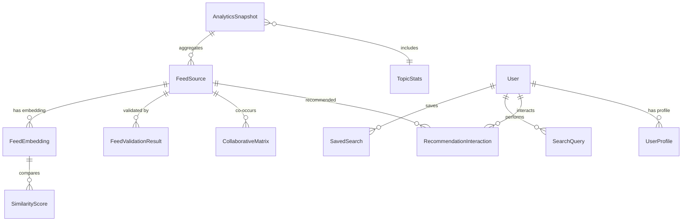

# Data Model: Phase 1 - Data Discovery & Analytics

**Feature Branch**: `002-data-discovery-analytics`  
**Date**: 2025-10-22  
**Status**: Design Complete

---

## Overview

This document defines the complete data model for Phase 1 features: Analytics Dashboard, Intelligent Search & Discovery, and AI-Powered Feed Recommendations. All entities use SQLModel for type-safe database interactions and Pydantic v2 for validation.

---

## Entity Relationships



---

## Core Entities (Existing, Extended)

### FeedSource (Extended)

**Purpose**: Represents a feed source with enhanced fields for search and recommendations.

**Fields**:
```python
from sqlmodel import SQLModel, Field
from uuid import UUID, uuid4
from datetime import datetime

class FeedSource(SQLModel, table=True):
    """Feed source with search/recommendation enhancements"""
    __tablename__ = "sources"
    
    # Existing fields (from MVP)
    id: str = Field(primary_key=True)
    url: str = Field(unique=True, index=True)
    title: str
    description: str | None
    source_type: str = Field(index=True)  # blog, podcast, newsletter, etc.
    topics: list[str] = Field(default_factory=list, sa_column_kwargs={"type_": JSON})
    verified: bool = Field(default=False, index=True)
    is_active: bool = Field(default=True, index=True)
    created_at: datetime = Field(default_factory=datetime.utcnow)
    updated_at: datetime = Field(default_factory=datetime.utcnow)
    
    # NEW: Search & Recommendation fields
    popularity_score: float = Field(default=0.0, index=True)  # Computed: follower count, click-through rate
    last_validated_at: datetime | None = Field(default=None, index=True)
    validation_count: int = Field(default=0)  # Number of successful validations
```

**Validation Rules**:
- `url` MUST be unique and valid HTTP(S) URL
- `source_type` MUST be one of: `blog`, `podcast`, `newsletter`, `video`, `social`, `other`
- `topics` MUST reference existing topics from `topics.yaml`
- `popularity_score` MUST be between 0.0 and 1.0
- `verified` can only be set by curators with manual approval

**Indexes**:
- Primary key: `id`
- Unique: `url`
- B-tree: `source_type`, `verified`, `is_active`, `popularity_score`
- Compound: `(is_active, verified, popularity_score)` for recommendation queries

---

## New Entities (Phase 1)

### 1. FeedEmbedding

**Purpose**: Stores vector embeddings for semantic search.

**Fields**:
```python
class FeedEmbedding(SQLModel, table=True):
    """Vector embeddings for semantic similarity search"""
    __tablename__ = "feed_embeddings"
    
    feed_id: str = Field(foreign_key="sources.id", primary_key=True)
    embedding: bytes = Field()  # 384-dim float32 array serialized as bytes (1536 bytes)
    embedding_model: str = Field(default="sentence-transformers/all-MiniLM-L6-v2")
    embedding_provider: str = Field(default="local")  # "local" or "huggingface"
    created_at: datetime = Field(default_factory=datetime.utcnow)
    updated_at: datetime = Field(default_factory=datetime.utcnow)
```

**Validation Rules**:
- `embedding` MUST be exactly 1536 bytes (384 float32 values)
- `embedding_model` MUST match configured model version
- `embedding_provider` MUST be "local" or "huggingface"

**Relationships**:
- `feed_id` references `FeedSource.id` (one-to-one)

**Indexes**:
- Primary key: `feed_id`
- B-tree: `updated_at` (for incremental refreshes)

**Usage**:
```python
import numpy as np

# Store embedding
embedding_vector = model.encode(["feed description"])[0]  # (384,) array
embedding_bytes = embedding_vector.astype(np.float32).tobytes()
db_embedding = FeedEmbedding(
    feed_id="feed-123",
    embedding=embedding_bytes,
    embedding_model="all-MiniLM-L6-v2",
    embedding_provider="local"
)

# Retrieve embedding
feed_emb = session.get(FeedEmbedding, "feed-123")
embedding_vector = np.frombuffer(feed_emb.embedding, dtype=np.float32)  # (384,) array
```

---

### 2. AnalyticsSnapshot

**Purpose**: Stores aggregated analytics metrics at a point in time for historical trending.

**Fields**:
```python
class AnalyticsSnapshot(SQLModel, table=True):
    """Daily analytics snapshots for historical trending"""
    __tablename__ = "analytics_snapshots"
    
    snapshot_date: str = Field(primary_key=True)  # ISO date: "2025-10-22"
    total_feeds: int
    active_feeds: int
    inactive_feeds: int
    validation_success_rate: float  # 0.0 - 1.0
    avg_response_time: float  # milliseconds
    trending_topics: str = Field(sa_column_kwargs={"type_": JSON})  # JSON array: [{"topic": "LLM", "count": 45}, ...]
    health_distribution: str = Field(sa_column_kwargs={"type_": JSON})  # JSON object: {"healthy": 800, "moderate": 150, "unhealthy": 50}
    created_at: datetime = Field(default_factory=datetime.utcnow)
```

**Validation Rules**:
- `snapshot_date` MUST be ISO 8601 date format (YYYY-MM-DD)
- `validation_success_rate` MUST be between 0.0 and 1.0
- `trending_topics` MUST be valid JSON array
- `health_distribution` MUST be valid JSON object

**Indexes**:
- Primary key: `snapshot_date`
- B-tree: `created_at` (for recent snapshots)

**Usage**:
```python
import json

snapshot = AnalyticsSnapshot(
    snapshot_date="2025-10-22",
    total_feeds=1000,
    active_feeds=950,
    inactive_feeds=50,
    validation_success_rate=0.92,
    avg_response_time=250.5,
    trending_topics=json.dumps([
        {"topic": "LLM", "count": 45, "growth": 0.15},
        {"topic": "Computer Vision", "count": 38, "growth": 0.08}
    ]),
    health_distribution=json.dumps({
        "healthy": 800,
        "moderate": 150,
        "unhealthy": 50
    })
)
```

---

### 3. TopicStats

**Purpose**: Tracks per-topic metrics for trending calculations.

**Fields**:
```python
class TopicStats(SQLModel, table=True):
    """Per-topic activity statistics"""
    __tablename__ = "topic_stats"
    
    topic: str = Field(primary_key=True)
    feed_count: int = Field(default=0)
    active_feed_count: int = Field(default=0)
    avg_health_score: float = Field(default=0.0)
    validation_frequency: int = Field(default=0)  # Validations in last 30 days
    last_updated: datetime = Field(default_factory=datetime.utcnow, index=True)
```

**Validation Rules**:
- `topic` MUST reference existing topic from `topics.yaml`
- `avg_health_score` MUST be between 0.0 and 1.0
- `validation_frequency` MUST be non-negative

**Indexes**:
- Primary key: `topic`
- B-tree: `validation_frequency` (for trending queries), `last_updated`

**Usage**:
```python
# Calculate trending topics
trending = session.exec(
    select(TopicStats)
    .where(TopicStats.validation_frequency > 0)
    .order_by(TopicStats.validation_frequency.desc())
    .limit(10)
).all()
```

---

### 4. SearchQuery

**Purpose**: Logs user search queries for analytics and personalization.

**Fields**:
```python
class SearchQuery(SQLModel, table=True):
    """User search query logs"""
    __tablename__ = "search_queries"
    
    id: UUID = Field(default_factory=uuid4, primary_key=True)
    user_id: str | None = Field(default=None, index=True)  # Optional, NULL for anonymous
    query_text: str = Field(index=True)
    search_type: str = Field(default="full_text")  # "full_text", "semantic", "hybrid"
    filters_applied: str | None = Field(default=None, sa_column_kwargs={"type_": JSON})  # JSON object
    result_count: int = Field(default=0)
    clicked_results: str | None = Field(default=None, sa_column_kwargs={"type_": JSON})  # JSON array of feed_ids
    timestamp: datetime = Field(default_factory=datetime.utcnow, index=True)
```

**Validation Rules**:
- `query_text` MUST be non-empty, max 400 characters
- `search_type` MUST be "full_text", "semantic", or "hybrid"
- `result_count` MUST be non-negative
- `filters_applied` MUST be valid JSON object if present
- `clicked_results` MUST be valid JSON array if present

**Indexes**:
- Primary key: `id`
- B-tree: `user_id`, `query_text`, `timestamp`
- Compound: `(query_text, timestamp)` for popular searches

**Usage**:
```python
import json

query = SearchQuery(
    user_id="user-123",
    query_text="transformer models",
    search_type="semantic",
    filters_applied=json.dumps({"source_type": "blog", "verified": True}),
    result_count=15,
    clicked_results=json.dumps(["feed-45", "feed-89"])
)
```

---

### 5. SavedSearch

**Purpose**: User-saved search queries for one-click replay.

**Fields**:
```python
class SavedSearch(SQLModel, table=True):
    """User-saved search queries"""
    __tablename__ = "saved_searches"
    
    id: UUID = Field(default_factory=uuid4, primary_key=True)
    user_id: str = Field(index=True)  # Required (anonymous user ID or authenticated user ID)
    search_name: str  # User-defined name
    query_text: str
    filters: str | None = Field(default=None, sa_column_kwargs={"type_": JSON})  # JSON object
    created_at: datetime = Field(default_factory=datetime.utcnow)
    last_used_at: datetime = Field(default_factory=datetime.utcnow, index=True)
```

**Validation Rules**:
- `search_name` MUST be non-empty, max 100 characters
- `query_text` MUST be non-empty, max 400 characters
- `filters` MUST be valid JSON object if present

**Indexes**:
- Primary key: `id`
- B-tree: `user_id`, `last_used_at`
- Compound: `(user_id, last_used_at)` for recent searches

**Usage**:
```python
saved = SavedSearch(
    user_id="anonymous-abc123",
    search_name="AI Research Blogs",
    query_text="machine learning research",
    filters=json.dumps({"source_type": "blog", "topics": ["AI", "Research"]})
)
```

---

### 6. RecommendationInteraction

**Purpose**: Tracks user feedback on recommendations for model training.

**Fields**:
```python
class RecommendationInteraction(SQLModel, table=True):
    """User interactions with recommendations"""
    __tablename__ = "recommendation_interactions"
    
    id: UUID = Field(default_factory=uuid4, primary_key=True)
    user_id: str = Field(index=True)  # Anonymous or authenticated
    feed_id: str = Field(foreign_key="sources.id", index=True)
    interaction_type: str  # "impression", "click", "like", "dismiss", "block_topic"
    context: str | None = Field(default=None, sa_column_kwargs={"type_": JSON})  # JSON: {"recommendation_algorithm": "content_based", "score": 0.85}
    timestamp: datetime = Field(default_factory=datetime.utcnow, index=True)
```

**Validation Rules**:
- `interaction_type` MUST be one of: `impression`, `click`, `like`, `dismiss`, `block_topic`
- `context` MUST be valid JSON object if present

**Relationships**:
- `feed_id` references `FeedSource.id` (many-to-one)

**Indexes**:
- Primary key: `id`
- B-tree: `user_id`, `feed_id`, `timestamp`
- Compound: `(user_id, interaction_type, timestamp)` for user feedback analysis

**Usage**:
```python
interaction = RecommendationInteraction(
    user_id="anonymous-xyz789",
    feed_id="feed-123",
    interaction_type="like",
    context=json.dumps({
        "algorithm": "content_based",
        "score": 0.85,
        "topics": ["LLM", "NLP"]
    })
)
```

---

### 7. UserProfile (Phase 1 Preparation for Phase 2)

**Purpose**: Stores user preferences and interests (localStorage in Phase 1, database in Phase 2).

**Fields**:
```python
class UserProfile(SQLModel, table=True):
    """User preferences and interests (Phase 2)"""
    __tablename__ = "user_profiles"
    
    user_id: str = Field(primary_key=True)  # Anonymous ID or authenticated user ID
    followed_feeds: str = Field(default="[]", sa_column_kwargs={"type_": JSON})  # JSON array of feed_ids
    preferred_topics: str = Field(default="[]", sa_column_kwargs={"type_": JSON})  # JSON array of topics
    blocked_topics: str = Field(default="[]", sa_column_kwargs={"type_": JSON})  # JSON array of blocked topics
    interaction_history: str = Field(default="{}", sa_column_kwargs={"type_": JSON})  # JSON object
    created_at: datetime = Field(default_factory=datetime.utcnow)
    updated_at: datetime = Field(default_factory=datetime.utcnow, index=True)
```

**Validation Rules**:
- `followed_feeds` MUST be valid JSON array
- `preferred_topics` MUST reference existing topics
- `blocked_topics` MUST reference existing topics

**Indexes**:
- Primary key: `user_id`
- B-tree: `updated_at`

**Phase 1 Implementation** (localStorage):
```typescript
// Browser localStorage schema
interface UserProfile {
  user_id: string;
  followed_feeds: string[];
  preferred_topics: string[];
  blocked_topics: string[];
  interaction_history: {
    likes: string[];
    dismisses: string[];
  };
  created_at: string;
  updated_at: string;
}

// Export/Import for cross-device transfer
const exportProfile = () => JSON.stringify(localStorage.getItem('userProfile'));
const importProfile = (json: string) => localStorage.setItem('userProfile', json);
```

---

### 8. CollaborativeMatrix (Phase 2)

**Purpose**: Precomputed feed co-occurrence matrix for collaborative filtering.

**Fields**:
```python
class CollaborativeMatrix(SQLModel, table=True):
    """Precomputed feed co-occurrence scores (Phase 2)"""
    __tablename__ = "collaborative_matrix"
    
    feed_id_1: str = Field(foreign_key="sources.id", primary_key=True)
    feed_id_2: str = Field(foreign_key="sources.id", primary_key=True)
    co_occurrence_score: float  # Users who follow feed_id_1 also follow feed_id_2
    support: int  # Number of users who follow both
    last_updated: datetime = Field(default_factory=datetime.utcnow, index=True)
```

**Validation Rules**:
- `feed_id_1` != `feed_id_2` (no self-loops)
- `co_occurrence_score` MUST be between 0.0 and 1.0
- `support` MUST be positive (minimum 3 users for statistical significance)

**Relationships**:
- `feed_id_1` references `FeedSource.id`
- `feed_id_2` references `FeedSource.id`

**Indexes**:
- Primary key: `(feed_id_1, feed_id_2)`
- B-tree: `co_occurrence_score`, `last_updated`
- Compound: `(feed_id_1, co_occurrence_score)` for recommendation queries

**Usage (Phase 2)**:
```python
# Find feeds similar to user's followed feeds
collaborative_recs = session.exec(
    select(CollaborativeMatrix)
    .where(CollaborativeMatrix.feed_id_1.in_(user_followed_feeds))
    .where(CollaborativeMatrix.co_occurrence_score >= 0.5)
    .order_by(CollaborativeMatrix.co_occurrence_score.desc())
    .limit(20)
).all()
```

---

## Full-Text Search (SQLite FTS5)

### FeedSearchIndex (Virtual Table)

**Purpose**: FTS5 virtual table for full-text search across feed metadata.

**Schema**:
```sql
CREATE VIRTUAL TABLE feed_search_index USING fts5(
  feed_id UNINDEXED,
  title,
  description,
  content,  -- Recent article titles (if cached in Phase 2)
  tokenize='porter unicode61'
);

-- Populate from FeedSource table
INSERT INTO feed_search_index (feed_id, title, description, content)
SELECT id, title, description, '' AS content
FROM sources
WHERE is_active = TRUE;

-- Search with ranking
SELECT 
  feed_id,
  rank,
  highlight(feed_search_index, 1, '<b>', '</b>') AS title_highlighted,
  highlight(feed_search_index, 2, '<b>', '</b>') AS description_highlighted
FROM feed_search_index
WHERE feed_search_index MATCH 'transformer attention'
ORDER BY rank
LIMIT 20;
```

**Indexes**:
- FTS5 automatically creates inverted indexes for all indexed columns
- `feed_id` is UNINDEXED (used for joining back to FeedSource)

---

## Materialized Views (Triggers)

### AnalyticsCache (Trigger-Maintained)

**Purpose**: Precompute expensive analytics aggregations for fast dashboard loading.

**Schema**:
```sql
CREATE TABLE analytics_cache (
  metric_name TEXT PRIMARY KEY,
  metric_value REAL,
  last_updated TEXT NOT NULL
);

-- Trigger to update avg_response_time on new validations
CREATE TRIGGER update_analytics_cache
AFTER INSERT ON validations
BEGIN
  INSERT OR REPLACE INTO analytics_cache (metric_name, metric_value, last_updated)
  VALUES (
    'avg_response_time',
    (SELECT AVG(response_time) FROM validations WHERE validated_at >= DATE('now', '-30 days')),
    datetime('now')
  );
  
  INSERT OR REPLACE INTO analytics_cache (metric_name, metric_value, last_updated)
  VALUES (
    'success_rate',
    (SELECT SUM(CASE WHEN success THEN 1 ELSE 0 END) * 100.0 / COUNT(*) FROM validations WHERE validated_at >= DATE('now', '-30 days')),
    datetime('now')
  );
END;
```

---

## Configuration Schema (Pydantic Settings)

### EmbeddingSettings

**Purpose**: Configure embedding generation providers and models.

**Schema**:
```python
from pydantic_settings import BaseSettings, SettingsConfigDict

class EmbeddingSettings(BaseSettings):
    """Embedding generation configuration"""
    provider: str = "local"  # "local" or "huggingface"
    hf_api_token: str = ""
    hf_model: str = "sentence-transformers/all-MiniLM-L6-v2"
    local_model: str = "sentence-transformers/all-MiniLM-L6-v2"
    cache_size: int = 1000
    batch_size: int = 32
    
    model_config = SettingsConfigDict(env_prefix="AIWF_EMBEDDING_")

class AnalyticsSettings(BaseSettings):
    """Analytics caching configuration"""
    static_cache_ttl: int = 3600  # 1 hour
    dynamic_cache_ttl: int = 300  # 5 minutes
    max_concurrent_queries: int = 10
    snapshot_schedule: str = "0 0 * * *"  # Daily at midnight (cron)
    
    model_config = SettingsConfigDict(env_prefix="AIWF_ANALYTICS_")

class SearchSettings(BaseSettings):
    """Search configuration"""
    autocomplete_limit: int = 5
    autocomplete_cache_ttl: int = 300
    full_text_limit: int = 20
    semantic_similarity_threshold: float = 0.7
    semantic_search_timeout: int = 3  # seconds
    
    model_config = SettingsConfigDict(env_prefix="AIWF_SEARCH_")

class RecommendationSettings(BaseSettings):
    """Recommendation algorithm configuration"""
    content_weight: float = 0.7
    popularity_weight: float = 0.2
    serendipity_weight: float = 0.1
    diversity_max_per_topic: int = 3
    diversity_min_topics: int = 2
    default_limit: int = 20
    
    model_config = SettingsConfigDict(env_prefix="AIWF_RECOMMENDATION_")
```

---

## Database Migrations

**Migration Strategy**: Use Alembic for schema migrations.

### Migration 1: Add Phase 1 Tables

```python
"""Add Phase 1 analytics, search, and recommendation tables

Revision ID: 002_phase1_tables
Revises: 001_mvp_tables
Create Date: 2025-10-22
"""

def upgrade():
    # Create new tables
    op.create_table('feed_embeddings', ...)
    op.create_table('analytics_snapshots', ...)
    op.create_table('topic_stats', ...)
    op.create_table('search_queries', ...)
    op.create_table('saved_searches', ...)
    op.create_table('recommendation_interactions', ...)
    op.create_table('user_profiles', ...)
    
    # Add columns to existing tables
    op.add_column('sources', sa.Column('popularity_score', sa.Float(), default=0.0))
    op.add_column('sources', sa.Column('last_validated_at', sa.DateTime(), nullable=True))
    op.add_column('sources', sa.Column('validation_count', sa.Integer(), default=0))
    
    # Create FTS5 virtual table
    op.execute("""
        CREATE VIRTUAL TABLE feed_search_index USING fts5(
            feed_id UNINDEXED,
            title,
            description,
            content,
            tokenize='porter unicode61'
        )
    """)
    
    # Create indexes
    op.create_index('idx_sources_popularity', 'sources', ['popularity_score'])
    op.create_index('idx_sources_active_verified', 'sources', ['is_active', 'verified', 'popularity_score'])
    ...

def downgrade():
    # Drop tables in reverse order
    op.drop_table('user_profiles')
    op.drop_table('recommendation_interactions')
    op.drop_table('saved_searches')
    op.drop_table('search_queries')
    op.drop_table('topic_stats')
    op.drop_table('analytics_snapshots')
    op.drop_table('feed_embeddings')
    
    # Remove columns
    op.drop_column('sources', 'validation_count')
    op.drop_column('sources', 'last_validated_at')
    op.drop_column('sources', 'popularity_score')
    
    # Drop FTS5 virtual table
    op.execute("DROP TABLE IF EXISTS feed_search_index")
    
    # Drop indexes
    op.drop_index('idx_sources_active_verified')
    op.drop_index('idx_sources_popularity')
    ...
```

---

## Data Validation

### JSON Schema for AnalyticsSnapshot

```json
{
  "$schema": "http://json-schema.org/draft-07/schema#",
  "type": "object",
  "properties": {
    "trending_topics": {
      "type": "array",
      "items": {
        "type": "object",
        "properties": {
          "topic": {"type": "string"},
          "count": {"type": "integer", "minimum": 0},
          "growth": {"type": "number"}
        },
        "required": ["topic", "count"]
      }
    },
    "health_distribution": {
      "type": "object",
      "properties": {
        "healthy": {"type": "integer", "minimum": 0},
        "moderate": {"type": "integer", "minimum": 0},
        "unhealthy": {"type": "integer", "minimum": 0}
      },
      "required": ["healthy", "moderate", "unhealthy"]
    }
  }
}
```

---

## Summary

**New Tables**: 8 (FeedEmbedding, AnalyticsSnapshot, TopicStats, SearchQuery, SavedSearch, RecommendationInteraction, UserProfile, CollaborativeMatrix)  
**Extended Tables**: 1 (FeedSource with popularity_score, last_validated_at, validation_count)  
**Virtual Tables**: 1 (feed_search_index using FTS5)  
**Triggers**: 1 (analytics_cache auto-update)  
**Indexes**: 15+ (B-tree and compound indexes for query optimization)  
**Configuration Classes**: 4 (EmbeddingSettings, AnalyticsSettings, SearchSettings, RecommendationSettings)

---

**Next Steps**: Generate API contracts (`contracts/openapi.yaml`) and quickstart guide (`quickstart.md`).

