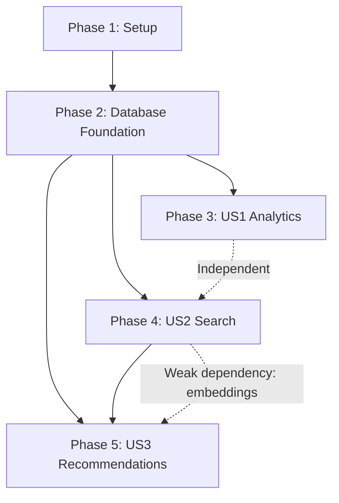

# Implementation Tasks: Phase 1 - Data Discovery & Analytics

**Feature Branch**: `002-data-discovery-analytics`  
**Date**: 2025-10-22  
**Status**: Ready for Implementation

---

## Task Summary

**Total Tasks**: 156  
**MVP Tasks** (US1 + US2): 92  
**Phase 2 Tasks** (US3): 39  
**Setup & Foundation**: 25  

**User Stories**:
- **US1**: Analytics Dashboard (P1) - 35 tasks
- **US2**: Intelligent Search & Discovery (P1) - 57 tasks  
- **US3**: AI-Powered Feed Recommendations (P2) - 39 tasks

**Parallel Opportunities**: 78 tasks can be executed in parallel (marked with [P])

---

## Phase 1: Setup & Environment Configuration

**Goal**: Initialize Phase 1 development environment and dependencies

**Tasks**: 15 (12 parallelizable)

### Environment Setup

- [ ] T001 Create feature branch `002-data-discovery-analytics` from main
- [ ] T002 [P] Install Python dependencies via `uv sync` (sentence-transformers, scikit-learn, numpy)
- [ ] T003 [P] Install web dependencies via `pnpm install` in apps/web (chart.js, react-chartjs-2)
- [ ] T004 [P] Create .env file with Phase 1 configuration (embedding settings, analytics cache TTLs)
- [ ] T005 [P] Update pyproject.toml with new dependencies (sentence-transformers==2.2.2, scikit-learn==1.3.2)
- [ ] T006 [P] Update package.json with chart.js and echarts dependencies

### Configuration Extensions

- [ ] T007 [P] Extend config.py with EmbeddingSettings class (provider, hf_api_token, local_model, cache_size)
- [ ] T008 [P] Extend config.py with AnalyticsSettings class (static_cache_ttl, dynamic_cache_ttl, max_concurrent_queries)
- [ ] T009 [P] Extend config.py with SearchSettings class (autocomplete_limit, full_text_limit, semantic_similarity_threshold)
- [ ] T010 [P] Extend config.py with RecommendationSettings class (content_weight, popularity_weight, serendipity_weight)

### Documentation Setup

- [ ] T011 [P] Create apps/web/content/docs/features/analytics.mdx with frontmatter
- [ ] T012 [P] Create apps/web/content/docs/features/search.mdx with frontmatter
- [ ] T013 [P] Create apps/web/content/docs/features/recommendations.mdx with frontmatter
- [ ] T014 Update apps/web/content/docs/meta.json to add new feature pages to navigation
- [ ] T015 [P] Create env.example with Phase 1 environment variables and comments

---

## Phase 2: Database Foundation & Migrations

**Goal**: Extend database schema with Phase 1 entities

**Tasks**: 10 (0 parallelizable - must execute sequentially)

### Database Migrations

- [ ] T016 Extend models.py with FeedSource extensions (popularity_score, last_validated_at, validation_count)
- [ ] T017 Create FeedEmbedding model in models.py (feed_id, embedding, embedding_model, embedding_provider)
- [ ] T018 Create AnalyticsSnapshot model in models.py (snapshot_date, total_feeds, trending_topics JSON)
- [ ] T019 Create TopicStats model in models.py (topic, feed_count, validation_frequency)
- [ ] T020 Create SearchQuery model in models.py (id, user_id, query_text, search_type, filters_applied JSON)
- [ ] T021 Create SavedSearch model in models.py (id, user_id, search_name, query_text, filters JSON)
- [ ] T022 Create RecommendationInteraction model in models.py (id, user_id, feed_id, interaction_type, context JSON)
- [ ] T023 Create UserProfile model in models.py (user_id, followed_feeds JSON, preferred_topics JSON, blocked_topics JSON)
- [ ] T024 Create CollaborativeMatrix model in models.py (feed_id_1, feed_id_2, co_occurrence_score, support)
- [ ] T025 Run database migration to create new tables (T016-T024) and add indexes

---

## Phase 3: User Story 1 - Analytics Dashboard (Priority: P1) 🎯 MVP

**Goal**: Enable feed curators to visualize collection metrics and trends

**Independent Test**: Visit `/analytics` → View charts → Filter by date range/topic → Export CSV → Verify metrics match database

**Tasks**: 35 (18 parallelizable)

### Backend: Analytics Module

- [ ] T026 [P] [US1] Create analytics.py module with calculate_summary_metrics() function
- [ ] T027 [P] [US1] Implement get_trending_topics() in analytics.py (query TopicStats, rank by validation_frequency)
- [ ] T028 [P] [US1] Implement get_publication_velocity() in analytics.py (group validations by date, calculate daily/weekly/monthly)
- [ ] T029 [P] [US1] Implement get_health_distribution() in analytics.py (bucket feeds by health_score: healthy/moderate/unhealthy)
- [ ] T030 [P] [US1] Implement cache decorator for analytics functions (functools.lru_cache with configurable TTL)
- [ ] T031 [P] [US1] Implement generate_analytics_snapshot() to create daily AnalyticsSnapshot records
- [ ] T032 [P] [US1] Implement export_analytics_csv() to generate CSV reports

### Backend: Storage Extensions

- [ ] T033 [US1] Extend storage.py with get_analytics_summary() query method
- [ ] T034 [US1] Extend storage.py with get_topic_stats() query method (with date range filter)
- [ ] T035 [US1] Extend storage.py with get_validation_history() query method (with aggregations)
- [ ] T036 [US1] Extend storage.py with add_analytics_snapshot() insert method
- [ ] T037 [US1] Create SQLite trigger for auto-updating TopicStats on new validations

### CLI: Analytics Commands

- [ ] T038 [P] [US1] Create apps/cli/ai_web_feeds/cli/commands/analytics.py with summary command
- [ ] T039 [P] [US1] Implement analytics trending command (CLI wrapper for get_trending_topics)
- [ ] T040 [P] [US1] Implement analytics velocity command (CLI wrapper for get_publication_velocity)
- [ ] T041 [P] [US1] Implement analytics export command (CLI wrapper for export_analytics_csv)
- [ ] T042 [P] [US1] Implement analytics refresh command to regenerate snapshot

### Web: API Routes

- [ ] T043 [P] [US1] Create apps/web/app/api/analytics/summary/route.ts (GET endpoint for summary metrics)
- [ ] T044 [P] [US1] Create apps/web/app/api/analytics/trending-topics/route.ts (GET endpoint with limit param)
- [ ] T045 [P] [US1] Create apps/web/app/api/analytics/publication-velocity/route.ts (GET endpoint with granularity param)
- [ ] T046 [P] [US1] Create apps/web/app/api/analytics/health-distribution/route.ts (GET endpoint)
- [ ] T047 [P] [US1] Create apps/web/app/api/analytics/export/route.ts (GET endpoint returning CSV)

### Web: UI Components

- [ ] T048 [P] [US1] Create apps/web/components/analytics/analytics-summary.tsx (display key metrics)
- [ ] T049 [P] [US1] Create apps/web/components/analytics/trending-topics-chart.tsx (Bar chart with Chart.js)
- [ ] T050 [P] [US1] Create apps/web/components/analytics/publication-velocity-chart.tsx (Line chart)
- [ ] T051 [P] [US1] Create apps/web/components/analytics/health-distribution-chart.tsx (Pie chart)
- [ ] T052 [P] [US1] Create apps/web/components/analytics/time-range-filter.tsx (7d/30d/90d/custom dropdown)
- [ ] T053 [P] [US1] Create apps/web/components/analytics/topic-filter.tsx (dropdown populated from topics.yaml)
- [ ] T054 [P] [US1] Create apps/web/components/analytics/export-button.tsx (CSV download trigger)
- [ ] T055 [P] [US1] Create apps/web/components/analytics/refresh-button.tsx (manual data refresh)

### Web: Analytics Page

- [ ] T056 [US1] Create apps/web/app/analytics/page.tsx (compose all analytics components)
- [ ] T057 [US1] Implement client-side state management for filters (time range, topic)
- [ ] T058 [US1] Implement chart interactivity (hover tooltips, click drill-down)
- [ ] T059 [US1] Add data freshness indicator ("Last updated: [timestamp]")
- [ ] T060 [US1] Add loading states and error handling for API calls

---

## Phase 4: User Story 2 - Intelligent Search & Discovery (Priority: P1) 🎯 MVP

**Goal**: Enable users to search feeds by keywords, topics, and semantic similarity

**Independent Test**: Visit `/search` → Type query → See autocomplete → View results → Apply filters → Save search → Verify results

**Tasks**: 57 (29 parallelizable)

### Backend: Embeddings Module

- [ ] T061 [P] [US2] Create embeddings.py module with generate_embeddings_local() function (Sentence-Transformers)
- [ ] T062 [P] [US2] Implement generate_embeddings_hf() in embeddings.py (Hugging Face Inference API)
- [ ] T063 [P] [US2] Implement generate_embeddings_hybrid() with automatic fallback logic
- [ ] T064 [P] [US2] Implement store_embeddings() to save embeddings as SQLite BLOBs
- [ ] T065 [P] [US2] Implement get_embedding() to retrieve and deserialize embeddings
- [ ] T066 [P] [US2] Implement cosine_similarity() for vector comparison (NumPy-based)

### Backend: Search Module (Full-Text)

- [ ] T067 [US2] Create search.py module with build_fts5_index() function
- [ ] T068 [US2] Implement full_text_search() in search.py (query SQLite FTS5, return ranked results)
- [ ] T069 [US2] Implement highlight_matches() to add <b> tags to search terms in results
- [ ] T070 [US2] Implement apply_faceted_filters() to combine full-text with filters (source_type, topics, verified)
- [ ] T071 [US2] Create FTS5 virtual table in database (feed_search_index with porter stemming)
- [ ] T072 [US2] Implement rebuild_fts5_index() to repopulate FTS5 table from FeedSource

### Backend: Search Module (Semantic)

- [ ] T073 [US2] Implement semantic_search() in search.py (cosine similarity with threshold filtering)
- [ ] T074 [US2] Implement hybrid_search() combining full-text + semantic results with weighted ranking
- [ ] T075 [US2] Implement search_timeout() wrapper with fallback to full-text after 3s

### Backend: Autocomplete Module

- [ ] T076 [P] [US2] Create autocomplete.py module with TrieNode class
- [ ] T077 [P] [US2] Implement AutocompleteTrie class with insert() and search() methods
- [ ] T078 [US2] Implement build_autocomplete_index() to populate trie from feeds and topics
- [ ] T079 [US2] Implement get_autocomplete_suggestions() with caching (functools.lru_cache, 5min TTL)

### Backend: Search Analytics & Saved Searches

- [ ] T080 [P] [US2] Implement log_search_query() in search.py (insert SearchQuery record)
- [ ] T081 [P] [US2] Implement save_search() in search.py (insert SavedSearch record)
- [ ] T082 [P] [US2] Implement get_saved_searches() query method
- [ ] T083 [P] [US2] Implement delete_saved_search() method
- [ ] T084 [P] [US2] Implement get_popular_searches() aggregation query (top 10 by count)

### Backend: Storage Extensions

- [ ] T085 [US2] Extend storage.py with add_feed_embedding() insert method
- [ ] T086 [US2] Extend storage.py with get_feed_embedding() query method
- [ ] T087 [US2] Extend storage.py with get_all_embeddings() batch query method
- [ ] T088 [US2] Extend storage.py with add_search_query() insert method
- [ ] T089 [US2] Extend storage.py with add_saved_search() insert method

### CLI: Search & Embedding Commands

- [ ] T090 [P] [US2] Create apps/cli/ai_web_feeds/cli/commands/search.py with query command
- [ ] T091 [P] [US2] Implement search index command (build FTS5 index)
- [ ] T092 [P] [US2] Implement search rebuild-index command (rebuild FTS5 + autocomplete trie)
- [ ] T093 [P] [US2] Implement search autocomplete command (test autocomplete trie)
- [ ] T094 [P] [US2] Create apps/cli/ai_web_feeds/cli/commands/embeddings.py with generate command
- [ ] T095 [P] [US2] Implement embeddings generate command with provider option (local/huggingface/hybrid)
- [ ] T096 [P] [US2] Implement embeddings verify command (check embedding count and validity)

### Web: Search API Routes

- [ ] T097 [P] [US2] Create apps/web/app/api/search/route.ts (GET endpoint with query, filters, pagination)
- [ ] T098 [P] [US2] Create apps/web/app/api/search/autocomplete/route.ts (GET endpoint with partial query)
- [ ] T099 [P] [US2] Create apps/web/app/api/search/popular/route.ts (GET endpoint for popular searches)
- [ ] T100 [P] [US2] Create apps/web/app/api/search/saved/route.ts (GET/POST/DELETE endpoints)

### Web: Search UI Components

- [ ] T101 [P] [US2] Create apps/web/components/search/search-bar.tsx (input with autocomplete dropdown)
- [ ] T102 [P] [US2] Create apps/web/components/search/search-type-toggle.tsx (full-text/semantic/hybrid switch)
- [ ] T103 [P] [US2] Create apps/web/components/search/faceted-filters.tsx (source type, topics, verified, active checkboxes)
- [ ] T104 [P] [US2] Create apps/web/components/search/search-results.tsx (list of feed cards with highlighted matches)
- [ ] T105 [P] [US2] Create apps/web/components/search/result-count-badges.tsx (show counts per filter)
- [ ] T106 [P] [US2] Create apps/web/components/search/save-search-button.tsx (modal for naming saved search)
- [ ] T107 [P] [US2] Create apps/web/components/search/saved-searches-sidebar.tsx (list of saved searches)
- [ ] T108 [P] [US2] Create apps/web/components/search/zero-results.tsx (suggestions + GitHub issue link)
- [ ] T109 [P] [US2] Create apps/web/components/search/pagination.tsx (infinite scroll or numbered pagination)

### Web: Search Page

- [ ] T110 [US2] Create apps/web/app/search/page.tsx (compose all search components)
- [ ] T111 [US2] Implement client-side state management for search query, filters, results
- [ ] T112 [US2] Implement debounced autocomplete (200ms delay after typing stops)
- [ ] T113 [US2] Implement search history storage (localStorage, last 10 searches)
- [ ] T114 [US2] Implement saved search replay (one-click load query + filters)
- [ ] T115 [US2] Add keyboard shortcuts (Cmd/Ctrl+K to focus, arrow keys for autocomplete)
- [ ] T116 [US2] Add loading states, error handling, and timeout fallback for semantic search
- [ ] T117 [US2] Implement result highlighting with <b> tags from API response

---

## Phase 5: User Story 3 - AI-Powered Feed Recommendations (Priority: P2)

**Goal**: Generate personalized feed suggestions based on user interests

**Independent Test**: Visit `/recommendations` → Complete quiz → View recommendations → Click "Why?" → Like/Dismiss → Verify suggestions update

**Tasks**: 39 (22 parallelizable)

### Backend: Recommendations Module

- [ ] T118 [P] [US3] Create recommendations.py module with generate_content_based_recommendations() function
- [ ] T119 [P] [US3] Implement calculate_topic_similarity() (topic overlap between user interests and feeds)
- [ ] T120 [P] [US3] Implement calculate_embedding_similarity() (cosine similarity between user's followed feeds and candidates)
- [ ] T121 [P] [US3] Implement calculate_popularity_score() (normalized popularity + verification boost)
- [ ] T122 [P] [US3] Implement calculate_final_recommendation_score() (70% content, 20% popularity, 10% serendipity)
- [ ] T123 [P] [US3] Implement enforce_diversity_constraints() (max 3 feeds per topic, min 2 topics)
- [ ] T124 [P] [US3] Implement generate_explanation() to create human-readable recommendation reasons
- [ ] T125 [P] [US3] Implement cold_start_recommendations() based on topic selection quiz

### Backend: Recommendation Feedback

- [ ] T126 [P] [US3] Implement apply_user_feedback() to adjust recommendation weights (like/dismiss)
- [ ] T127 [P] [US3] Implement block_topic() to exclude topics from future recommendations
- [ ] T128 [P] [US3] Implement get_similar_feeds() for "users also liked" suggestions
- [ ] T129 [P] [US3] Implement refresh_recommendation_data() nightly job (update topic popularity, refresh embeddings)

### Backend: UserProfile Management

- [ ] T130 [P] [US3] Implement create_user_profile() to initialize profile from quiz
- [ ] T131 [P] [US3] Implement update_user_profile() to add followed_feeds and preferred_topics
- [ ] T132 [P] [US3] Implement get_user_profile() query method
- [ ] T133 [P] [US3] Implement export_user_profile_json() for localStorage backup
- [ ] T134 [P] [US3] Implement import_user_profile_json() for cross-device transfer

### Backend: Interaction Logging

- [ ] T135 [P] [US3] Implement log_recommendation_interaction() (impression, click, like, dismiss, block_topic)
- [ ] T136 [P] [US3] Implement get_recommendation_metrics() (CTR, precision@10, recall@10)

### Backend: Storage Extensions

- [ ] T137 [US3] Extend storage.py with add_recommendation_interaction() insert method
- [ ] T138 [US3] Extend storage.py with get_user_interactions() query method
- [ ] T139 [US3] Extend storage.py with get_recommendation_metrics() aggregation query

### CLI: Recommendation Commands

- [ ] T140 [P] [US3] Create apps/cli/ai_web_feeds/cli/commands/recommendations.py with cold-start command
- [ ] T141 [P] [US3] Implement recommend content-based command with user-id and limit options
- [ ] T142 [P] [US3] Implement recommend refresh command to update recommendation data (nightly job)
- [ ] T143 [P] [US3] Implement recommend metrics command to display CTR and precision@10

### Web: Recommendations API Routes

- [ ] T144 [P] [US3] Create apps/web/app/api/recommendations/route.ts (GET endpoint with user_id and limit params)
- [ ] T145 [P] [US3] Create apps/web/app/api/recommendations/cold-start/route.ts (POST endpoint with selected_topics)
- [ ] T146 [P] [US3] Create apps/web/app/api/recommendations/feedback/route.ts (POST endpoint for like/dismiss/block)
- [ ] T147 [P] [US3] Create apps/web/app/api/recommendations/similar/[feed_id]/route.ts (GET endpoint for similar feeds)

### Web: Recommendations UI Components

- [ ] T148 [P] [US3] Create apps/web/components/recommendations/onboarding-quiz.tsx (topic selection with 3-5 topics)
- [ ] T149 [P] [US3] Create apps/web/components/recommendations/recommendation-card.tsx (feed card with explanation)
- [ ] T150 [P] [US3] Create apps/web/components/recommendations/explanation-tooltip.tsx ("Why this recommendation?")
- [ ] T151 [P] [US3] Create apps/web/components/recommendations/feedback-buttons.tsx (like/dismiss/block topic)
- [ ] T152 [P] [US3] Create apps/web/components/recommendations/recommendation-grid.tsx (masonry layout for cards)

### Web: Recommendations Page

- [ ] T153 [US3] Create apps/web/app/recommendations/page.tsx (compose all recommendation components)
- [ ] T154 [US3] Implement cold start flow (show quiz if no user profile exists)
- [ ] T155 [US3] Implement recommendation loading with skeleton UI
- [ ] T156 [US3] Implement feedback handling (optimistic UI updates, persist to API)

---

## Dependencies & Execution Order

### Phase Completion Order

**Critical Path**: Setup → Database → Search (embeddings required for recommendations) → Recommendations

**User Story Independence**:
- ✅ **US1 (Analytics)** is fully independent of US2 and US3
- ✅ **US2 (Search)** is independent of US1, weak dependency from US3 (embeddings)
- ⚠️ **US3 (Recommendations)** requires embeddings from US2

---

## Parallel Execution Examples

### Phase 3 (US1 - Analytics) Parallelization

**Wave 1** (after T025 migration complete):
- T026-T032 (7 analytics functions)
- T038-T042 (5 CLI commands)
- T043-T047 (5 API routes)
- T048-T055 (8 UI components)
- **Total**: 25 tasks in parallel

**Wave 2** (after Wave 1 complete):
- T056-T060 (5 page integration tasks)
- **Total**: 5 tasks sequential

### Phase 4 (US2 - Search) Parallelization

**Wave 1** (after T025 migration complete):
- T061-T066 (6 embedding functions)
- T076-T077 (2 autocomplete classes)
- T080-T084 (5 search analytics functions)
- T090-T096 (7 CLI commands)
- T097-T100 (4 API routes)
- T101-T109 (9 UI components)
- **Total**: 33 tasks in parallel

**Wave 2** (after Wave 1 complete):
- T067-T075 (9 search functions - sequential due to FTS5 dependency)
- T085-T089 (5 storage extensions - sequential)
- **Total**: 14 tasks sequential

**Wave 3** (after Wave 2 complete):
- T110-T117 (8 page integration tasks)
- **Total**: 8 tasks sequential

### Phase 5 (US3 - Recommendations) Parallelization

**Wave 1** (after T025 migration + T061-T066 embeddings complete):
- T118-T125 (8 recommendation functions)
- T126-T129 (4 feedback functions)
- T130-T136 (7 profile/interaction functions)
- T140-T143 (4 CLI commands)
- T144-T147 (4 API routes)
- T148-T152 (5 UI components)
- **Total**: 32 tasks in parallel

**Wave 2** (after Wave 1 complete):
- T137-T139 (3 storage extensions - sequential)
- T153-T156 (4 page integration tasks - sequential)
- **Total**: 7 tasks sequential

---

## Implementation Strategy

### MVP-First Approach

**Recommended MVP Scope** (Prioritize US1 + US2 only):
1. ✅ **Phase 1**: Setup (all tasks)
2. ✅ **Phase 2**: Database Foundation (all tasks)
3. ✅ **Phase 3**: US1 Analytics Dashboard (all 35 tasks)
4. ✅ **Phase 4**: US2 Intelligent Search (all 57 tasks)
5. ⏸️ **Phase 5**: US3 Recommendations (defer to Phase 2 release)

**Total MVP Tasks**: 92 tasks (59% of total)

**Rationale**:
- US1 and US2 deliver immediate value (analytics + search)
- US3 (recommendations) requires user interaction data to be effective
- Deferring US3 allows faster MVP release and user feedback collection
- US3 can be added incrementally in Phase 2 once user accounts exist

### Incremental Delivery Milestones

**Milestone 1: Analytics MVP** (Phase 1-3)
- ✅ Environment setup
- ✅ Database migrations
- ✅ Analytics dashboard with charts
- **Test**: Curator can view metrics and export CSV
- **Duration**: ~2 weeks

**Milestone 2: Search MVP** (Phase 4)
- ✅ Full-text search with FTS5
- ✅ Autocomplete with Trie index
- ✅ Faceted filtering
- ✅ Semantic search (optional HF API)
- **Test**: User can search and save queries
- **Duration**: ~3 weeks

**Milestone 3: Recommendations (Phase 2 Feature)** (Phase 5)
- ✅ Content-based recommendations
- ✅ Cold start onboarding quiz
- ✅ User feedback (like/dismiss)
- **Test**: User receives personalized suggestions
- **Duration**: ~2 weeks

---

## Validation & Testing

### Per-Phase Acceptance Criteria

**Phase 3 (US1) Acceptance**:
- [ ] Analytics dashboard loads within 2 seconds
- [ ] All charts render correctly with real data
- [ ] Time range filters update charts
- [ ] Topic filter dropdown works
- [ ] CSV export downloads correctly formatted file
- [ ] "Refresh Now" button updates data

**Phase 4 (US2) Acceptance**:
- [ ] Autocomplete responds within 200ms
- [ ] Full-text search returns results within 500ms
- [ ] Search results highlight matching keywords
- [ ] Faceted filters update results correctly
- [ ] Semantic search completes within 3 seconds
- [ ] "Save Search" stores query correctly
- [ ] Saved searches appear in sidebar

**Phase 5 (US3) Acceptance**:
- [ ] Cold start quiz selects 3-5 topics
- [ ] Recommendations generate within 1 second
- [ ] 10-20 recommendations displayed
- [ ] "Why?" explanation shows on hover
- [ ] "Like" button updates recommendations
- [ ] "Dismiss" button reduces similar feed scores
- [ ] "Block topic" excludes topic from future recommendations

### Test Coverage Requirements

**Unit Tests** (≥90% coverage):
- `tests/tests/packages/ai_web_feeds/test_analytics.py` (T026-T032)
- `tests/tests/packages/ai_web_feeds/test_search.py` (T067-T075)
- `tests/tests/packages/ai_web_feeds/test_embeddings.py` (T061-T066)
- `tests/tests/packages/ai_web_feeds/test_recommendations.py` (T118-T129)
- `tests/tests/packages/ai_web_feeds/test_autocomplete.py` (T076-T079)

**Integration Tests**:
- SQLite FTS5 index building and querying
- Embedding generation and storage (local + HF API)
- Analytics snapshot generation
- Recommendation scoring with real data

**E2E Tests** (Playwright):
- Complete analytics workflow (visit → filter → export)
- Complete search workflow (query → filter → save)
- Complete recommendation workflow (quiz → view → feedback)

---

## Performance Benchmarks

**Target Performance** (must meet before marking phase complete):

| Operation | Target | Measurement |
|-----------|--------|-------------|
| Analytics dashboard load | <2s | Lighthouse Performance score ≥90 |
| Search autocomplete | <200ms | p95 latency |
| Full-text search | <500ms | 10,000+ feed catalog |
| Semantic search | <3s | Including vector similarity computation |
| Recommendation generation | <1s | Content-based algorithm |

---

**Next Steps**: 
1. Review tasks and confirm MVP scope (recommend US1 + US2 only)
2. Assign tasks to developers or start implementation
3. Track progress in project management tool (GitHub Projects, Jira, etc.)
4. Update task status as complete and run acceptance tests per phase

---

**Version**: 0.2.0 (Phase 1) | **Last Updated**: 2025-10-22

