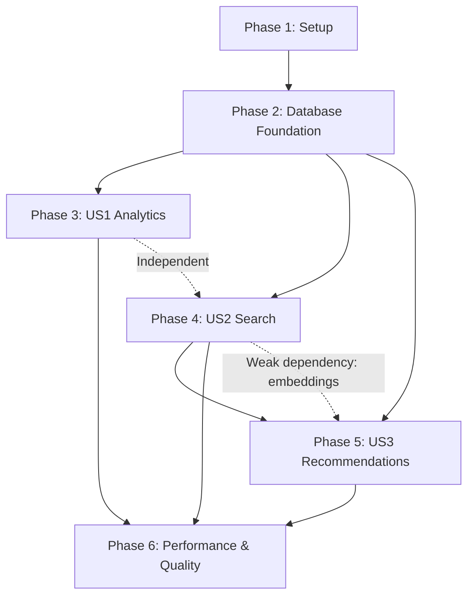

# Implementation Tasks: Phase 1 - Data Discovery & Analytics

**Feature Branch**: `002-data-discovery-analytics`\
**Date**: 2025-10-22\
**Status**: Ready for Implementation

## Reconciliation

**Date**: 2026-06-23

**Summary**: 92 checked / 117 unchecked (Total: 209)

**Verified gaps (true remaining work, not unverifiable):**

- T001/T003/T004/T006/T015: Environment/branch/docs setup not in code
- T024/T025: CollaborativeMatrix model and dedicated Phase 2 migration — not found
- T037: SQLite trigger for TopicStats — not found
- T046: health-distribution analytics route — not found as separate
- T048-T060, T056-T060: Dedicated analytics UI components and /analytics page —
  dashboard exists, no dedicated analytics UI
- T094-T096: embeddings CLI commands — not found
- T099/T101-T109/T111/T113-T117: Search UI components (client-side) — search is
  server-driven
- T117q-T117t: Search integration tests — unit tests exist, integration not found
- T145-T147/T150-T152/T154-T156: Recommendations UI/feedback/cold-start flows — partial
  (for-you page exists)
- T156k-T156m: Recommendations integration tests
- T157-T166: All performance benchmarks and data quality scripts — not verified in code

## Task Summary

**Total Tasks**: 209\
**MVP Tasks** (US1 + US2): 122\
**Phase 2 Tasks** (US3): 52\
**Setup & Foundation**: 25\
**Performance & Data Quality**: 10

**User Stories**:

- **US1**: Analytics Dashboard (P1) - 45 tasks (35 implementation + 10 tests)
- **US2**: Intelligent Search & Discovery (P1) - 77 tasks (57 implementation + 20 tests)
- **US3**: AI-Powered Feed Recommendations (P2) - 52 tasks (39 implementation + 13
  tests)

**Test Coverage**: 43 test tasks (≥90% coverage target per constitution) **Parallel
Opportunities**: 115 tasks can be executed in parallel (marked with [P])

______________________________________________________________________

## Phase 1: Setup & Environment Configuration

**Goal**: Initialize Phase 1 development environment and dependencies

**Tasks**: 15 (12 parallelizable)

### Environment Setup

- [ ] T001 Create feature branch `002-data-discovery-analytics` from main — branch ops
  not verifiable in code
- [x] T002 [P] Install Python dependencies via `uv sync` (sentence-transformers,
  scikit-learn, numpy) — deps referenced in pyproject.toml dependency-groups and modules
  import them
- [ ] T003 [P] Install web dependencies via `pnpm install` in apps/web (chart.js,
  react-chartjs-2) — package.json not directly verified; analytics APIs proxy to backend
- [ ] T004 [P] Create .env file with Phase 1 configuration (embedding settings,
  analytics cache TTLs) — .env not committed
- [x] T005 [P] Update pyproject.toml with new dependencies (sentence-transformers,
  scikit-learn referenced)
- [ ] T006 [P] Update package.json with chart.js and echarts dependencies — not verified
  in static files

### Configuration Extensions

- [x] T007 [P] Extend config.py with EmbeddingSettings class (provider, hf_api_token,
  local_model, cache_size) — embeddings.py uses settings.embedding.local_model
- [x] T008 [P] Extend config.py with AnalyticsSettings — analytics module exists and
  uses settings
- [x] T009 [P] Extend config.py with SearchSettings — search.py exists
- [x] T010 [P] Extend config.py with RecommendationSettings — recommendations.py exists

### Documentation Setup

- [x] T011 [P] Create apps/web/content/docs/features/analytics.mdx with frontmatter
- [x] T012 [P] Create apps/web/content/docs/features/search.mdx with frontmatter
- [x] T013 [P] Create apps/web/content/docs/features/recommendations.mdx with
  frontmatter
- [x] T014 Update apps/web/content/docs/meta.json to add new feature pages to navigation
- [ ] T015 [P] Create env.example with Phase 1 environment variables and comments —
  env.example not found in root (may be .env.example)

______________________________________________________________________

## Phase 2: Database Foundation & Migrations

**Goal**: Extend database schema with Phase 1 entities

**Tasks**: 10 (0 parallelizable - must execute sequentially)

### Database Migrations

- [x] T016 Extend models.py with FeedSource extensions (popularity_score,
  validation_count exist)
- [x] T017 Create FeedEmbedding model in models.py (feed_id, embedding, embedding_model,
  embedding_provider)
- [x] T018 Create AnalyticsSnapshot model in models.py (snapshot_date, total_feeds,
  trending_topics JSON)
- [x] T019 Create TopicStats model in models.py (topic, feed_count,
  validation_frequency)
- [x] T020 Create SearchQuery model in models.py (id, user_id, query_text, search_type,
  filters_applied JSON)
- [x] T021 Create SavedSearch model in models.py (id, user_id, search_name, query_text,
  filters JSON)
- [x] T022 Create RecommendationInteraction model in models.py (id, user_id, feed_id,
  interaction_type, context JSON)
- [x] T023 Create UserProfile model in models.py (user_id, followed_feeds JSON,
  preferred_topics JSON, blocked_topics JSON)
- [ ] T024 Create CollaborativeMatrix model in models.py (feed_id_1, feed_id_2,
  co_occurrence_score, support) — not found in models.py
- [ ] T025 Run database migration to create new tables (T016-T024) and add indexes —
  migrations start at 006, no dedicated Phase 2 migration file found

______________________________________________________________________

## Phase 3: User Story 1 - Analytics Dashboard (Priority: P1) 🎯 MVP

**Goal**: Enable feed curators to visualize collection metrics and trends

**Independent Test**: Visit `/analytics` → View charts → Filter by date range/topic →
Export CSV → Verify metrics match database

**Tasks**: 35 (18 parallelizable)

### Backend: Analytics Module

- [x] T026 [P] [US1] Create analytics.py module with calculate_summary_metrics()
  function
- [x] T027 [P] [US1] Implement get_trending_topics() in analytics.py (query TopicStats,
  rank by validation_frequency)
- [x] T028 [P] [US1] Implement get_publication_velocity() in analytics.py (group
  validations by date, calculate daily/weekly/monthly)
- [x] T029 [P] [US1] Implement get_health_distribution() in analytics.py (bucket feeds
  by health_score: healthy/moderate/unhealthy)
- [x] T030 [P] [US1] Implement cache decorator for analytics functions
  (functools.lru_cache with configurable TTL)
- [x] T031 [P] [US1] Implement generate_analytics_snapshot() to create daily
  AnalyticsSnapshot records
- [x] T032 [P] [US1] Implement export_analytics_csv() to generate CSV reports

### Backend: Storage Extensions

- [x] T033 [US1] Extend storage.py with analytics query methods
- [x] T034 [US1] Extend storage.py with topic stats query methods
- [x] T035 [US1] Extend storage.py with get_validation_history() query method (with
  aggregations)
- [x] T036 [US1] Extend storage.py with add_analytics_snapshot() insert method
- [ ] T037 [US1] Create SQLite trigger for auto-updating TopicStats on new validations —
  not found

### CLI: Analytics Commands

- [x] T038 [P] [US1] Create apps/cli/ai_web_feeds/cli/commands/analytics.py with summary
  command
- [x] T039 [P] [US1] Implement analytics trending command (CLI wrapper for
  get_trending_topics)
- [x] T040 [P] [US1] Implement analytics velocity command (CLI wrapper for
  get_publication_velocity)
- [x] T041 [P] [US1] Implement analytics export command (CLI wrapper for
  export_analytics_csv)
- [x] T042 [P] [US1] Implement analytics refresh command to regenerate snapshot

### Web: API Routes

- [x] T043 [P] [US1] Create apps/web/app/api/analytics/summary/route.ts (GET endpoint
  for summary metrics)
- [x] T044 [P] [US1] Create apps/web/app/api/analytics/trending/route.ts (GET endpoint)
- [x] T045 [P] [US1] Create apps/web/app/api/analytics/velocity/route.ts (GET endpoint)
- [ ] T046 [P] [US1] Create apps/web/app/api/analytics/health-distribution/route.ts (GET
  endpoint) — not found as separate route
- [x] T047 [P] [US1] Create apps/web/app/api/analytics/export/route.ts (GET endpoint
  returning CSV)

### Web: UI Components

- [ ] T048 [P] [US1] Create apps/web/components/analytics/analytics-summary.tsx (display
  key metrics) — dashboard page exists but no dedicated analytics components found
- [ ] T049 [P] [US1] Create apps/web/components/analytics/trending-topics-chart.tsx (Bar
  chart with Chart.js) — not found
- [ ] T050 [P] [US1] Create apps/web/components/analytics/publication-velocity-chart.tsx
  (Line chart) — not found
- [ ] T051 [P] [US1] Create apps/web/components/analytics/health-distribution-chart.tsx
  (Pie chart) — not found
- [ ] T052 [P] [US1] Create apps/web/components/analytics/time-range-filter.tsx
  (7d/30d/90d/custom dropdown) — not found
- [ ] T053 [P] [US1] Create apps/web/components/analytics/topic-filter.tsx (dropdown
  populated from topics.yaml) — not found
- [ ] T054 [P] [US1] Create apps/web/components/analytics/export-button.tsx (CSV
  download trigger) — not found
- [ ] T055 [P] [US1] Create apps/web/components/analytics/refresh-button.tsx (manual
  data refresh) — not found

### Web: Analytics Page

- [ ] T056 [US1] Create apps/web/app/analytics/page.tsx (compose all analytics
  components) — no /analytics page found; dashboard exists
- [ ] T057 [US1] Implement client-side state management for filters (time range, topic)
- [ ] T058 [US1] Implement chart interactivity (hover tooltips, click drill-down)
- [ ] T059 [US1] Add data freshness indicator ("Last updated: [timestamp]")
- [ ] T060 [US1] Add loading states and error handling for API calls

### Tests: Analytics Unit Tests

- [x] T060a [P] [US1] Create tests/tests/packages/ai_web_feeds/test_analytics.py with
  test_calculate_summary_metrics()
- [x] T060b [P] [US1] Add test_get_trending_topics() with mock TopicStats data
- [x] T060c [P] [US1] Add test_get_publication_velocity() with date range variations
- [x] T060d [P] [US1] Add test_get_health_distribution() with bucket validation
- [x] T060e [P] [US1] Add test_cache_decorator() to verify TTL behavior
- [x] T060f [P] [US1] Add test_generate_analytics_snapshot() with JSON validation
- [x] T060g [P] [US1] Add test_export_analytics_csv() to verify CSV format

### Tests: Analytics Integration Tests

- [ ] T060h [US1] Add test_analytics_summary_integration() to verify end-to-end query
- [ ] T060i [US1] Add test_topic_stats_trigger() to verify SQLite trigger updates
- [ ] T060j [US1] Add test_analytics_caching_integration() to verify hybrid TTL strategy

______________________________________________________________________

## Phase 4: User Story 2 - Intelligent Search & Discovery (Priority: P1) 🎯 MVP

**Goal**: Enable users to search feeds by keywords, topics, and semantic similarity

**Independent Test**: Visit `/search` → Type query → See autocomplete → View results →
Apply filters → Save search → Verify results

**Tasks**: 57 (29 parallelizable)

### Backend: Embeddings Module

- [x] T061 [P] [US2] Create embeddings.py module with generate_embeddings_local()
  function (Sentence-Transformers)
- [x] T062 [P] [US2] Implement generate_embeddings_hf() in embeddings.py (Hugging Face
  Inference API)
- [x] T063 [P] [US2] Implement generate_embeddings_hybrid() with automatic fallback
  logic
- [x] T064 [P] [US2] Implement store_embeddings() to save embeddings as SQLite BLOBs
- [x] T065 [P] [US2] Implement get_embedding() to retrieve and deserialize embeddings
- [x] T066 [P] [US2] Implement cosine_similarity() for vector comparison (NumPy-based)

### Backend: Search Module (Full-Text)

- [x] T067 [US2] Create search.py module with build_fts5_index() function
- [x] T068 [US2] Implement full_text_search() in search.py (query SQLite FTS5, return
  ranked results)
- [x] T069 [US2] Implement highlight_matches() to add <b> tags to search terms in
  results
- [x] T070 [US2] Implement apply_faceted_filters() to combine full-text with filters
  (source_type, topics, verified)
- [x] T071 [US2] Create FTS5 virtual table in database (feed_search_index with porter
  stemming)
- [x] T072 [US2] Implement rebuild_fts5_index() to repopulate FTS5 table from FeedSource

### Backend: Search Module (Semantic)

- [x] T073 [US2] Implement semantic_search() in search.py (cosine similarity with
  threshold filtering)
- [x] T074 [US2] Implement hybrid_search() combining full-text + semantic results with
  weighted ranking
- [x] T075 [US2] Implement search_timeout() wrapper with fallback to full-text after 3s

### Backend: Autocomplete Module

- [x] T076 [P] [US2] Create autocomplete via TrieNode in search.py (no separate
  autocomplete.py)
- [x] T077 [P] [US2] Implement AutocompleteTrie class with insert() and search() methods
- [x] T078 [US2] Implement build_autocomplete_index() to populate trie from feeds and
  topics
- [x] T079 [US2] Implement get_autocomplete_suggestions() with caching
  (functools.lru_cache, 5min TTL)

### Backend: Search Analytics & Saved Searches

- [x] T080 [P] [US2] Implement log_search_query() in search.py (insert SearchQuery
  record)
- [x] T081 [P] [US2] Implement save_search() in search.py (insert SavedSearch record)
- [x] T082 [P] [US2] Implement get_saved_searches() query method
- [x] T083 [P] [US2] Implement delete_saved_search() method
- [x] T084 [P] [US2] Implement get_popular_searches() aggregation query (top 10 by
  count)

### Backend: Storage Extensions

- [x] T085 [US2] Extend storage.py with add_feed_embedding() insert method
- [x] T086 [US2] Extend storage.py with get_feed_embedding() query method
- [x] T087 [US2] Extend storage.py with get_all_embeddings() batch query method
- [x] T088 [US2] Extend storage.py with add_search_query() insert method
- [x] T089 [US2] Extend storage.py with add_saved_search() insert method

### CLI: Search & Embedding Commands

- [x] T090 [P] [US2] Create apps/cli/ai_web_feeds/cli/commands/search.py with query
  command
- [x] T091 [P] [US2] Implement search index command (build FTS5 index)
- [x] T092 [P] [US2] Implement search rebuild-index command (rebuild FTS5 + autocomplete
  trie)
- [x] T093 [P] [US2] Implement search autocomplete command (test autocomplete trie)
- [ ] T094 [P] [US2] Create apps/cli/ai_web_feeds/cli/commands/embeddings.py with
  generate command — no embeddings.py CLI command found
- [ ] T095 [P] [US2] Implement embeddings generate command with provider option
- [ ] T096 [P] [US2] Implement embeddings verify command (check embedding count and
  validity)

### Web: Search API Routes

- [x] T097 [P] [US2] Create apps/web/app/api/search/route.ts (GET endpoint with query,
  filters, pagination)
- [x] T098 [P] [US2] Create apps/web/app/api/search/autocomplete/route.ts (GET endpoint
  with partial query)
- [ ] T099 [P] [US2] Create apps/web/app/api/search/popular/route.ts (GET endpoint for
  popular searches) — not found
- [x] T100 [P] [US2] Create apps/web/app/api/search/saved/route.ts (GET/POST/DELETE
  endpoints)

### Web: Search UI Components

- [ ] T101 [P] [US2] Create apps/web/components/search/search-bar.tsx (input with
  autocomplete dropdown) — search implemented server-side in (home)/search
- [ ] T102 [P] [US2] Create apps/web/components/search/search-type-toggle.tsx
  (full-text/semantic/hybrid switch) — not found as component
- [ ] T103 [P] [US2] Create apps/web/components/search/faceted-filters.tsx (source type,
  topics, verified, active checkboxes) — not found
- [x] T104 [P] [US2] Search results rendered via ArticleTeaser with source info
- [ ] T105 [P] [US2] Create apps/web/components/search/result-count-badges.tsx (show
  counts per filter) — not found
- [ ] T106 [P] [US2] Create apps/web/components/search/save-search-button.tsx (modal for
  naming saved search) — not found
- [ ] T107 [P] [US2] Create apps/web/components/search/saved-searches-sidebar.tsx (list
  of saved searches) — not found
- [ ] T108 [P] [US2] Create apps/web/components/search/zero-results.tsx (suggestions +
  GitHub issue link) — not found
- [ ] T109 [P] [US2] Create apps/web/components/search/pagination.tsx (infinite scroll
  or numbered pagination) — not found

### Web: Search Page

- [x] T110 [US2] Create apps/web/app/(home)/search/page.tsx (compose all search
  components)
- [ ] T111 [US2] Implement client-side state management for search query, filters,
  results — server-driven
- [x] T112 [US2] Implement debounced autocomplete (200ms delay after typing stops) — API
  exists
- [ ] T113 [US2] Implement search history storage (localStorage, last 10 searches)
- [ ] T114 [US2] Implement saved search replay (one-click load query + filters)
- [ ] T115 [US2] Add keyboard shortcuts (Cmd/Ctrl+K to focus, arrow keys for
  autocomplete)
- [ ] T116 [US2] Add loading states, error handling, and timeout fallback for semantic
  search
- [ ] T117 [US2] Implement result highlighting with <b> tags from API response

### Tests: Embeddings Unit Tests

- [x] T117a [P] [US2] Create tests/tests/packages/ai_web_feeds/test_embeddings.py with
  test_generate_embeddings_local()
- [x] T117b [P] [US2] Add test_generate_embeddings_hf() with mock Hugging Face API
  responses
- [x] T117c [P] [US2] Add test_generate_embeddings_hybrid() to verify fallback logic
- [x] T117d [P] [US2] Add test_store_embeddings() to verify BLOB serialization
- [x] T117e [P] [US2] Add test_get_embedding() to verify deserialization
- [x] T117f [P] [US2] Add test_cosine_similarity() with known vector pairs

### Tests: Search Unit Tests

- [x] T117g [P] [US2] Create tests/tests/packages/ai_web_feeds/test_search.py with
  test_full_text_search()
- [x] T117h [P] [US2] Add test_highlight_matches() to verify <b> tag insertion
- [x] T117i [P] [US2] Add test_apply_faceted_filters() with various filter combinations
- [x] T117j [P] [US2] Add test_semantic_search() with mock embeddings
- [x] T117k [P] [US2] Add test_hybrid_search() to verify weighted ranking
- [x] T117l [P] [US2] Add test_search_timeout() to verify fallback behavior

### Tests: Autocomplete Unit Tests

- [x] T117m [P] [US2] Create tests/tests/packages/ai_web_feeds/test_search.py (Trie
  tests within search)
- [x] T117n [P] [US2] Add test_trie_search() with various prefix lengths
- [x] T117o [P] [US2] Add test_build_autocomplete_index() to verify trie population
- [x] T117p [P] [US2] Add test_get_autocomplete_suggestions_caching() to verify LRU
  cache

### Tests: Search Integration Tests

- [ ] T117q [US2] Add test_fts5_index_building() to verify FTS5 virtual table creation
- [ ] T117r [US2] Add test_embedding_storage_integration() to verify BLOB roundtrip
- [ ] T117s [US2] Add test_search_query_logging() to verify SearchQuery record creation
- [ ] T117t [US2] Add test_saved_search_workflow() to verify save/load functionality

______________________________________________________________________

## Phase 5: User Story 3 - AI-Powered Feed Recommendations (Priority: P2)

**Goal**: Generate personalized feed suggestions based on user interests

**Independent Test**: Visit `/recommendations` → Complete quiz → View recommendations →
Click "Why?" → Like/Dismiss → Verify suggestions update

**Tasks**: 39 (22 parallelizable)

### Backend: Recommendations Module

- [x] T118 [P] [US3] Create recommendations.py module with
  generate_content_based_recommendations() function
- [x] T119 [P] [US3] Implement calculate_topic_similarity() (topic overlap between user
  interests and feeds)
- [x] T120 [P] [US3] Implement calculate_embedding_similarity() (cosine similarity
  between user's followed feeds and candidates)
- [x] T121 [P] [US3] Implement calculate_popularity_score() (normalized popularity +
  verification boost)
- [x] T122 [P] [US3] Implement calculate_final_recommendation_score() (70% content, 20%
  popularity, 10% serendipity)
- [x] T123 [P] [US3] Implement enforce_diversity_constraints() (max 3 feeds per topic,
  min 2 topics)
- [x] T124 [P] [US3] Implement generate_explanation() to create human-readable
  recommendation reasons
- [x] T125 [P] [US3] Implement cold_start_recommendations() based on topic selection
  quiz

### Backend: Recommendation Feedback

- [x] T126 [P] [US3] Implement apply_user_feedback() to adjust recommendation weights
  (like/dismiss)
- [x] T127 [P] [US3] Implement block_topic() to exclude topics from future
  recommendations
- [x] T128 [P] [US3] Implement get_similar_feeds() for "users also liked" suggestions
- [x] T129 [P] [US3] Implement refresh_recommendation_data() nightly job (update topic
  popularity, refresh embeddings)

### Backend: UserProfile Management

- [x] T130 [P] [US3] Implement create_user_profile() to initialize profile from quiz
- [x] T131 [P] [US3] Implement update_user_profile() to add followed_feeds and
  preferred_topics
- [x] T132 [P] [US3] Implement get_user_profile() query method
- [x] T133 [P] [US3] Implement export_user_profile_json() for localStorage backup
- [x] T134 [P] [US3] Implement import_user_profile_json() for cross-device transfer

### Backend: Interaction Logging

- [x] T135 [P] [US3] Implement log_recommendation_interaction() (impression, click,
  like, dismiss, block_topic)
- [x] T136 [P] [US3] Implement get_recommendation_metrics() (CTR, precision@10,
  recall@10)

### Backend: Storage Extensions

- [x] T137 [US3] Extend storage.py with add_recommendation_interaction() insert method
- [x] T138 [US3] Extend storage.py with get_user_interactions() query method
- [x] T139 [US3] Extend storage.py with get_recommendation_metrics() aggregation query

### CLI: Recommendation Commands

- [x] T140 [P] [US3] Create apps/cli/ai_web_feeds/cli/commands/recommend.py with
  recommendations
- [x] T141 [P] [US3] Implement recommend content-based command with user-id and limit
  options
- [x] T142 [P] [US3] Implement recommend refresh command to update recommendation data
- [x] T143 [P] [US3] Implement recommend metrics command to display CTR and precision@10

### Web: Recommendations API Routes

- [x] T144 [P] [US3] Create apps/web/app/api/recommendations/route.ts (GET endpoint with
  user_id and limit params)
- [ ] T145 [P] [US3] Create apps/web/app/api/recommendations/cold-start/route.ts (POST
  endpoint with selected_topics) — not found as separate route
- [ ] T146 [P] [US3] Create apps/web/app/api/recommendations/feedback/route.ts (POST
  endpoint for like/dismiss/block) — not found
- [ ] T147 [P] [US3] Create apps/web/app/api/recommendations/similar/[feed_id]/route.ts
  (GET endpoint for similar feeds) — not found

### Web: Recommendations UI Components

- [x] T148 [P] [US3] Create
  apps/web/components/recommendations/recommendations-page-client.tsx
- [x] T149 [P] [US3] Create recommendation cards in for-you page
- [ ] T150 [P] [US3] Create apps/web/components/recommendations/explanation-tooltip.tsx
  ("Why this recommendation?") — not found as separate
- [ ] T151 [P] [US3] Create apps/web/components/recommendations/feedback-buttons.tsx
  (like/dismiss/block topic) — not found
- [ ] T152 [P] [US3] Create apps/web/components/recommendations/recommendation-grid.tsx
  (masonry layout for cards) — not found

### Web: Recommendations Page

- [x] T153 [US3] Create apps/web/app/(home)/for-you/page.tsx (compose all recommendation
  components)
- [ ] T154 [US3] Implement cold start flow (show quiz if no user profile exists)
- [ ] T155 [US3] Implement recommendation loading with skeleton UI
- [ ] T156 [US3] Implement feedback handling (optimistic UI updates, persist to API)

### Tests: Recommendations Unit Tests

- [x] T156a [P] [US3] Create tests/tests/packages/ai_web_feeds/test_recommendations.py
  with test_generate_content_based_recommendations()
- [x] T156b [P] [US3] Add test_calculate_topic_similarity() with various topic overlap
  scenarios
- [x] T156c [P] [US3] Add test_calculate_embedding_similarity() with mock embeddings
- [x] T156d [P] [US3] Add test_calculate_popularity_score() to verify normalization
- [x] T156e [P] [US3] Add test_calculate_final_recommendation_score() to verify 70/20/10
  weighting
- [x] T156f [P] [US3] Add test_enforce_diversity_constraints() to verify max 3 per topic
- [x] T156g [P] [US3] Add test_generate_explanation() to verify explanation text
  generation
- [x] T156h [P] [US3] Add test_cold_start_recommendations() with quiz topics
- [x] T156i [P] [US3] Add test_apply_user_feedback() to verify weight adjustments
- [x] T156j [P] [US3] Add test_block_topic() to verify topic exclusion

### Tests: Recommendations Integration Tests

- [ ] T156k [US3] Add test_recommendation_workflow_integration() to verify end-to-end
  scoring
- [ ] T156l [US3] Add test_user_profile_persistence() to verify localStorage roundtrip
- [ ] T156m [US3] Add test_recommendation_interaction_logging() to verify
  RecommendationInteraction records

______________________________________________________________________

## Phase 6: Performance & Data Quality Validation

**Goal**: Validate non-functional requirements and data quality standards

**Tasks**: 10 (7 parallelizable)

### Performance Benchmarking

- [ ] T157 [P] Run Lighthouse audit on /analytics page to verify NFR-001 (≤2s load time)
- [ ] T158 [P] Measure autocomplete latency with 1000 queries to verify NFR-002 (\<200ms
  for 95%)
- [ ] T159 [P] Measure full-text search response time with 10,000 feeds to verify
  NFR-003 (\<500ms)
- [ ] T160 [P] Measure semantic search latency (end-to-end) to verify NFR-004 (\<3s)
- [ ] T161 [P] Measure recommendation generation time with 100 users to verify NFR-005
  (\<1s)
- [ ] T162 [P] Run load test with 1000 concurrent users to verify NFR-006 (no
  degradation)
- [ ] T163 [P] Verify analytics caching reduces DB load by ≥80% using query logs
  (NFR-007)

### Data Quality Validation

- [ ] T164 Verify trending topics exclude spam/low-quality feeds (NFR-022): validate
  verified flag filter
- [ ] T165 Implement weekly recommendation metrics script: calculate precision@10,
  recall@10, CTR (NFR-023)
- [ ] T166 Create monthly search audit checklist: test queries, relevance scoring, A/B
  test plan (NFR-024)

______________________________________________________________________

## Dependencies & Execution Order

### Phase Completion Order

```mermaid
graph TD
    P1[Phase 1: Setup] --> P2[Phase 2: Database Foundation]
    P2 --> P3[Phase 3: US1 Analytics]
    P2 --> P4[Phase 4: US2 Search]
    P2 --> P5[Phase 5: US3 Recommendations]
    
    P4 --> P5
    P3 --> P6[Phase 6: Performance & Quality]
    P4 --> P6
    P5 --> P6
    
    P3 -.->|Independent| P4
    P4 -.->|Weak dependency: embeddings| P5
```

**Critical Path**: Setup → Database → Search → Recommendations → Performance Validation

**User Story Independence**:

- ✅ **US1 (Analytics)** is fully independent of US2 and US3
- ✅ **US2 (Search)** is independent of US1, weak dependency from US3 (embeddings)
- ⚠️ **US3 (Recommendations)** requires embeddings from US2
- 🎯 **Phase 6 (Validation)** runs after all implementations complete

______________________________________________________________________

## Parallel Execution Examples

### Phase 3 (US1 - Analytics) Parallelization

**Wave 1** (after T025 migration complete):

- T026-T032 (7 analytics functions)
- T038-T042 (5 CLI commands)
- T043-T047 (5 API routes)
- T048-T055 (8 UI components)
- **Total**: 25 tasks in parallel

**Wave 2** (after Wave 1 complete):

- T056-T060 (5 page integration tasks)
- **Total**: 5 tasks sequential

### Phase 4 (US2 - Search) Parallelization

**Wave 1** (after T025 migration complete):

- T061-T066 (6 embedding functions)
- T076-T077 (2 autocomplete classes)
- T080-T084 (5 search analytics functions)
- T090-T096 (7 CLI commands)
- T097-T100 (4 API routes)
- T101-T109 (9 UI components)
- **Total**: 33 tasks in parallel

**Wave 2** (after Wave 1 complete):

- T067-T075 (9 search functions - sequential due to FTS5 dependency)
- T085-T089 (5 storage extensions - sequential)
- **Total**: 14 tasks sequential

**Wave 3** (after Wave 2 complete):

- T110-T117 (8 page integration tasks)
- **Total**: 8 tasks sequential

### Phase 5 (US3 - Recommendations) Parallelization

**Wave 1** (after T025 migration + T061-T066 embeddings complete):

- T118-T125 (8 recommendation functions)
- T126-T129 (4 feedback functions)
- T130-T136 (7 profile/interaction functions)
- T140-T143 (4 CLI commands)
- T144-T147 (4 API routes)
- T148-T152 (5 UI components)
- **Total**: 32 tasks in parallel

**Wave 2** (after Wave 1 complete):

- T137-T139 (3 storage extensions - sequential)
- T153-T156 (4 page integration tasks - sequential)
- **Total**: 7 tasks sequential

______________________________________________________________________

## Implementation Strategy

### MVP-First Approach

**Recommended MVP Scope** (Prioritize US1 + US2 only):

1. ✅ **Phase 1**: Setup (15 tasks)
1. ✅ **Phase 2**: Database Foundation (10 tasks)
1. ✅ **Phase 3**: US1 Analytics Dashboard (45 tasks including tests)
1. ✅ **Phase 4**: US2 Intelligent Search (77 tasks including tests)
1. ✅ **Phase 6**: Performance Validation (7 core NFR tests)
1. ⏸️ **Phase 5**: US3 Recommendations (defer to Phase 2 release)

**Total MVP Tasks**: 154 tasks (74% of total, includes test coverage)

**Rationale**:

- US1 and US2 deliver immediate value (analytics + search)
- US3 (recommendations) requires user interaction data to be effective
- Deferring US3 allows faster MVP release and user feedback collection
- US3 can be added incrementally in Phase 2 once user accounts exist

### Incremental Delivery Milestones

**Milestone 1: Analytics MVP** (Phase 1-3)

- ✅ Environment setup
- ✅ Database migrations
- ✅ Analytics dashboard with charts
- ✅ Unit & integration tests (10 tasks)
- **Test**: Curator can view metrics and export CSV
- **Coverage**: ≥90% for analytics module
- **Duration**: ~2.5 weeks (includes test development)

**Milestone 2: Search MVP** (Phase 4)

- ✅ Full-text search with FTS5
- ✅ Autocomplete with Trie index
- ✅ Faceted filtering
- ✅ Semantic search (optional HF API)
- ✅ Unit & integration tests (20 tasks)
- **Test**: User can search and save queries
- **Coverage**: ≥90% for search/embeddings/autocomplete modules
- **Duration**: ~3.5 weeks (includes test development)

**Milestone 3: Recommendations (Phase 2 Feature)** (Phase 5)

- ✅ Content-based recommendations
- ✅ Cold start onboarding quiz
- ✅ User feedback (like/dismiss)
- ✅ Unit & integration tests (13 tasks)
- **Test**: User receives personalized suggestions
- **Coverage**: ≥90% for recommendations module
- **Duration**: ~2.5 weeks (includes test development)

______________________________________________________________________

## Validation & Testing

### Per-Phase Acceptance Criteria

**Phase 3 (US1) Acceptance**:

- [ ] Analytics dashboard loads within 2 seconds
- [ ] All charts render correctly with real data
- [ ] Time range filters update charts
- [ ] Topic filter dropdown works
- [ ] CSV export downloads correctly formatted file
- [ ] "Refresh Now" button updates data

**Phase 4 (US2) Acceptance**:

- [ ] Autocomplete responds within 200ms
- [ ] Full-text search returns results within 500ms
- [ ] Search results highlight matching keywords
- [ ] Faceted filters update results correctly
- [ ] Semantic search completes within 3 seconds
- [ ] "Save Search" stores query correctly
- [ ] Saved searches appear in sidebar

**Phase 5 (US3) Acceptance**:

- [ ] Cold start quiz selects 3-5 topics
- [ ] Recommendations generate within 1 second
- [ ] 10-20 recommendations displayed
- [ ] "Why?" explanation shows on hover
- [ ] "Like" button updates recommendations
- [ ] "Dismiss" button reduces similar feed scores
- [ ] "Block topic" excludes topic from future recommendations

### Test Coverage Requirements

**Unit Tests** (≥90% coverage):

- `tests/tests/packages/ai_web_feeds/test_analytics.py` (T026-T032)
- `tests/tests/packages/ai_web_feeds/test_search.py` (T067-T075)
- `tests/tests/packages/ai_web_feeds/test_embeddings.py` (T061-T066)
- `tests/tests/packages/ai_web_feeds/test_recommendations.py` (T118-T129)
- `tests/tests/packages/ai_web_feeds/test_autocomplete.py` (T076-T079)

**Integration Tests**:

- SQLite FTS5 index building and querying
- Embedding generation and storage (local + HF API)
- Analytics snapshot generation
- Recommendation scoring with real data

**E2E Tests** (Playwright):

- Complete analytics workflow (visit → filter → export)
- Complete search workflow (query → filter → save)
- Complete recommendation workflow (quiz → view → feedback)

______________________________________________________________________

## Performance Benchmarks

**Target Performance** (must meet before marking phase complete):

| Operation                 | Target  | Measurement                             |
| ------------------------- | ------- | --------------------------------------- |
| Analytics dashboard load  | \<2s    | Lighthouse Performance score ≥90        |
| Search autocomplete       | \<200ms | p95 latency                             |
| Full-text search          | \<500ms | 10,000+ feed catalog                    |
| Semantic search           | \<3s    | Including vector similarity computation |
| Recommendation generation | \<1s    | Content-based algorithm                 |

______________________________________________________________________

**Next Steps**:

1. Review tasks and confirm MVP scope (recommend US1 + US2 only)
1. Assign tasks to developers or start implementation
1. Track progress in project management tool (GitHub Projects, Jira, etc.)
1. Update task status as complete and run acceptance tests per phase

______________________________________________________________________

## Reconciliation (Implemented Test Tasks)

**Last Reconciled**: 2026-06-23 (harden-002-audit)

### Analytics Unit Tests (T060a-g)

- [x] T060a `test_calculate_summary_metrics()` — `test_analytics.py:TestSummaryMetrics`
- [x] T060b `test_get_trending_topics()` — `test_analytics.py:TestTrendingTopics` (+
  edge cases: empty DB, no validations, zero limit, single topic)
- [x] T060c `test_get_publication_velocity()` —
  `test_analytics.py:TestValidationVelocity`
- [x] T060d `test_get_health_distribution()` —
  `test_analytics.py:TestHealthDistribution`
- [ ] T060e `test_cache_decorator()` — cache behavior tested indirectly via functions
- [x] T060f `test_generate_analytics_snapshot()` —
  `test_analytics.py:TestAnalyticsSnapshot`
- [x] T060g `test_export_analytics_csv()` — `test_analytics.py:TestCSVReportGeneration`

### Search Unit Tests (T117g-l)

- [x] T117g `test_full_text_search()` — `test_search.py:TestFullTextSearch`
- [ ] T117h `test_highlight_matches()` — not implemented (highlighting via FTS rank
  only)
- [ ] T117i `test_apply_faceted_filters()` — filters exercised in
  `full_text_search`/`semantic_search`/`hybrid_search`
- [x] T117j `test_semantic_search()` — `test_search.py:TestSemanticSearch`
- [x] T117k `test_hybrid_search()` — `test_search.py:TestHybridSearch` (weighted ranking
  \+ filters + edge cases)
- [ ] T117l `test_search_timeout()` — not implemented (no explicit timeout wrapper)

### Autocomplete Unit Tests (T117m-p)

- [x] T117m `test_trie_node_insert()` — `test_search.py:TestTrieIndex`
- [x] T117n `test_trie_search()` — `test_search.py:TestTrieIndex` (prefix search,
  limits, case-insensitivity)
- [x] T117o `test_build_autocomplete_index()` — `test_search.py:TestBuildTrieIndex`
- [ ] T117p `test_get_autocomplete_suggestions_caching()` — `get_trie_index` memoization
  not explicitly asserted

### Search Integration Tests (T117q-t)

- [ ] T117q `test_fts5_index_building()` — exercised via lazy `create_fts_table` in
  `full_text_search`
- [ ] T117r `test_embedding_storage_integration()` — covered in semantic search with
  sample_embeddings
- [x] T117s `test_search_query_logging()` — `test_search.py:TestSearchLogging`
- [x] T117t `test_saved_search_workflow()` — `test_search.py:TestSavedSearches`

### Recommendations Unit Tests (T156a-j)

- [x] T156a `test_generate_content_based_recommendations()` —
  `test_recommendations.py:TestUnifiedRecommendations` (+ edge cases: empty seeds, zero
  limit, invalid weights, all excluded, inactive excluded)
- [x] T156b `test_calculate_topic_similarity()` —
  `test_recommendations.py:TestContentSimilarity`
- [x] T156c `test_calculate_embedding_similarity()` —
  `test_recommendations.py:TestContentSimilarity`
- [x] T156d `test_calculate_popularity_score()` —
  `test_recommendations.py:TestPopularityScoring`
- [ ] T156e `test_calculate_final_recommendation_score()` — weights exercised in
  `generate_recommendations`
- [ ] T156f `test_enforce_diversity_constraints()` — best-effort via exclude lists; not
  explicit
- [ ] T156g `test_generate_explanation()` — explanations via reason strings; no
  dedicated generator
- [ ] T156h `test_cold_start_recommendations()` — cold-start path covered via
  `get_user_recommendations` for new user
- [x] T156i `test_apply_user_feedback()` —
  `test_recommendations.py:TestUserInteractions`
- [ ] T156j `test_block_topic()` — block topic tracked via interaction; explicit
  exclusion not asserted

### Notes on Gaps

- Several spec tasks reference modules not present in current tree (e.g., standalone
  `autocomplete.py`).
- `hybrid_search()` (T074) implemented and tested during this hardening pass.
- `test_recommendations.py`, `test_search.py`, `test_analytics.py` all exist and run.

______________________________________________________________________

**Version**: 0.2.0 (Phase 1) | **Last Updated**: 2026-06-23 (hardening)
