> Research-driven ambitious expansion of the AI Web Feeds source catalog (+80–120 net sources) with strict HTTP prune/fix, orphan-topic activation, trusted-by-policy (no verified flags), and a hyperfine parallel execution DAG for lead-orchestrated subagent waves.

# Feed Source Collection Enhancement Plan (v2)

## Apology / status

The prior iteration hung when tool calls were cancelled mid-research. This v2 plan consolidates the completed research, your scope choices (**ambitious +80–120**, **strict HTTP prune**, **no verified flags**), and a **parallel subagent execution DAG** ready for `/execute-plan` or manual wave orchestration.

---

## End-to-end critique of v1 (what v2 fixes)

| v1 weakness | v2 fix |
|-------------|--------|
| Coarse 3-wave PR split (~30–45 each) — too much serial work inside waves | **12 micro-PRs** with non-overlapping file ownership (`feeds.yaml` shard slices) |
| Research artifact underspecified | **`specs/003-feed-collection-enhancement/`** with gap matrix, HTTP audit log, candidate ledger |
| HTTP audit monolithic | **Parallel HTTP shards** (26 sources/shard × 10 workers) → merge → fix PR |
| No lead gates between parallel work | **5 orchestration gates** (G0–G4) with explicit merge + validation commands |
| Candidate discovery mixed with authoring | **Read-only discovery lane** (Wave 0–2) before any `feeds.yaml` edits |
| Verified flag ambiguity | **Explicit policy:** never author `verified`; leave CLI/DB fields dormant |
| Success metrics vague | **Quantified acceptance criteria** per gate (see §Acceptance) |

---

## Policy (non-negotiable)

- **Trusted catalog:** do not add `verified: true` to [data/feeds.yaml](data/feeds.yaml). Do not build verification UI work in this cycle.
- **Authoring contract:** minimal v3 entries (`url` + `topics` + optional `title`/`notes`) per [data/feeds.schema.json](data/feeds.schema.json).
- **Topic cap:** 1–6 topics per source from [data/topics.yaml](data/topics.yaml).
- **Single-writer rule for `feeds.yaml`:** parallel builders produce **patch files** or **shard YAML snippets**; only the **Integrator** role merges into `feeds.yaml` (avoids merge conflicts).

---

## Baseline (research-confirmed)

| Asset | Count | Health |
|-------|-------|--------|
| [data/feeds.yaml](data/feeds.yaml) | 262 | Schema + topic refs pass |
| [data/feeds.enriched.yaml](data/feeds.enriched.yaml) | 262 | 100% title / source_type / topics |
| [data/topics.yaml](data/topics.yaml) | 92 topics | 18 orphans (zero sources) |
| SQLite `sources` | 262 | Matches catalog |
| Media gap | podcasts 3, newsletters ~4, forums 0, docs 0 | Under-covered |
| Already present (exclude from discovery) | BAIR, METR, OWASP, Raschka, Latent Space, Import AI, NIST AISI | — |
| High-confidence gaps | Simon Willison, Gwern, Ben's Bites, Last Week in AI, alignment.anthropic (proxy), forum/docs feeds | Backlog |

---

## Orchestration model (massively parallel)

```mermaid
flowchart TB
  subgraph W0 [Wave0_ReadOnly_Parallel]
    S1[Scout_Inventory]
    S2[Scout_Orphans]
    S3[Scout_Saturation]
    R1[Research_Media]
    R2[Research_Safety]
    R3[Research_Domain]
    R4[Research_Geo]
    R5[Research_ForumsDocs]
    H1[HTTP_Shard_01]
    H2[HTTP_Shard_02]
    HN[HTTP_Shard_10]
  end
  G0{{Gate_G0_Synthesis}}
  subgraph W1 [Wave1_Refine_Serial]
    I1[Integrator_HTTP_Fixes]
    I2[Integrator_Metadata]
  end
  G1{{Gate_G1_Refine_Validated}}
  subgraph W2 [Wave2_Additions_Parallel]
    B1[Builder_Media_Podcasts]
    B2[Builder_Media_Newsletters]
    B3[Builder_Practitioners]
    B4[Builder_Conferences]
    B5[Builder_Governance]
    B6[Builder_DomainApps]
    B7[Builder_Simulation]
    B8[Builder_Forums]
    B9[Builder_Docs]
    B10[Builder_Geography]
    B11[Builder_EmergingLabs]
  end
  G2{{Gate_G2_Candidate_Merged}}
  subgraph W3 [Wave3_Integrate_Serial]
    M1[Integrator_Append_Sources]
    E1[Enrich_Regenerate]
  end
  G3{{Gate_G3_Assets_30of30}}
  subgraph W4 [Wave4_Verify_Parallel]
    V1[Reviewer_Diff]
    V2[QA_ValidateCLI]
    V3[QA_DataAssets]
    V4[QA_WebSmoke]
  end
  G4{{Gate_G4_Ship}}
  W0 --> G0 --> W1 --> G1 --> W2 --> G2 --> W3 --> G3 --> W4 --> G4
```



**Concurrency budget:** up to **18 read-only workers** (Wave 0) + **11 builders** (Wave 2) + **4 verifiers** (Wave 4). Cap active builders at **8** if API quota constrained.

**Roles:**

| Role | Agent type | Worktree | Owns |
|------|------------|----------|------|
| Lead | Orchestrator | main | Gates, merge order, `feeds.yaml` integrator steps |
| Scout | explore | false | Read-only repo analysis |
| Researcher | generalPurpose | false | External feed discovery (read-only) |
| HTTP-Auditor | generalPurpose | false | HTTP checks per shard |
| Builder | generalPurpose | true | `candidates/*.yaml` shard files only |
| Integrator | generalPurpose | true | `data/feeds.yaml` + derivative regen |
| Reviewer | code-reviewer | false | Diff + policy compliance |
| QA | generalPurpose | false | Validation commands |

---

## Hyperfine task graph (DAG)

Format: `task_id` | depends_on | owner | output artifact | done when

### Wave 0 — Read-only parallel (no `feeds.yaml` edits)

| task_id | depends | owner | output | done when |
|---------|---------|-------|--------|-----------|
| `T00_baseline_snapshot` | — | Scout | `specs/003-feed-collection-enhancement/baseline.json` | 262-source stats exported |
| `T01_orphan_topic_matrix` | T00 | Scout | `specs/003-feed-collection-enhancement/orphan-matrix.md` | All 18 orphans classified Activate/Merge/Defer |
| `T02_saturation_map` | T00 | Scout | `specs/003-feed-collection-enhancement/saturation.md` | Over/under topic + source_type tables |
| `T03_duplicate_url_scan` | T00 | Scout | `specs/003-feed-collection-enhancement/duplicates.md` | Exact + normalized URL collisions listed |
| `T10_research_media` | T00 | Researcher | `specs/003-feed-collection-enhancement/candidates/media.yaml` | ≥25 podcast/newsletter leads, confidence scored |
| `T11_research_practitioners` | T00 | Researcher | `candidates/practitioners.yaml` | ≥15 practitioner leads (Willison, Gwern, etc.) |
| `T12_research_safety_evals` | T00 | Researcher | `candidates/safety-eval.yaml` | ≥15 alignment/evals/governance leads |
| `T13_research_conferences` | T01 | Researcher | `candidates/conferences.yaml` | ≥12 conference/proceedings leads |
| `T14_research_domain_apps` | T01 | Researcher | `candidates/domain-apps.yaml` | ≥15 finance/health/legal/edtech leads |
| `T15_research_forums_docs` | T00 | Researcher | `candidates/forums-docs.yaml` | ≥15 forum/docs leads with feed proof |
| `T16_research_geography` | T00 | Researcher | `candidates/geography.yaml` | ≥12 non-US English-primary leads |
| `T17_research_emerging_labs` | T00 | Researcher | `candidates/emerging-labs.yaml` | ≥10 xAI/Mistral/Cohere/Groq-class leads |
| `T20_http_shard_01` | T00 | HTTP-Auditor | `specs/003-feed-collection-enhancement/http/shard-01.json` | Sources 1–26 checked |
| `T21_http_shard_02` | T00 | HTTP-Auditor | `http/shard-02.json` | Sources 27–52 |
| `T22_http_shard_03` | T00 | HTTP-Auditor | `http/shard-03.json` | … |
| `T23_http_shard_04` | T00 | HTTP-Auditor | `http/shard-04.json` | … |
| `T24_http_shard_05` | T00 | HTTP-Auditor | `http/shard-05.json` | … |
| `T25_http_shard_06` | T00 | HTTP-Auditor | `http/shard-06.json` | … |
| `T26_http_shard_07` | T00 | HTTP-Auditor | `http/shard-07.json` | … |
| `T27_http_shard_08` | T00 | HTTP-Auditor | `http/shard-08.json` | … |
| `T28_http_shard_09` | T00 | HTTP-Auditor | `http/shard-09.json` | … |
| `T29_http_shard_10` | T00 | HTTP-Auditor | `http/shard-10.json` | Sources 235–262 |
| `T30_http_merge` | T20–T29 | Lead | `specs/003-feed-collection-enhancement/http-audit.md` | All shards merged; failures classified FIX/REMOVE/REPLACE |
| `T31_candidate_ledger` | T10–T17,T03 | Lead | `specs/003-feed-collection-enhancement/candidate-ledger.md` | ~150 leads ranked; exclusions applied; target +80–120 selected |
| `T32_gap_matrix_final` | T01,T02,T31,T30 | Lead | `specs/003-feed-collection-enhancement/gap-matrix.md` | Single SSOT research doc |

**Gate G0:** Lead reviews T32 + T30. Abort if HTTP audit incomplete or candidate pool <80 viable leads.

---

### Wave 1 — Refine (serial integrator, 1 PR)

| task_id | depends | owner | output | done when |
|---------|---------|-------|--------|-----------|
| `T40_apply_http_fixes` | G0 | Integrator | PR-01 `refine/http-fixes` | All strict HTTP failures resolved (0 broken) |
| `T41_metadata_retag` | T40 | Integrator | same PR | Orphan activations via retag where honest |
| `T42_source_type_pass` | T40 | Integrator | same PR | Enrichment-aligned types for edge cases |
| `T43_notes_and_dedupe` | T40 | Integrator | same PR | Near-dup review complete; notes added |
| `T44_validate_refine` | T41–T43 | QA | CI green | `validate all` + `validate_data_assets.py` 30/30 |

**Gate G1:** PR-01 merged. Catalog still 262± (net zero or small shrink from removes).

---

### Wave 2 — Candidate authoring (parallel builders, 11 shards)

Builders write **only** to `specs/003-feed-collection-enhancement/candidates/approved/` — never touch `data/feeds.yaml`.

| task_id | depends | owner | target | count |
|---------|---------|-------|--------|-------|
| `T50_build_podcasts` | G1,T10 | Builder | `approved/podcasts.yaml` | 12–15 new |
| `T51_build_newsletters` | G1,T10 | Builder | `approved/newsletters.yaml` | 14–18 new |
| `T52_build_practitioners` | G1,T11 | Builder | `approved/practitioners.yaml` | 8–10 new |
| `T53_build_conferences` | G1,T13 | Builder | `approved/conferences.yaml` | 10–12 new |
| `T54_build_governance` | G1,T12 | Builder | `approved/governance.yaml` | 8–10 new |
| `T55_build_domain_apps` | G1,T14 | Builder | `approved/domain-apps.yaml` | 10–12 new |
| `T56_build_simulation` | G1,T31 | Builder | `approved/simulation.yaml` | 6–8 new |
| `T57_build_forums` | G1,T15 | Builder | `approved/forums.yaml` | 8–10 new |
| `T58_build_docs` | G1,T15 | Builder | `approved/docs.yaml` | 6–8 new |
| `T59_build_geography` | G1,T16 | Builder | `approved/geography.yaml` | 8–10 new |
| `T60_build_emerging_labs` | G1,T17 | Builder | `approved/emerging-labs.yaml` | 8–10 new |
| `T61_builder_dedupe` | T50–T60 | Lead | `approved/MANIFEST.json` | Cross-shard URL dedupe; sum ∈ [80,120] |

**Per-builder checklist (mandatory in prompt):**
1. Exact URL not in `data/feeds.yaml` (use T03 scan)
2. HTTP 200 + valid feed at PR time
3. 1–6 valid topic IDs
4. No `verified` field
5. `notes` if URL is non-obvious (platform, generator, section-specific)

**Gate G2:** MANIFEST approved by Lead; total new sources 80–120.

---

### Wave 3 — Integrate + regenerate (serial, stacked PRs)

Split into **4 integration PRs** to keep reviewable diffs:

| task_id | depends | owner | PR | contents |
|---------|---------|-------|-----|----------|
| `T70_merge_batch_a` | G2 | Integrator | PR-02 | podcasts + newsletters + practitioners |
| `T71_merge_batch_b` | T70 | Integrator | PR-03 | conferences + governance + simulation |
| `T72_merge_batch_c` | T71 | Integrator | PR-04 | domain-apps + forums + docs |
| `T73_merge_batch_d` | T72 | Integrator | PR-05 | geography + emerging-labs |
| `T74_enrich_regen` | each batch | Integrator | per PR | `enrich all` → JSON/OPML/SQLite |
| `T75_validate_assets` | T74 | QA | per PR | `validate_data_assets.py` 30/30 |

Commands per integration PR:
```bash
uv run ai-web-feeds validate all
uv run ai-web-feeds enrich all --input data/feeds.yaml --output data/feeds.enriched.yaml
uv run python data/validate_data_assets.py
cd apps/web && pnpm exec tsx -e "import { loadFeedCatalog } from './lib/feeds.ts'; console.log(loadFeedCatalog().sources.length)"
```

**Gate G3:** All 4 PRs merged; source count ∈ [342, 382].

---

### Wave 4 — Verify + ship (parallel)

| task_id | depends | owner | output |
|---------|---------|-------|--------|
| `T80_review_diff` | G3 | Reviewer | Policy report: no verified, schema, topic refs |
| `T81_qa_cli` | G3 | QA | `validate all --strict` log |
| `T82_qa_data_assets` | G3 | QA | 30/30 confirmation |
| `T83_qa_web_smoke` | G3 | QA | Catalog load + `getFeedStats` + sitemap source count |
| `T84_http_reaudit` | G3 | HTTP-Auditor | Full-catalog HTTP pass (0 failures) |
| `T85_update_gap_matrix` | T80–T84 | Lead | Post-ship metrics in gap-matrix.md |

**Gate G4 (ship):** All acceptance criteria met (§Acceptance).

---

## PR stack order (for `/execute-plan`)

```
main
 └── refine/http-fixes          (PR-01)
      └── expand/batch-a-media   (PR-02)
           └── expand/batch-b-gov (PR-03)
                └── expand/batch-c-platform (PR-04)
                     └── expand/batch-d-geo-labs (PR-05)
```

`--concurrency 8` for Wave 2 builders; Wave 3 remains serial due to `feeds.yaml` single-writer.

---

## Acceptance criteria (quantified)

| Metric | Before | Target after G4 |
|--------|--------|-----------------|
| Source count | 262 | 342–382 |
| HTTP failures (strict) | unknown | **0** |
| Orphan topics | 18 | **≤6** (defer documented) |
| Podcasts | 3 | **≥15** |
| Newsletters | ~4 | **≥18** |
| Forums | 0 | **≥8** |
| Docs-type sources | 0 | **≥6** |
| `validate_data_assets` | 30/30 | **30/30** each PR |
| Verified fields authored | 0 | **0** (policy) |
| Duplicate URLs | 0 | **0** |

---

## Out of scope

- `verified` / curation-status product work
- Fumadocs `.source` collection
- `topics.yaml` version bump (unless Merge strategy approved in T01)
- `articles.generated.json` population (separate pipeline cycle)
- Non-English sources unless English-primary publisher

---

## Risk mitigations

| Risk | Mitigation |
|------|------------|
| `feeds.yaml` merge conflicts | Builders → shard YAML → single Integrator |
| Dead RSS URLs after add | HTTP check in builder + T84 full re-audit |
| OPML/sitemap bloat | Acceptable; monitor `apps/web` build in T83 |
| Generator-dependent feeds | Document in `notes`; quarterly re-audit |
| Parallel research hallucination | Candidate ledger requires URL + HTTP proof before T50–T60 |

---

## Execution commands (quick reference)

**Wave 0 HTTP shards (example):**
```bash
# Lead splits feeds.yaml sources into 10 JSON index files; each auditor runs:
uv run ai-web-feeds validate http --file data/feeds.yaml  # full or filtered by index
```

**Integrator append pattern:**
```bash
# Merge approved shard into feeds.yaml (script or manual append)
uv run ai-web-feeds validate all
uv run python data/validate_data_assets.py
```

**Suggested orchestration:** `/execute-plan specs/003-feed-collection-enhancement/gap-matrix.md --concurrency 8` after T32 exists, OR manual wave dispatch following DAG task IDs.

## Todos

- [ ] **W0-scouts** — Wave 0 scouts (T00–T03): baseline.json, orphan-matrix, saturation map, duplicate URL scan
- [ ] **W0-research** — Wave 0 researchers (T10–T17): 7 parallel candidate YAML shards, ≥80 viable leads total
- [ ] **W0-http** — Wave 0 HTTP auditors (T20–T29): 10 parallel shards → T30 merge → http-audit.md
- [ ] **G0-synthesis** — Gate G0: Lead produces gap-matrix.md + candidate-ledger.md (T31–T32)
- [ ] **W1-refine-pr** — Wave 1 PR-01 (T40–T44): strict HTTP fix/remove/replace + metadata retag, 0 broken URLs
- [ ] **W2-builders** — Wave 2 parallel builders (T50–T60): 11 approved/*.yaml shards, 80–120 new sources
- [ ] **G2-manifest** — Gate G2: Lead dedupe MANIFEST.json, confirm 80–120 count (T61)
- [ ] **W3-integrate** — Wave 3 integrator PRs 02–05 (T70–T75): append batches, enrich, 30/30 each
- [ ] **W4-verify** — Wave 4 parallel verify (T80–T85): review, QA, full HTTP re-audit, post-ship metrics
- [ ] **G4-ship** — Gate G4: Confirm acceptance table (342–382 sources, ≤6 orphans, 0 HTTP failures)
