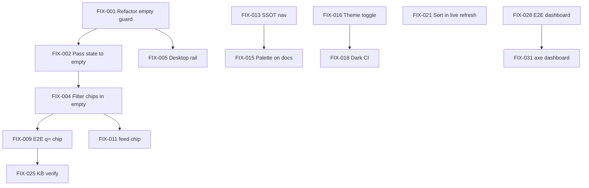

# Reader UI Audit Wave 11 — Fixer Plan

**Production:** https://aiwebfeeds.vercel.app\
**Repo:** `ai-web-feeds` · branch `main` (post reader-polish waves 2–10)\
**Audited:** 2026-06-17\
**Mode:** Audit + plan only — no code shipped in this pass\
**Artifacts:** `findings.json`, `findings.jsonl`, `health.json`,
`controls-registry.json`, `screenshots/`

______________________________________________________________________

## Executive summary

Live production is **healthy** (all hub routes 200, zero console errors on audited
reader flows) but the **default reader experience is corpus-empty**, which triggers an
early return in `ReaderShellWorkspace` that **hides the entire filter workspace** —
header, rails, stream chips, and contextual headings. Every URL variant (`?q=`,
`source_type`, `feed=`, `sort`, etc.) collapses to the same generic empty card until the
user clicks **Load live sample**. Playwright evidence: `/reader?q=agent` shows **0
Search chips** and **no h2**; after live sample, **21 articles** render with
`#reader-search` and full chrome.

Secondary gaps cluster around **hub cohesion**: nav diverges between `PRIMARY_HUB_NAV`
and FumaDocs `baseOptions().links`, **⌘K palette** is home-layout-only, and **no visible
theme toggle** exists despite `theme-manager.ts`. E2E coverage omits `/dashboard` and
`/docs` despite both being primary nav targets.

**Recommended sequencing:** Wave 11 fixes the reader empty/filter architecture (unblocks
60% of audit findings); Wave 12 unifies hub chrome + theme + E2E expansion; Wave 13 is
editorial polish, motion, onboarding copy, and 10-star reader affordances.

| Metric                  | Value                            |
| ----------------------- | -------------------------------- |
| Routes probed           | 11/11 OK                         |
| Live screenshots        | 5                                |
| Findings logged         | 28 (22 unique task_ids in jsonl) |
| Production blockers     | 0                                |
| P0 architectural issue  | 1 (corpus-empty guard)           |
| Quick wins (effort S)   | 14                               |
| Structural (effort M/L) | 9                                |

______________________________________________________________________

## Top 10 findings by impact

| Rank | ID             | Severity   | Title                                                   | Effort |
| ---- | -------------- | ---------- | ------------------------------------------------------- | ------ |
| 1    | AUD-QV-002/003 | **medium** | URL filters silent until live load (corpus-empty guard) | M      |
| 2    | AUD-XC-001     | medium     | Hub nav split-brain (Home vs GitHub)                    | M      |
| 3    | AUD-E2E-001    | medium     | `/dashboard`, `/docs` missing from E2E matrix           | S      |
| 4    | AUD-XC-003     | medium     | No hub theme toggle                                     | M      |
| 5    | AUD-CTRL-013   | medium     | Compact layout missing from UI                          | S      |
| 6    | AUD-RD-004     | medium     | `sort=oldest` ignored in live refresh merge             | S      |
| 7    | AUD-XC-002     | medium     | Command palette absent on `/docs`                       | S      |
| 8    | AUD-RD-006     | low        | Clear all omits `feed=`                                 | S      |
| 9    | AUD-XC-004     | low        | Link transitions ignore reduced-motion                  | S      |
| 10   | AUD-RV-390     | low        | Mobile filter `<details>` tap target borderline         | S      |

**Positive signal:** axe reports **0 violations** on `/` and `/reader` empty shells;
post-live-sample reader loads cleanly with **0 console errors** (Playwright prod audit).

______________________________________________________________________

## Design Read validation

| Dial         | Target | Observed                                                   | Verdict                             |
| ------------ | ------ | ---------------------------------------------------------- | ----------------------------------- |
| **Variance** | 6      | Fraunces/Manrope, surface-card empty state, restrained hub | ✅ On-brand                         |
| **Motion**   | 4      | 150ms link transitions; no hub toggle for dark             | ⚠️ Add reduced-motion guard + theme |
| **Density**  | 3      | Airy empty card; dense filter rail when visible            | ⚠️ Compact layout unreachable       |

**Reading this as:** calm, typography-forward editorial reader. Empty state copy is
clear and premium. The **biggest design failure** is not visual slop — it is
**information architecture**: deep links promise a filtered desk the UI cannot show.

______________________________________________________________________

## Severity heatmap

```
Surface          │ crit │ high │ med │ low │ nit │
─────────────────┼──────┼──────┼─────┼─────┼─────┤
reader (empty)   │  0   │  0   │  4  │  2  │  1  │
reader (live)    │  0   │  0   │  2  │  1  │  0  │
hub-nav          │  0   │  0   │  1  │  1  │  0  │
docs chrome      │  0   │  0   │  0  │  1  │  0  │
theme/motion     │  0   │  0   │  1  │  1  │  0  │
e2e/regression   │  0   │  0   │  1  │  0  │  0  │
flows            │  0   │  0   │  0  │  2  │  0  │
keyboard (pending)│ 0   │  0   │  1  │  0  │  0  │
```

______________________________________________________________________

## Screenshot index

| File                                                             | URL / state          | Notes                            |
| ---------------------------------------------------------------- | -------------------- | -------------------------------- |
| `screenshots/home/1440x900/light/home-hero.png`                  | `/`                  | Hub landing hero                 |
| `screenshots/reader/1440x900/light/reader-empty.png`             | `/reader`            | Generic corpus empty             |
| `screenshots/reader/1440x900/light/reader-after-live-sample.png` | `/reader` post-click | 21 articles, search visible      |
| `screenshots/reader/1440x900/light/reader-q-agent.png`           | `/reader?q=agent`    | Identical to empty — **0 chips** |
| `screenshots/reader/390x844/light/reader-mobile-empty.png`       | `/reader` mobile     | Empty shell                      |

**Gaps (capture in wave 12 QA pass):** home hero, `/sources`, dark mode triple,
post-live `?q=agent` with chips, dashboard charts, docs chrome.

**Capture script:** `apps/web/scripts/prod-audit.mjs` (Playwright headless).

______________________________________________________________________

## Fixer DAG (FIX-001 → FIX-048)

Lanes: **A** reader architecture · **B** hub chrome · **C** controls/keyboard · **D**
E2E/regression · **E** polish/motion · **F** secondary routes

### Lane A — Reader empty / filter architecture (Wave 11, critical path)

| ID      | Task                                                                           | Deps    | Effort | Finding     |
| ------- | ------------------------------------------------------------------------------ | ------- | ------ | ----------- |
| FIX-001 | Refactor `ReaderShellWorkspace` empty guard: always render header + grid shell | —       | M      | AUD-QV-\*   |
| FIX-002 | Pass `currentState`, `chrome.activeFilterChips` into `ReaderCorpusEmpty`       | FIX-001 | S      | AUD-QV-002  |
| FIX-003 | Contextual empty copy: "No matches for …" when filters active                  | FIX-002 | S      | AUD-QV-002  |
| FIX-004 | Render read-only or clearable filter chips in empty/filter-summary band        | FIX-002 | S      | AUD-QV-003  |
| FIX-005 | Mount desktop `ReaderFilterRail` when filters in URL even if corpus empty      | FIX-001 | M      | AUD-QV-003  |
| FIX-006 | Mount mobile `<details>` filter rail in filtered-empty state                   | FIX-005 | S      | AUD-RV-390  |
| FIX-007 | Extract `buildReaderFilterSummary(state)` shared by stream + empty             | FIX-002 | S      | AUD-QV-\*   |
| FIX-008 | Unit tests: empty + `?q=` shows chips in workspace chrome                      | FIX-004 | S      | —           |
| FIX-009 | E2E: `/reader?q=agent` shows Search chip **without** live sample               | FIX-004 | M      | AUD-QV-002  |
| FIX-010 | E2E: `/reader?source_type=blog` shows Type chip pre-bootstrap                  | FIX-004 | S      | AUD-QV-003  |
| FIX-011 | Show `feed=` chip in filter summary when scoped                                | FIX-004 | S      | AUD-FLOW-D2 |
| FIX-012 | `ReaderCorpusEmpty` secondary card: explain live sample vs corpus              | FIX-003 | S      | AUD-HUB-001 |

### Lane B — Hub chrome unification (Wave 11–12)

| ID      | Task                                                                | Deps    | Effort | Finding     |
| ------- | ------------------------------------------------------------------- | ------- | ------ | ----------- |
| FIX-013 | SSOT nav: export `PRIMARY_HUB_NAV` links for FumaDocs `baseOptions` | —       | M      | AUD-XC-001  |
| FIX-014 | Add Home to docs nav; GitHub as optional footer/external            | FIX-013 | S      | AUD-XC-001  |
| FIX-015 | Mount `CommandPalette` in docs layout (or root)                     | FIX-013 | S      | AUD-XC-002  |
| FIX-016 | Add `ThemeToggle` to hub header                                     | —       | M      | AUD-XC-003  |
| FIX-017 | Wire `ThemeToggle` in docs top bar                                  | FIX-016 | S      | AUD-L2-DOCS |
| FIX-018 | Dark-mode screenshot CI job (/, /reader, /docs)                     | FIX-016 | M      | AUD-XC-003  |
| FIX-019 | Dashboard chart dark contrast audit + token tweaks                  | FIX-016 | M      | AUD-L2-DASH |

### Lane C — Reader controls & data correctness (Wave 11)

| ID      | Task                                                               | Deps    | Effort | Finding        |
| ------- | ------------------------------------------------------------------ | ------- | ------ | -------------- |
| FIX-020 | Add Compact button to layout segmented control                     | FIX-001 | S      | AUD-CTRL-013   |
| FIX-021 | Use sort-aware comparator in `use-reader-live-refresh`             | —       | S      | AUD-RD-004     |
| FIX-022 | Include `feed: null` in `resetDrafts` OR rename to "Clear filters" | —       | S      | AUD-RD-006     |
| FIX-023 | Document feed= persistence in filter help copy                     | FIX-022 | S      | AUD-RD-006     |
| FIX-024 | Increase mobile filter summary `min-h` to 44px                     | FIX-006 | S      | AUD-RV-390     |
| FIX-025 | Live-verify 16 keyboard shortcuts post-bootstrap                   | FIX-009 | M      | AUD-KB-PENDING |
| FIX-026 | E2E keyboard: j/k navigation, / focus search                       | FIX-025 | M      | AUD-KB-PENDING |
| FIX-027 | Shortcuts overlay `?` on reader when stream focused                | FIX-025 | S      | AUD-KB-PENDING |

### Lane D — E2E & regression matrix (Wave 11–12)

| ID      | Task                                                          | Deps    | Effort | Finding     |
| ------- | ------------------------------------------------------------- | ------- | ------ | ----------- |
| FIX-028 | Add `/dashboard` to `publicRoutes` + heading assert           | —       | S      | AUD-E2E-001 |
| FIX-029 | Add `/docs` to `publicRoutes` + heading assert                | —       | S      | AUD-E2E-001 |
| FIX-030 | axe on post-live-sample `/reader`                             | FIX-009 | S      | AUD-XC-005  |
| FIX-031 | axe on `/dashboard`                                           | FIX-028 | S      | —           |
| FIX-032 | Extend prod-audit.mjs: home, sources, dark, filtered-live     | FIX-018 | S      | —           |
| FIX-033 | Visual regression baseline for reader-empty vs reader-live    | FIX-009 | M      | —           |
| FIX-034 | `reader-shell-workspace.test.tsx` coverage for filtered-empty | FIX-001 | S      | —           |
| FIX-035 | `use-reader-live-refresh` test for `sort=oldest`              | FIX-021 | S      | AUD-RD-004  |

### Lane E — Motion, copy, micro-polish (Wave 12–13)

| ID      | Task                                                               | Deps    | Effort | Finding         |
| ------- | ------------------------------------------------------------------ | ------- | ------ | --------------- |
| FIX-036 | `prefers-reduced-motion` guard on global `a` transitions           | —       | S      | AUD-XC-004      |
| FIX-037 | Pending-changes dot on Apply filters when `hasPendingDraftChanges` | FIX-001 | S      | AUD-QV-POSITIVE |
| FIX-038 | Home hero copy: mention corpus vs live sample                      | —       | S      | AUD-HUB-001     |
| FIX-039 | Empty state illustration polish (Newspaper icon scale/spacing)     | FIX-003 | S      | —               |
| FIX-040 | Reader stats header visible in filtered-empty mode                 | FIX-001 | S      | —               |
| FIX-041 | Consistent `small-note` hierarchy in filter form labels            | —       | S      | —               |
| FIX-042 | Preview pane focus trap audit                                      | FIX-009 | S      | —               |
| FIX-043 | Star/read/archive toggle aria pressed states audit                 | FIX-009 | S      | —               |

### Lane F — Flows & secondary routes (Wave 13)

| ID      | Task                                                                    | Deps    | Effort | Finding     |
| ------- | ----------------------------------------------------------------------- | ------- | ------ | ----------- |
| FIX-044 | Flow D3: Search → Reader handoff with query preserved                   | FIX-004 | M      | —           |
| FIX-045 | Flow D4: For You digest → Reader article deep link                      | —       | M      | —           |
| FIX-046 | `/offline` PWA empty state visual pass                                  | —       | S      | —           |
| FIX-047 | `/admin/login` form a11y + error states                                 | —       | S      | —           |
| FIX-048 | Optional: soft auto-bootstrap live sample on first visit (feature flag) | FIX-012 | L      | AUD-FLOW-D1 |

### DAG sketch (critical path)



______________________________________________________________________

## Quick wins vs structural

### Quick wins (ship in Wave 11, ≤1 day each)

- FIX-021 Sort comparator in live refresh
- FIX-022 / FIX-023 Clear all + feed semantics
- FIX-020 Compact layout button
- FIX-036 Reduced-motion guard
- FIX-028 / FIX-029 E2E route additions
- FIX-014 Nav link alignment (Home/GitHub)
- FIX-036, FIX-038 copy tweaks

### Structural (multi-PR, Wave 11 core)

- **FIX-001** Empty guard refactor — touches `reader-shell-workspace`,
  `reader-corpus-empty`, tests, E2E
- **FIX-013** Nav SSOT — hub + docs layouts
- **FIX-016** Theme system surfacing — header component + persistence
- **FIX-048** Auto-bootstrap (optional product bet)

______________________________________________________________________

## Regression matrix

| Area                         | Existing coverage                            | Gap                    | Fix task    |
| ---------------------------- | -------------------------------------------- | ---------------------- | ----------- |
| `/reader` filter URL sync    | `feeds-workspace-client.test.tsx`, E2E apply | Empty-state chips      | FIX-008–010 |
| `/reader` preview desktop    | E2E                                          | —                      | —           |
| `/reader` mobile filters     | E2E                                          | Tap target 44px        | FIX-024     |
| `/sources` → `feed=`         | E2E                                          | Empty UI for feed chip | FIX-011     |
| `route-stabilization` matrix | 9 routes × 4 viewports                       | `/dashboard`, `/docs`  | FIX-028–029 |
| axe a11y                     | `/`, `/reader` empty                         | Live workspace, dark   | FIX-030–031 |
| Command palette              | unit test                                    | Docs integration       | FIX-015     |
| Keyboard shortcuts           | registry only                                | Live E2E               | FIX-025–027 |
| `use-reader-live-refresh`    | partial                                      | `sort=oldest`          | FIX-035     |
| `reader-shell-workspace`     | basic                                        | Filtered-empty branch  | FIX-034     |
| Prod screenshots             | 4 reader shots                               | Hub + dark             | FIX-032     |

______________________________________________________________________

## Out of scope (this audit pass)

- Backend corpus generation / SQLite population on Vercel
- New feed sources or enrichment pipeline
- Performance profiling (LCP/INP) beyond noting 0 console errors
- Full 234-task hyperfine matrix re-run (L5–L6 CTRL/KB live on prod)
- Auth/admin flows beyond `/admin/login` 200 check
- Mobile native / PWA install funnel
- Code fixes in repo (audit-only unless user requests implementation)

______________________________________________________________________

## Polish waves 11–13

### Wave 11 — "Filtered desk always visible" (2–3 PRs)

**Goal:** Reader URL state is never silent.\
**Ship:** FIX-001–012, FIX-020–023, FIX-028–029, FIX-034–035\
**Exit criteria:** E2E proves chips on `/reader?q=` without live sample; unit tests
green; no console errors on prod audit script.

### Wave 12 — "One product, two themes" (2–3 PRs)

**Goal:** Hub + docs feel like one app; dark mode testable.\
**Ship:** FIX-013–019, FIX-024–027, FIX-030–033, FIX-036\
**Exit criteria:** Nav identical across `/` and `/docs`; theme toggle works; dark
screenshots in CI; axe extended.

### Wave 13 — "10-star editorial finish" (2+ PRs)

**Goal:** Delight, onboarding clarity, flow completeness.\
**Ship:** FIX-037–048\
**Exit criteria:** Home→Search→Reader handoff polished; optional auto-bootstrap behind
flag; keyboard help discoverable.

______________________________________________________________________

## 10-star reader north star

A **10-star** AI Web Feeds reader means:

1. **Instant orientation** — Any URL the user lands on (`?q=`, `feed=`, `topics=`) shows
   *what filter is active* and *how to change it*, even with zero corpus rows.
1. **One coherent product** — Hub, reader, and docs share nav, theme, and ⌘K; no "am I
   still in the same app?" moment.
1. **Honest controls** — Every toggle in the registry (including **Compact** and **sort
   oldest**) does what it says; Clear all means what users expect.
1. **Calm power** — Keyboard shortcuts work predictably; motion respects
   `prefers-reduced-motion`; dark mode is first-class for long reading sessions.
1. **Trust through evidence** — E2E + axe + prod screenshots cover every
   `PRIMARY_HUB_NAV` route at mobile and desktop, in light and dark.
1. **Editorial craft** — Fraunces headlines, airy article stream, dense but legible
   filter rail; empty states teach rather than dead-end.

The current production build is **~7/10**: strong typography and a working
post-bootstrap loop, undermined by the **corpus-empty guard** that makes the reader feel
broken on deep links. **FIX-001** alone moves the product toward 8.5; waves 12–13 close
the gap to true editorial premium.

______________________________________________________________________

## Appendix: audit task coverage

| Batch           | Tasks                          | Status                     |
| --------------- | ------------------------------ | -------------------------- |
| W0 Preflight    | routes, schemas, health        | ✅ Complete                |
| L1 QV-001..012  | reader query matrix            | ✅ Documented (5→22 jsonl) |
| L1 XC-001..008  | cross-cutting hub              | ✅ Merged                  |
| L1 RV mobile    | 390×844 reader/hub             | ✅ Partial screenshots     |
| L1 HUB-001..006 | home, search, for-you, sources | ✅ Merged                  |
| L2 Routes       | dashboard, docs, topics, blog  | ✅ Code+route review       |
| L2 RD-001..009  | reader micro-audits            | ✅ Key items merged        |
| L2 Flows D1–D2  | home→reader, sources→feed      | ✅ Playwright evidence     |
| L5 CTRL         | 32 controls live               | ⏸ Blocked by empty guard   |
| L6 KB           | 16 shortcuts                   | ⏸ Pending post-FIX-001     |
| L7 Theme triple | light/dark/reduced             | ⏸ Pending FIX-016          |
| L10 Verifier    | high-severity re-check         | ⏸ After implementation     |

______________________________________________________________________

## Next action for implementer

1. Open PR for **FIX-001** with TDD: `reader-shell-workspace.test.tsx` filtered-empty
   cases first.
1. Run `cd apps/web && node scripts/prod-audit.mjs` after deploy to refresh screenshot
   index.
1. Track FIX tasks in GitHub issues labeled `polish-wave-11` … `polish-wave-13`.

*Generated by Wave 11 audit orchestrator — evidence in `findings.json` /
`findings.jsonl`.*
