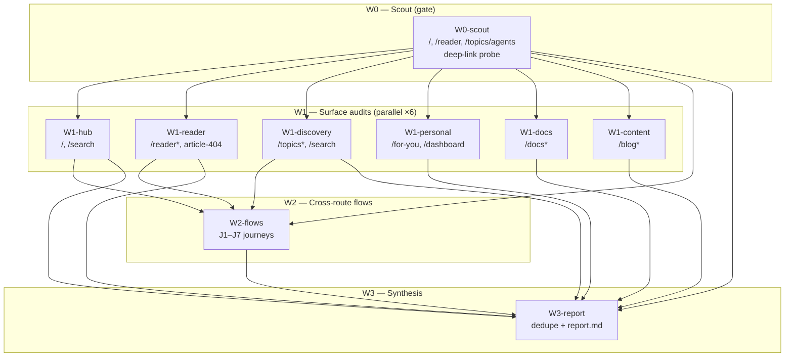
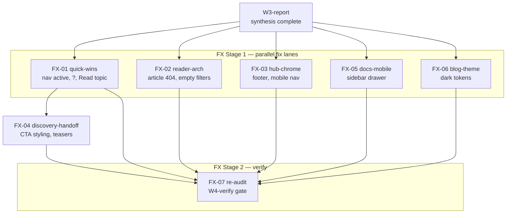

# Visual Audit Plan — 2026-06-22

**Production:** https://aiwebfeeds.vercel.app\
**Mode:** Report-only (audit complete) · Fix waves planned, not executed\
**Artifacts:** `brief.md`, `manifest.json`, `report.md`, `findings/`, `screenshots/`\
**Reference:** `specs/reader-ui-audit-wave11/plan.md` (fixer DAG style)

______________________________________________________________________

## Executive summary

Full-app visual audit executed via **hyperfine parallel subagent graph** (W0→W1
fan-out→W2→W3). **95 screenshots**, **~39 raw findings** deduped to **~35**, overall
health **6.6/10**.

Reader is the weakest surface (5.5) due to **P0** article 404 and broken `?` shortcuts.
Discovery scores highest (7.6) but **J2** topic→reader handoff is broken in flows.

Machine-readable orchestration lives in **`manifest.json`**. Human synthesis in
**`report.md`**.

| Metric              | Value               |
| ------------------- | ------------------- |
| Waves completed     | W0, W1 (×6), W2, W3 |
| Subagent model      | `composer-2.5-fast` |
| Max parallel agents | 7 (W1 fan-out)      |
| Screenshot total    | 95                  |
| P0 findings         | 2                   |
| P1 findings         | 7                   |

______________________________________________________________________

## Hyperfine task graph (audit DAG)



### Topological execution order

| Stage | Tasks                                                                         | Parallelism           |
| ----- | ----------------------------------------------------------------------------- | --------------------- |
| 0     | `W0-scout`                                                                    | 1                     |
| 1     | `W1-hub`, `W1-reader`, `W1-discovery`, `W1-personal`, `W1-docs`, `W1-content` | **6**                 |
| 2     | `W2-flows`                                                                    | 1 (after W0 + key W1) |
| 3     | `W3-report`                                                                   | 1 (after all W1 + W2) |

______________________________________________________________________

## Subagent launch recipe

Use **`manifest.json`** as the source of truth. Anti-hang constraints that kept
relaunched agents stable:

1. **Browse:** `$B=~/.agents/skills/gstack/browse/dist/browse` — use **`goto`**, never
   `open`
1. **Scope cap:** ≤20 tool calls per task; write JSON then STOP
1. **Model:** `composer-2.5-fast` for surface/flow audits
1. **Retries:** ≤1 retry per failed `click @eN`

### W0-scout (lead)

```bash
B=~/.agents/skills/gstack/browse/dist/browse
OUT=specs/visual-audit-2026-06-22/screenshots/W0-scout
mkdir -p "$OUT"
$B goto https://aiwebfeeds.vercel.app/
$B viewport 1440x900
$B screenshot "$OUT/home__1440x900__light__baseline.png"
# Probe deep links; record 404s in W0-scout.json
```

### W1 fan-out (6 subagents, same wave)

Spawn all six with identical envelope schema; each writes `findings/W1-{lane}.json`.

| Task         | Routes                                         | Min shots |
| ------------ | ---------------------------------------------- | --------- |
| W1-hub       | `/`, `/search`                                 | 6         |
| W1-reader    | `/reader`, `?q=`, `?source_type=`, article 404 | 8         |
| W1-discovery | `/topics`, `/topics/agents`, `/search`         | 6         |
| W1-personal  | `/for-you`, `/dashboard`                       | 4         |
| W1-docs      | `/docs`, `/docs/development/cli`               | 4         |
| W1-content   | `/blog`, `/blog/hub-and-blog`                  | 6         |

### W2-flows (1 subagent)

Seven journeys J1–J7; screenshot naming `J{n}__{step}__{viewport}__{theme}.png`.

### W3-report (1 subagent)

Reads all `findings/W*.json` → writes `findings/W3-report.json` + `report.md`.

______________________________________________________________________

## Task manifest reference

Full task list, edges, deps, health scores, and planned fix lanes: **`manifest.json`**.

Key completed outputs:

| Task         | Findings JSON                | Screenshots | Health |
| ------------ | ---------------------------- | ----------- | ------ |
| W0-scout     | `findings/W0-scout.json`     | 3           | 8.0    |
| W1-hub       | `findings/W1-hub.json`       | 16          | 7.0    |
| W1-reader    | `findings/W1-reader.json`    | 20          | 5.5    |
| W1-discovery | `findings/W1-discovery.json` | 12          | 7.6    |
| W1-personal  | `findings/W1-personal.json`  | 4           | 5.0    |
| W1-docs      | `findings/W1-docs.json`      | 6           | 6.0    |
| W1-content   | `findings/W1-content.json`   | 9           | 7.5    |
| W2-flows     | `findings/W2-flows.json`     | 25          | 6.0    |
| W3-report    | `findings/W3-report.json`    | —           | 6.6    |

______________________________________________________________________

## Recommended fix DAG (FX — planned, not executed)

Post-audit remediation lanes derived from `report.md` top-10 and journey failures.



### Lane FX-01 — Quick wins (effort S, ~1 day)

| ID     | Task                                                       | Finding        | Deps |
| ------ | ---------------------------------------------------------- | -------------- | ---- |
| FX-01a | Fix nav `data-active` on `/` (Home not Reader)             | P1 nav active  | —    |
| FX-01b | Wire `?` → `ReaderShortcutsSheet` on empty + loaded reader | P0 shortcuts   | —    |
| FX-01c | Point "Read topic" → `/reader?topics=agents`               | P1 J2 partial  | —    |
| FX-01d | Keep "Load live sample" in-place (no router.push)          | P1 load sample | —    |
| FX-01e | Docs `data-active` for `/docs*` subtree                    | P2 docs nav    | —    |

### Lane FX-02 — Reader architecture (effort M)

| ID     | Task                                                  | Finding          | Deps            |
| ------ | ----------------------------------------------------- | ---------------- | --------------- |
| FX-02a | Article route fallback (not hard 404) or restore slug | P0 article 404   | —               |
| FX-02b | Guard/disable filter controls when corpus empty       | P2 empty filters | FX-02a optional |

### Lane FX-03 — Hub chrome (effort M)

| ID     | Task                                            | Finding       | Deps |
| ------ | ----------------------------------------------- | ------------- | ---- |
| FX-03a | Shared `SiteFooter` on hub, dashboard, blog     | P1 no footer  | —    |
| FX-03b | Mobile menu: unique roles, backdrop, open state | P2 J6 partial | —    |

### Lane FX-04 — Discovery handoff (effort S)

| ID     | Task                                            | Finding          | Deps   |
| ------ | ----------------------------------------------- | ---------------- | ------ |
| FX-04a | Per-card "Open in reader" on topic/source cards | P1 topic cards   | FX-01c |
| FX-04b | ArticleTeaser "Read in reader" secondary action | P2 search teaser | —      |
| FX-04c | Differentiate "Continue in reader" CTA styling  | P2 search CTA    | —      |

### Lane FX-05 — Docs mobile (effort M)

| ID     | Task                                  | Finding         | Deps            |
| ------ | ------------------------------------- | --------------- | --------------- |
| FX-05a | Fumadocs sidebar → drawer on `<768px` | P1 docs sidebar | —               |
| FX-05b | Hub top-nav parity on docs layout     | P2 docs chrome  | FX-03a optional |

### Lane FX-06 — Blog theme (effort M)

| ID     | Task                                                | Finding        | Deps |
| ------ | --------------------------------------------------- | -------------- | ---- |
| FX-06a | Blog pages consume `theme-manager` / `dark:` tokens | P1 blog dark   | —    |
| FX-06b | Restore hub chrome on immersive post variant        | P2 post chrome | —    |

### Lane FX-07 — Re-audit gate (W4-verify)

**Gates before ship:**

- `overall_health_score >= 8`
- `P0_count == 0`
- `J2 status == pass` (Topics→Reader)
- `J6`, `J7` at least `pass` or documented partial with fix

Re-run W1-reader + W2-flows only (subset) or full W1 fan-out per `manifest.json` task
`FX-07-verify`.

______________________________________________________________________

## Severity → wave mapping

| Severity    | Count | Primary wave                      |
| ----------- | ----- | --------------------------------- |
| P0 critical | 2     | FX-02 + FX-01b                    |
| P1 high     | 7     | FX-01, FX-03, FX-04, FX-05, FX-06 |
| P2 medium   | 16    | polish-wave-12                    |
| P3 low/nit  | 14    | polish-wave-13                    |

______________________________________________________________________

## Screenshot naming contract

```
{route-slug}__{viewport}__{theme}__{state}.png
```

Journey captures (W2):

```
J{n}__{step}__{viewport}__{theme}.png
```

______________________________________________________________________

## Blocked / env surfaces (do not treat as regressions)

| Route               | Reason                                             |
| ------------------- | -------------------------------------------------- |
| `/for-you`          | Requires `BACKEND_URL`; empty state is intentional |
| `/reader/article/*` | 404 until article route or corpus restored         |
| `/reader` default   | Corpus empty until "Load live sample"              |

______________________________________________________________________

## Orchestrator pseudocode

```python
# Load manifest.json
tasks = topo_sort(manifest["tasks"], manifest["edges"])

for stage in manifest["topological_order"]:
    parallel = [t for t in stage if all(dep.done for dep in t.depends_on)]
    spawn_subagents(parallel, model="composer-2.5-fast", max_calls=20)
    wait_all(parallel)
    assert all(t.outputs_exist() for t in parallel)

# W3 always last
run_synthesizer(inputs=findings/W*.json, outputs=[W3-report.json, report.md])
```

______________________________________________________________________

## Related files

| File                            | Purpose                                     |
| ------------------------------- | ------------------------------------------- |
| `brief.md`                      | Severity map, viewports, browse hints       |
| `manifest.json`                 | Machine-readable DAG, tasks, edges, results |
| `report.md`                     | Executive report (W3 output)                |
| `findings/W3-report.json`       | Deduped findings + scores                   |
| `specs/reader-ui-audit-wave11/` | Prior reader audit + finding schema         |

**Status:** Audit graph **complete** (W0–W3). Fix graph **complete** (FX-01–FX-07).
Post-fix verify: `findings/W4-verify.json`.\
**Updated:** 2026-06-23
